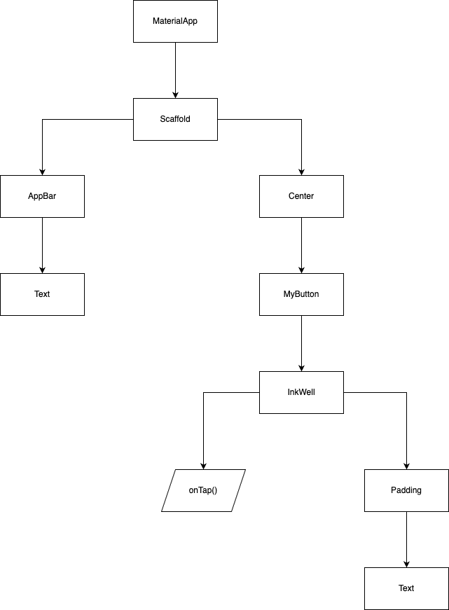

### 点按涟漪组件InkWell
点击以下出现水波涟漪的效果一般都会出现在按钮上，或者一个小方框上。所以InkWell组件也可就是比较抽象、没有具体形状的组件，它具体长什么样子
由它的child属性指定。这个示例里child是一个Padding->Text,所以最后就是一个文本组件。

### ListView组件
ListView组件创建一个可滚动的列表，这个示例是直接通过builder方法来创建的，有三种方式可以创建。
- 通过普通的ListView()构造方法来创建。需要在children属性中一个个指定child。
- 通过ListView.builder()构造方法来创建。需要通过itemBuilder方法来创建child。如果我们直到items，就可以通过index下标创建每个item，就不用一个个指定item了。
- 通过ListView.separated()构造方法来创建。需要通过itemBuilder和separatorBuilder方法来创建child和分割线。这种表示需要间隔开每个item的情况。


> ListView是最常使用的滚动组件



```java

import 'package:flutter/material.dart';

  void main() {
  runApp(const MyApp());  //runApp是一个方法，参数是一个widget
  }

// MyApp 是一个有状态的widget，当删除一个item时，可以更新整个widget的状态
class MyApp extends StatefulWidget {
  const MyApp({super.key});

  // StatefulWidget组件都有一个createState方法，返回一个State类
  @override
  MyAppState createState() {
    return MyAppState();
  }
}

// State类有一个build方法，在build方法里返回widget。所以直到State类里的build方法，才开始真正组织widget。
class MyAppState extends State<MyApp> {
  final items = List<String>.generate(20, (i) => 'Item ${i + 1}');

  @override
  Widget build(BuildContext context) {
    const title = 'Dismissing Items';

    return MaterialApp(
      title: title,
      theme: ThemeData(
      colorScheme: ColorScheme.fromSeed(seedColor: Colors.deepPurple),
      ),
    home: Scaffold(
      appBar: AppBar(
      title: const Text(title),
        ),
    body: ListView.builder(
      itemCount: items.length,
      itemBuilder: (context, index) {
      final item = items[index];
      return Dismissible(
        // 每个Dismissible必须包含一个Key。Key允许Flutter唯一标识每个widget。
        key: Key(item),
        // 该方法告诉app，当该item滑走的时候应该怎么做
        onDismissed: (direction) {
        //从数据列表中删除该item
        setState(() {
        items.removeAt(index);
                });

      // 然后展示一个SnackBar
      ScaffoldMessenger.of(context)
        .showSnackBar(SnackBar(content: Text('$item dismissed')));
              },
      // 当该item滑走过程中，组件后面展示红色背景
      background: Container(color: Colors.red),
      child: ListTile(
        title: Text(item),
              ),
            );
    },
        ),
      ),
    );
  }
}
```

