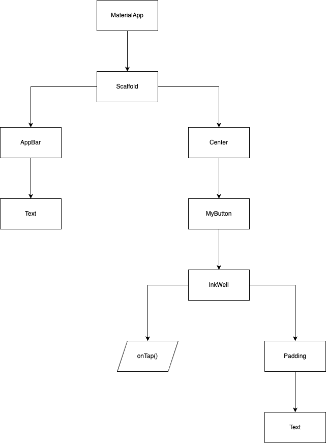

### 点按涟漪组件InkWell

点击以下出现水波涟漪的效果一般都会出现在按钮上，或者一个小方框上。所以InkWell组件也可就是比较抽象、没有具体形状的组件，它具体长什么样子
由它的child属性指定。这个示例里child是一个Padding->Text,所以最后就是一个文本组件。

### 属性

- onTap属性，表示一个方法，当用户点击该组件时，会调用该方法。这里表示会弹出一个SnackBar组件
- child属性，表示被包裹的组件，这里是一个Text组件

> 注意这里的布局图，最上层是MaterialApp.



```java

import 'package:flutter/material.dart';

void main() => runApp(const MyApp());

class MyApp extends StatelessWidget {
  const MyApp({super.key});

  @override
  Widget build(BuildContext context) {
    const title = 'InkWell Demo';

    return const MaterialApp(
      title: title,
      home: MyHomePage(title: title),
    );
  }
}

class MyHomePage extends StatelessWidget {
  final String title;

  const MyHomePage({super.key, required this.title});

  @override
  Widget build(BuildContext context) {
    return Scaffold(
      appBar: AppBar(
        title: Text(title),
      ),
      body: const Center(
        child: MyButton(),
      ),
    );
  }
}

class MyButton extends StatelessWidget {
  const MyButton({super.key});

  @override
  Widget build(BuildContext context) {
    // The InkWell wraps the custom flat button widget.
    return InkWell(
      // When the user taps the button, show a snackbar.
      onTap: () {
        ScaffoldMessenger.of(context).showSnackBar(const SnackBar(
          content: Text('Tap'),
        ));
      },
      child: const Padding(
        padding: EdgeInsets.all(12),
        child: Text('Flat Button'),
      ),
    );
  }
}
```
