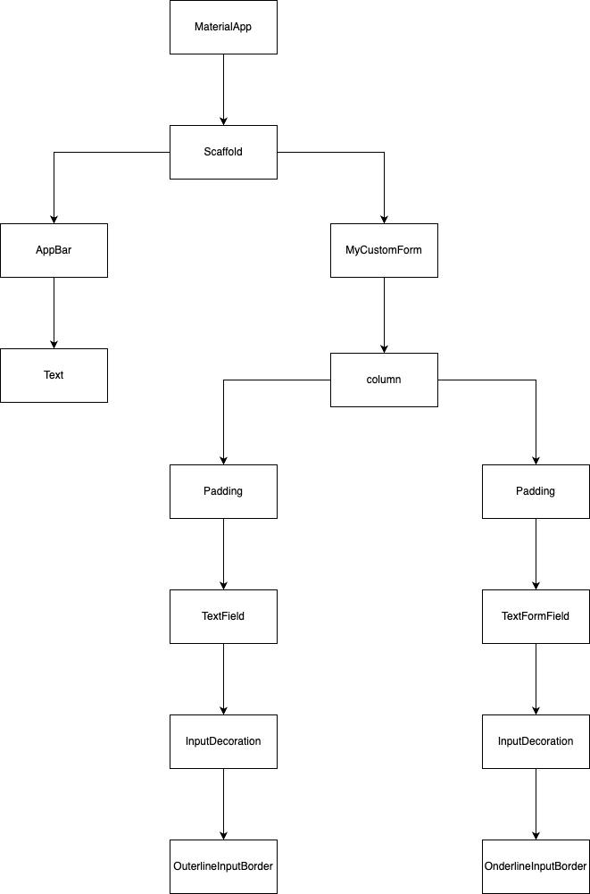
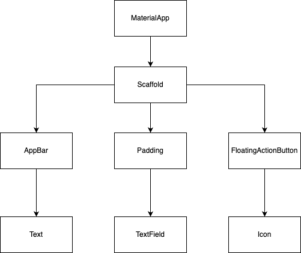

##1.输入框 TextField和TextFormField

输入框组件是非常常见的组件，在搜索框、注册登录输入表单、输入信息等场景下都需要用到输入框。flutter中内置的输入框组件是上面两种。
- TextField组件
- TextFormField组件 

> 怎么把输入框设计的好看是很重要的，需要设计的有质感，而不是很沉闷的千篇一律的电子范儿，我设想的是
- 首先需要有一个prefixIcon，比如输入食物的种类的时候就放食物的图片
- 框里的背景颜色需要修改，不要白色
- 字体要粗体，样式也要修改
- 边框是有带一点点的圆角
- 边框颜色像跑马灯一样变化，有动态效果

### 示例
最重要的就是TextField和TextFormField里都有decoration属性，在decoration属性可以设置输入框的样式，比如背景颜色，边框颜色，边框样式，提示文字等。

```java
import 'package:flutter/material.dart';

void main() => runApp(const MyApp());

class MyApp extends StatelessWidget {
  const MyApp({super.key});

  @override
  Widget build(BuildContext context) {
    const appTitle = 'Form Styling Demo';
    return MaterialApp(
      title: appTitle,
      home: Scaffold(
        appBar: AppBar(
          title: const Text(appTitle),
        ),
        body: const MyCustomForm(),
      ),
    );
  }
}

class MyCustomForm extends StatelessWidget {
  const MyCustomForm({super.key});

  @override
  Widget build(BuildContext context) {
    return Column(
      crossAxisAlignment: CrossAxisAlignment.start,
      children: <Widget>[
        const Padding(
          padding: EdgeInsets.symmetric(horizontal: 8, vertical: 16),
          child: TextField(
            decoration: InputDecoration(
              fillColor: Color.fromARGB(255, 81, 77, 77),
              border: OutlineInputBorder(
                  borderRadius: BorderRadius.all(Radius.circular(15.0))),
              hintText: 'Enter your food',
              hintStyle: TextStyle(
                  fontWeight: FontWeight.w600,
                  color: Color.fromARGB(255, 47, 71, 83)),
              labelStyle: TextStyle(
                  fontWeight: FontWeight.w600,
                  color: Color.fromARGB(255, 47, 71, 83)),
              prefixIcon: Icon(Icons.run_circle),
            ),
          ),
        ),
        Padding(
          padding: const EdgeInsets.symmetric(horizontal: 8, vertical: 16),
          child: TextFormField(
            decoration: const InputDecoration(
              border: UnderlineInputBorder(),
              labelText: 'Enter your username',
            ),
          ),
        ),
      ],
    );
  }
}

```


### 组件图




## 2.获取输入框的值

要想获取输入框TextField中输入的值，可以设置TextField的controller属性，这个属性指定一个TextEditingController，这个controller有一个**text方法，返回输入框中的文本**。
在api文档上搜索TextEditingController时，看到显示的是把这个类放在了widget中，所以这个controller实际上还是属于Widget的一种。

### 示例

```java
import 'package:flutter/material.dart';

void main() => runApp(const MyApp());

class MyApp extends StatelessWidget {
  const MyApp({super.key});

  @override
  Widget build(BuildContext context) {
    return const MaterialApp(
      title: 'Retrieve Text Input',
      home: MyCustomForm(),
    );
  }
}

// Define a custom Form widget.
class MyCustomForm extends StatefulWidget {
  const MyCustomForm({super.key}); 

  @override
  State<MyCustomForm> createState() => _MyCustomFormState();
}

// Define a corresponding State class.
// This class holds the data related to the Form.
class _MyCustomFormState extends State<MyCustomForm> {
  // Create a text controller and use it to retrieve the current value
  // of the TextField.
  final myController = TextEditingController();

  @override
  void dispose() {
    // Clean up the controller when the widget is disposed.
    myController.dispose();
    super.dispose();
  }

  @override
  Widget build(BuildContext context) {
    return Scaffold(
      appBar: AppBar(
        title: const Text('Retrieve Text Input'),
      ),
      body: Padding(
        padding: const EdgeInsets.all(16),
        child: TextField(
          controller: myController,
        ),
      ),
      floatingActionButton: FloatingActionButton(
        // When the user presses the button, show an alert dialog containing
        // the text that the user has entered into the text field.
        onPressed: () {
          showDialog(
            context: context,
            builder: (context) {
              return AlertDialog(
                // Retrieve the text the that user has entered by using the
                // TextEditingController.
                content: Text(myController.text),
              );
            },
          );
        },
        tooltip: 'Show me the value!',
        child: const Icon(Icons.text_fields),
      ),
    );
  }
}


```

### 结构图




## 3.随时获取输入框的变动，每次输入框变动时，都获取输入值

两种方式：一种是用给TextField组件加上onChanged属性，另一种给TextField加上controller属性，controller要加上监听器，每次监听到输入变化时，调用监听方法，
注意，添加listener是在组件初始化的时候注册的，所以是需要实现initState方法中，在initState方法中给controller注册监听方法。
### 示例

```java
import 'package:flutter/material.dart';

void main() => runApp(const MyApp());

class MyApp extends StatelessWidget {
  const MyApp({super.key});

  @override
  Widget build(BuildContext context) {
    return const MaterialApp(
      title: 'Retrieve Text Input',
      home: MyCustomForm(),
    );
  }
}

// Define a custom Form widget.
class MyCustomForm extends StatefulWidget {
  const MyCustomForm({super.key});

  @override
  State<MyCustomForm> createState() => _MyCustomFormState();
}

// Define a corresponding State class.
// This class holds data related to the Form.
class _MyCustomFormState extends State<MyCustomForm> {
  // Create a text controller and use it to retrieve the current value
  // of the TextField.
  final myController = TextEditingController();

  @override
  void initState() {
    super.initState();

    // Start listening to changes.
    myController.addListener(_printLatestValue);
  }

  @override
  void dispose() {
    // Clean up the controller when the widget is removed from the widget tree.
    // This also removes the _printLatestValue listener.
    myController.dispose();
    super.dispose();
  }

  void _printLatestValue() {
    final text = myController.text;
    print('Second text field: $text (${text.characters.length})');
  }

  @override
  Widget build(BuildContext context) {
    return Scaffold(
      appBar: AppBar(
        title: const Text('Retrieve Text Input'),
      ),
      body: Padding(
        padding: const EdgeInsets.all(16),
        child: Column(
          children: [
            TextField(
              onChanged: (text) {
                print('First text field: $text (${text.characters.length})');
              },
            ),
            TextField(
              controller: myController,
            ),
          ],
        ),
      ),
    );
  }
}
```


## 4.表单验证

- 先创建一个Form表单，所有的输入框都在Form里
- 给每个输入框加上校验规则，也就是给每个TextFormField组件添加validator属性
- 在Form最下面加上一个按钮，点击按钮时，触发onPressed()方法，在方法里调用Form的validate方法

### 示例

```java
import 'package:flutter/material.dart';

void main() => runApp(const MyApp());

class MyApp extends StatelessWidget {
  const MyApp({super.key});

  @override
  Widget build(BuildContext context) {
    const appTitle = 'Form Validation Demo';

    return MaterialApp(
      title: appTitle,
      home: Scaffold(
        appBar: AppBar(
          title: const Text(appTitle),
        ),
        body: const MyCustomForm(),
      ),
    );
  }
}

// Create a Form widget.
class MyCustomForm extends StatefulWidget {
  const MyCustomForm({super.key});

  @override
  MyCustomFormState createState() {
    return MyCustomFormState();
  }
}

// 这个类有一些和表单关联的数据，所以需要创建一个State类
class MyCustomFormState extends State<MyCustomForm> {
  // 创建一个global key 唯一定位Form组件，并允许验证表单
  final _formKey = GlobalKey<FormState>();

  @override
  Widget build(BuildContext context) {
    // Build a Form widget using the _formKey created above.
    return Form(
      key: _formKey,
      child: Column(
        crossAxisAlignment: CrossAxisAlignment.start,
        children: [
          TextFormField(
            //validator接收用户输入到text
            validator: (value) {
              if (value == null || value.isEmpty) {
                return 'Please enter some text';
              }
              return null;
            },
          ),
          Padding(
            padding: const EdgeInsets.symmetric(vertical: 16),
            child: ElevatedButton( //需要在Form里创建一个按钮用来在onPressed()方法触发点击时验证表单
              onPressed: () {
                // 使用_formKey.currentState获得FormState，FormState是Flutter创建表单时Flutter自动创建的。调用validate()方法会调用FormField表单中所有文本框的validator()方法。
                // 因为这里需要使用global key，所以在Form组件中定义了一个global key属性。
                if (_formKey.currentState!.validate()) {
                  // 在实际生产中，验证成功后，一般需要调用后端做一些操作或保存表单信息到数据库。
                  ScaffoldMessenger.of(context).showSnackBar(
                    const SnackBar(content: Text('Processing Data')),
                  );
                }
              },
              child: const Text('Submit'),
            ),
          ),
        ],
      ),
    );
  }
}
```
