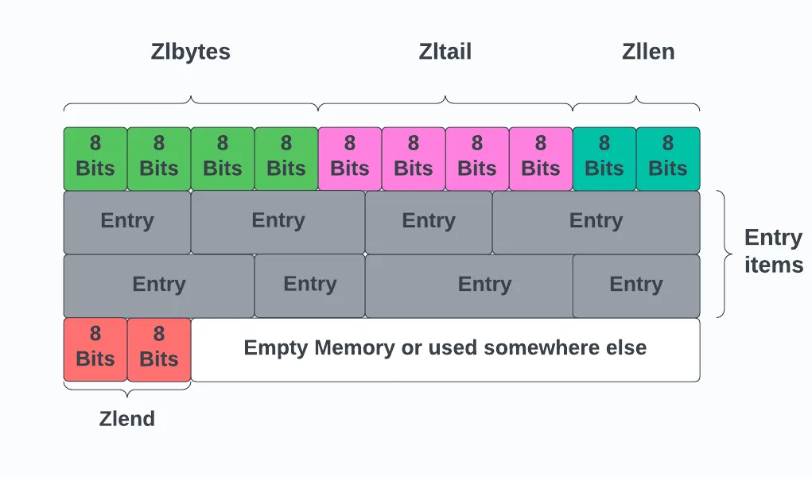

# Redis面试题

### Redis的架构

---
### Redis使用单线程为什么快？
1. redis所有数据都存储在内存中，读写速度就比磁盘要快；
2. 单线程避免了多线程的上下文切换，可以让redis专注于处理任务队列中的请求，不用考虑线程间的竞争和同步问题；
3. IO多路复用和事件驱动模型：redis使用了IO多路复用技术，通过事件驱动的方式监听多个客户端连接，把请求放入队列中，不会因为某个请求阻塞整个服务；
4. redis使用简单高效的数据结构，比如字符串、哈希表、列表、集合，能够在常数时间或对数时间内完成操作；

---
### redis为什么设计成单线程？
避免了多线程并发带来的复杂性和开销。因为redis的大部分操作都是内存操作，而非磁盘操作。单线程可以避免锁和上下文切换带来的开销，
而且，redis还采用了非阻塞io模型，可以处理大量并发连接。

---
### redis线程模式
Redis 基于 Reactor 模式开发了自己的文件事件处理器（file event handler）。
- 文件事件处理器使用 I/O 多路复用（multiplexing）程序来同时监听多个Socket套接字，会根据套接字执行的任务为套接字关联不同的事件处理器。
- 当被监听的套接字准备好执行连接应答（accept）、读取（read）、写入（write）、关闭（close）操作时，与操作相对应的文件事件就会产生，这时文件事件处理器就会调用套接字之前关联好的事件处理器来处理这些事件。

> 虽然文件事件处理器以单线程方式运行，但通过使用 I/O 多路复用程序来监听多个套接字，文件事件处理器实现了高性能的网络通信模型。

> 通过IO多路复用模型连接多个客户端，通过文件事件处理器分配事件处理。

---
### 文件事件处理器组成
- 多个socket套接字
- IO多路复用程序
- 文件事件分派器
- 多种事件处理器（命令请求处理器、命令回复处理器、连接应答处理器、主从连接处理器）

---
### Redis的数据类型有哪些？分别适用于哪些场景？
- String：SDS
- Hash：dict
- List：ziplist，quicklist
- Set：
- ZSet

1. **String** 是最基本的数据类型，可以存储字符串、整数或浮点数。
**适用场景**：
  - 缓存键值对数据，如用户信息、配置项等。
  - 计数器应用，比如统计网站的访问量、文章的阅读次数等。
  - 实现分布式锁。

2. **哈希（Hash）** 类似于 Java 中的 HashMap，是一个键值对集合，适合存储对象。
**适用场景**：
  - 存储比较复杂的对象，比如用户资料、商品信息这种，每个字段对应一个属性。
  - 更新部分字段时不需要重写整个对象，效率较高。

3. **List** 按照插入顺序排序的字符串列表，可以在列表两端进行操作。
**适用场景**：
  - 可以实现消息队列，支持生产者消费者模式。
  - 展示时间线的动态，比如微博的时间线功能。
  - 任务队列管理，先入先出（FIFO）或后入先出（LIFO）。

4. **Set集合** 没有顺序内容不重复的字符串集合。
**适用场景**：
  - 标签系统，给文章打标签，适合查找具有相同标签的文章。
  - 关注/粉丝系统，维护用户的关注列表和粉丝列表。
  - 随机抽取元素，如抽奖活动中的中奖名单抽取。

5. **Sorted Set / Zset有序集合** 与集合类似，但每个元素关联了一个分数（score），通过分数来为成员排序。
**适用场景**：
  - 排行榜，根据用户的分数排序显示排行榜。
  - 带权重的任务调度系统，优先处理分数较高的任务。
  - 范围查询，比如获取某分数范围内的用户。

6. **Bitmaps位图** 实际上并不是一种独立的数据结构，而是字符串类型的特殊形式，可以对字符串的位进行操作。
**适用场景**：
  - 用户在线状态记录，每天用一位表示一个用户是否在线。
  - 统计活跃用户数量，按天统计活跃度。
  - 签到功能，记录用户连续签到的情况。

7. **HyperLogLog** 用于基数估计，估算集合中不同元素的数量。
**适用场景**：
  - 统计网站的 UV（Unique Visitor），即独立访客数。
  - 大规模数据集中唯一值的快速统计，误差在可接受范围内。

8. **地理空间索引（Geospatial Indexes）** 基于有序集合实现，可以用来存储地理位置坐标，并支持计算两点间的距离等功能。
**适用场景**：
  - 地理位置相关的应用，如“附近的人”、“附近的商家”等。
  - 物流配送路径规划，根据用户地址推荐最近的服务站。

---
### Redis的底层数据结构

1. ZipList：压缩列表：本身是一个特殊的双向链表，特殊点在于每个entry并不是维护prev、next指针，而是维护上一个entry地址和自身长度。用于存放少量数据的集合，例如hash、sorted set、list(元素少的话用ziplist或quicklist，元素多的话用linked list或dictionary)
 - zlbytes: ziplist占用的总字节数
 - zltail：最后一个entry的offset偏移值
 - zllen：entry的数量(数据元素的数量)
 - Entry：存储数据的单元，长度可变
 - zlend：表示ziplist结尾的一个标志，固定值0xFF(255)



2. SDS：简单动态字符串，可以快速得到字符串长度，优化最佳字符串的操作，(char数据追加数据的话需要重新分配内存，但是sds有一个free字段，可以内存预分配策略，预分配的空间足够的话，就不会进行空间分配。高效追加数据)
 - len：buffer空间的长度
 - free：buffer空间剩余空间长度
 - buf：char[] 实际保存的数据

3. skiplist：用在sorted set，多层链表结构，每一层都是有序的链表，最底层包含所有节点，越上层，元素越少，检索的时候可以跳过不必要的元素。
 - 查找过程中，先从最上层查找，当找到比目标值大的时候，再回到上一个节点，到上一个节点的下一层，往右查找。这样一层一层的查找。时间复杂度是O(logN)
 - Sorted Set使用跳表和哈希表实现，跳表用于按分值排序和范围查询，哈希表用于按成员值快速查找。

4. dict: 用于实现hash，实现了渐进式rehash机制，避免一次性rehash造成的阻塞问题；

6. intset：set的一种底层实现。当一个集合元素较少并且都是整形时，用该结构存储，节省空间。

7. linked list：list的一种实现，

8. quick list：list的默认底层实现，由多个ziplist组成的双向链表，每个节点都是一个ziplist。

> 渐进式rehash：普通的hash表在元素数量和桶数量的比值超过一定阈值的时候，就会执行rehash操作，这个时候会调整hash表的大小，把所有键值对重新计算，分配到新的哈希槽里。这个过程如果是一次性完成的话，数据量大的情况下，会导致redis暂时无法处理其他请求。
> 所以渐进式rehash会在rehash的时候，先分配出一个空的哈希表，然后每次在有新元素插入的时候，除了给新元素分配哈希槽外，再取原哈希表一部分键值对数据分配到新的哈希表上，直到所有数据都在新哈希表上。

---
### 跳表相对于平衡树在并发场景下的优势
1. 平衡树需要左旋右旋操作来维持平衡，节点之间的关系比较紧密。并发的时候，需要对整个子树加锁，锁的粒度比较大。
2. 跳表每层都是独立的有序链表，插入删除操作主要会修改单个节点的前后指针，只需要对单个节点或者单层链表加锁。锁的范围更小

---
### rdb和aof两种持久化机制比较？AOF重写？

1. **RDB(Redis Database Backup):** RDB是一种快照机制，它会在指定的时间间隔内将内存中的数据集保存到磁盘上。
- 优点：
  - 保存的是压缩后的二进制文件，快照文件紧凑，恢复数据时候直接解析还原数据就行，比较快，不用一条条执行命令，适合备份和灾难恢复。
  - 恢复速度快，因为只需要加载一个快照文件。
- 缺点：
  - 如果Redis在两次快照之间崩溃，则这段时间内的数据变化将会丢失。
- 怎么配置：在 `redis.conf` 文件中配置触发 RDB 快照的条件，例如：
  ```conf
  save 900 1    # 900秒内至少有1个键发生变化则触发快照
  save 300 10   # 300秒内至少有10个键发生变化则触发快照
  save 60 10000 # 60秒内至少有10000个键发生变化则触发快照
  ```

2. **AOF(Append Only File):** AOF 记录服务器接收到的所有写操作命令，并在服务器启动时重新执行这些命令来重建数据集。
- 优点：
  - 数据安全性更高，几乎不会丢失任何数据（取决于同步策略）。
  - 可以通过调整同步策略来平衡性能与数据安全之间的关系。
- 缺点：
  - 文件体积较大，可能会影响恢复速度。
  - 写入效率相对较低。
- 怎么配置：在 `redis.conf` 文件中设置 AOF 相关参数，如：
  ```conf
  appendonly yes # 开启AOF
  appendfsync everysec # 每秒同步一次，还有always(每次写操作后同步)和no(不同步)
  ```

> **手动触发 RDB 快照:** 使用 `SAVE` 或 `BGSAVE` 命令手动创建快照。SAVE会阻塞主进程，BGSAVE会在后台异步生成快照

> **AOF重写:** 执行BGREWRITEAOF命令的时候，创建新AOF文件时，会同时创建一个缓存区，保存这个期间服务器执行的写命令，然后把缓冲区内容加入新AOF文件，最后用新的AOF文件替换旧的AOF文件。

---
### redis如何使用事务？

可以使用MULTI和EXEC命令开启事务

1. **`MULTI`**：开启一个事务。
2. **`EXEC`**：执行事务中的所有命令。
3. **`DISCARD`**：取消事务，清空事务队列中的所有命令。
4. **`WATCH`**（可选）：监视一个或多个键。如果这些键在事务执行前被其他客户端修改，事务将被取消。

> Redis 的事务不支持回滚（Rollback）。如果事务中的某个命令执行失败，后续命令仍然会被继续执行，而不会撤销之前已经成功的操作。

---
### Redis的几种部署方式？


---
### 缓存更新策略有哪几种？内存淘汰机制？
数据淘汰策略是指达到内存限制时，决定哪些数据应该被移除，释放空间，

- volatile-lru：仅针对设置了过期时间的键，使用LRU算法进行淘汰；
- volatile-ttl：从设置了过期时间的键中，优先淘汰剩余时间最短的键；
- volatile-random：从设置了过期时间的键中随机选择键进行淘汰；
- allkeys-lru：从所有键中选择最近最少使用的键淘汰
- allkeys-random：随机选择键进行淘汰，不考虑访问频率和过期时间；
- no-eviction：当内存达到最大限制时，不再处理写请求，读请求可以继续处理；

4.0版本后增加了两种：
- volatile-lfu：仅针对设置了过期时间的键，使用LFU算法进行淘汰；
- allkeys-lfu：从所有键中选择最不经常使用的键淘汰；

---
### 常见的缓存读写策略有哪些？

---
### Redis过期策略是什么？如何设置过期时间？
- 惰性删除：访问键的时候再判断这个键是否过期，如果过期，再删除；
- 定期删除：每个一段时间扫描检查，有过期的就删除。

如何设置过期时间？
- EXPIRE key 60 60秒后过期
- SET key "hello" EX 60 

> redis采用惰性删除+定期删除

---
### 如何判断缓存过期？

---
### 项目中是如何使用redis的？redis使用场景有哪些？
1. 缓存：把热点数据保存在redis中，减少对后端数据库的访问，提高响应速度；
2. 会话存储：在分布式web应用里，redis可以用来集中管理用户会话信息，比传统的基于文件或数据库的会话存储方式会更快；
3. 消息队列：可以用List构建队列，然后用发布订阅模式构建消息队列；
4. 计数器：可以用Sorted Sets数据结构，实现分数排行榜，还有计数器应用，比如网站点击统计、商品评分；
5. 分布式锁：可以实现分布式环境下的互斥锁，解决多个节点之间资源竞争的问题；
6. 限流控制：可以利用redis的原子操作特性，进行API访问速率限制；
7. redis支持地理空间索引，可以存储地理位置信息，可以开发类似于"附近的人"这样的功能；

---
### 缓存穿透

**缓存穿透:** 是指查询一个数据库中不存在的数据，因为缓存里也没有这份数据，所以每次都会直接访问数据库，如果这种请求量很大的话，可能会导致数据库压力比较大，
这种情况一般发生在恶意攻击或者系统异常的时候。

**解决方法:** 
1. 就是通过布隆过滤器判断key是否合法，具体做法是：把所有可能存在的请求的值都存放在布隆过滤器中，当用户请求过来，先判断用户发来的
请求的值是否存在于布隆过滤器中，如果布隆过滤器判断不存在，那么肯定不存在；如果判断存在，则可能存在，会有一定的误判。
2. 缓存空对象，对数据库不存在的数据，可把它缓存起来，设置一个比较短的有效期。这样再次收到相同的请求时，可以直接从缓存中返回结果，而不是每次都去查询数据库。

---
### 缓存击穿
指请求的key对应的是热点数据，这些数据存在于数据库中，但是不存在于缓存中，这就会导致大量的请求直接到数据库中，对数据库造成巨大的压力。  
解决方法设置针对热点数据永不过期或过期时间比较长。
另外就是针对热点数据提前预热，将它存入缓存中并设置合理的过期时间。

---
### 缓存雪崩
指缓存在同一时间大面积的失效，导致大量的请求都直接落到数据库上，对数据库造成巨大的压力。或者是缓存服务本身宕机，导致雪崩。

解决方法：如果是redis服务自身不可用，可以采用redis集群，避免单机出现问题导致整个缓存服务没办法使用。
如果是热点缓存大面积同时失效，可以设置不同的失效时间，比如随机设置缓存的失效时间。或者设置二级缓存。

---
### 如何保证缓存和数据库数据的一致性？

---
### 如何使用redis实现分布式锁？
1. 加锁：首先用redis的SET命令或SETNX命令实现加锁，SET key value NX EX 30
2. 解锁：然后解锁的话需要确保只有持有锁的客户端才能删除锁，所以需要结合Lua脚本实现删除锁的操作。del key

```java

String luaScript = "if redis.call('GET', KEYS[1]) == ARGV[1] then " +
                   "return redis.call('DEL', KEYS[1]) " +
                   "else return 0 end";

DefaultRedisScript<Long> redisScript = new DefaultRedisScript<>(luaScript, Long.class);
Long result = redisTemplate.execute(redisScript, Collections.singletonList(lockKey), uniqueValue);

if (result != null && result == 1) {
    // 成功解锁
} else {
    // 解锁失败（锁不属于当前客户端）
}

```

**注意事项：**
1. 设置合理的过期时间，时间过短，可能锁提前释放；过长，可能增加死锁风险；如果业务执行时间可能超过锁的过期时间，可以使用**续期机制**，比如Redisson的Watchdog；
2. 防止误删锁：每个客户端在加锁时生成唯一的值，解锁的时候需要验证自己加的锁，确保不会误删其他客户端的锁；

**使用Redisson实现分布式锁的过程**

```java

Config config = new Config();
config.useSingleServer().setAddress("redis://127.0.0.1:6379");

RedissonClient redisson = Redisson.create(config);

// 获取锁
RLock lock = redisson.getLock("resource_lock");

try {
    // 尝试加锁，最多等待 100 秒，锁的过期时间为 10 秒
    boolean isLocked = lock.tryLock(100, 10, TimeUnit.SECONDS);
    if (isLocked) {
        // 成功获取锁
        System.out.println("Lock acquired!");
        // 执行业务逻辑
    }
} catch (InterruptedException e) {
    e.printStackTrace();
} finally {
    // 释放锁
    lock.unlock();
    System.out.println("Lock released!");
}

redisson.shutdown();
```

---
### Redission的看门狗机制

---
### redis的管道是什么？如何使用管道提高性能？

redis支持管道，客户端可以一次发送多条命令，最后一起读取返回结果，这样只需要一次网络开销，速度就会得到提升，主要是解决网络io的性能问题。

---
### redis的Lua脚本是什么？怎么使用？
Lua脚本是一种在redis服务器端执行的脚本语言，用于执行一系列的redis命令。
可以用于实现事务、锁、计数器等功能

怎么使用：在客户端Jedis中调用eval、直接执行EVAL命令

---
### redis的Lua脚本配合set nx命令实现分布式锁？
脚本放在redis服务端，客户端通过EVAL命令执行脚本，获取锁。

---
### redis的发布/订阅模式是什么？怎么使用？

是一种消息通信模式，发布者将消息发送到一个或多个频道，订阅者监听特定频道的消息。

- SUBSCRIBE channel [channel...] 订阅给定的一个或多个频道；
- PUBLISH channel message 向指定频道发送消息；
- UNSUBSCRIBE [channel [channel]] 停止接收指定频道的消息。

---
### redis的限流是什么？如何实现限流？

是控制访问速率的机制，防止某个资源被过度使用，比如API、数据库查询。用于流量控制、服务降级。

Redis中的限流算法有：
1. 漏斗算法：请求进入漏斗，但是以固定的速率被处理，请求量过大，就会被丢弃，可以用List存储请求；
2. 令牌桶算法：有一个固定容量的桶，系统以一个固定的速率向桶中添加令牌，每当一个请求到来时，需要从桶中取走一个令牌，如果没有了令牌，就拒绝该请求；
3. 计数器法：维护一个计数器记录一段时间内的请求数量，一旦请求数超过了阈值，就拒绝后续请求；
4. 基于滑动窗口的日志计数法：可以通过有序集合ZSET存储请求的时间戳，然后计算特定时间窗口内的请求数量。

- 单机限流可以使用Guava的RateLimiter对某个接口实现限流。

- 如果是集群限流，需要使用分布式限流工具，比如Sentinel。

---
### 如何保证redis高可用性？

1. 持久化：保证服务意外停止后，数据还能被恢复；
2. 主从复制：是Redis高可用的基础，通过多个节点分担读负载，提供数据冗余。主节点负责处理写操作，将数据同步到从节点；从节点只负责读操作，分担读压力；
3. sentinel集群：哨兵模式用于监控Redis节点状态，在主节点出现故障时候能自动进行故障转移。
4. 集群模式：数据分片（数据分布在多个主节点上，每个主节点只负责一部分数据）、多副本机制
5. 多机部署和容灾：同城双活、异地多活。

---
### Redis的主从复制是什么？如何实现主从复制？
是指redis可以配置多个从数据库，和主数据库保持同步，实现数据读写分离。主数据库可以读写操作，从数据库一般只读。这样可以分散读请求的压力。

**工作工程**：

1. 初次全量同步：当一个从服务器连接到主服务器上，会触发一次全量同步过程。主服务器会生成RDB文件，发给从服务器，同时，主服务器还会把生成RDB文件期间产生的所有写命令记录下来
把这些命令也会发给从服务器，保持数据一致性；
2. 增量同步：如果主从之间连接断开一段时间，redis会基于偏移量，从上次同步的位置继续同步，不需要全量同步；
3. 心跳检测：主从之间会有心跳检测，检测是否在线。

**如何配置从服务器**

修改从服务器的redis.conf配置文件：slaveof 主服务器ip 主服务器端口

---
### redis哨兵(Redis Sentinel)是什么？如何使用哨兵？

哨兵是redis提供的高可用解决方案，会监控集群内主从节点的运行状态，当主节点宕机，会故障转移，自动将某个从节点选举成新的主节点。

主要功能：
1. 监控：监控主从服务器是否正常运行；
2. 自动故障转移：主服务器出现故障，会自动将其中一个从服务器升级为主服务器；

怎么使用：
1. 配置sentinel.conf配置文件
2. 用redis-sentinel /path/to/sentinel.conf启动
3. 用redis-server /path/to/sentinel.conf --sentinel启动

