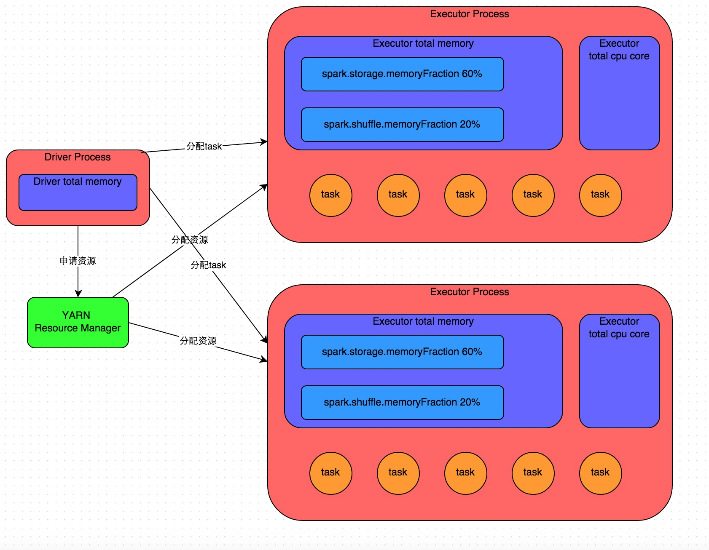

---
### Spark的架构和组件？
**spark架构，运行机制，组件**
1. Driver：是我们写的主程序，会解析代码生成DAG图，划分Stage和task，负责作业的提交和调度；
2. Cluster Manager：分配管理集群资源，比如YARN(Yarn resource manager)
3. Worker Node：集群中的worker节点，运行executor进程
4. Executor：worker node上的进程，负责实际执行task任务
5. DAG Scheduler：将一个job作业根据Shuffle拆分成多个Stage，每个stage里面是一个pipeline
6. Task Scheduler：将stage里的task分发给executor执行

7. RDD、DataSet、DataFrame：
- RDD：表示一个弹性分布式数据集合，支持两种操作，Transformation(map,filter,flatMap)、Action(collect,count,saveAsTextFile)，不可变，但是可以通过转换操作生成新的RDD；弹性的，支持自动容错和数据恢复；分布式的，数据分布在多个节点上；可以从HDFS数据源加载数据；
- DataFrame：带有元数据schema，每一列都带有名称和类型，可以认为是RDD+schema的组合。类似于数据库的表，支持SQL操作；高效查询；支持SQL查询；支持DataFrame操作，select,filter,join,groupBy
- DataSet：RDD和DataFrame可以调用toDS转换成DataSet，需要指定case class。类型安全的数据集合，结合了RDD和DataFrame的优点，适合需要类型安全和高性能优化的场景。

**Spark任务执行流程， Spark工作流程**：
1. 首先我们通过Spark-submit提交任务的时候，会指定jar包和主类；
2. 然后会启动Driver进程，执行main函数，会初始化SparkContext，向Cluster manager注册程序，申请需要的executor资源；
3. 当代码执行Action算子操作时会触发job的执行，DAG Scheduler会根据RDD的依赖关系生成DAG图，根据宽依赖Shuffle划分成多个stage；
4. 每个stage对应一个taskset，taskset里有很多task。Task Scheduler会把taskset中的task分发给executor；
5. 最后就是executor读取数据执行具体的task任务



**Job，Stage，Task区别**：
1. Job是一个完整的计算任务，包含多个Stage
2. Stage包含多个Task，表示一个阶段
3. Task是运行在Executor上的实际最小执行单元

---
### spark的内存管理
一般有driver进程和executor进程，driver进程中比较简单，主要分析executor内的内存。
executor的内存是建立在JVM内存之上，堆内内存是由JVM直接管理，堆外内存直接向操作系统进行内存的申请和释放。

---
### 列举spark中的transformation算子和action算子
1. transformation算子
 - map:对rdd内的元素进行函数操作映射为另一个rdd，一对一
 - flatMap：将迭代器返回的内容一起构成一个新的rdd，一对多
 - filter
 - groupByKey
 - reduceByKey：在shuffle之前会进行预聚合
 - sortByKey
2. action算子
 - reduce：将所有元素聚合成单个值，比如累加，乘法
 - collect：将 RDD中的所有元素收集到Driver程序的内存中，返回一个数组。可能导致driver的OOM
 - first
 - take
 - aggregate：接收一个初始值，和两个函数，对分区内的数据基于初始值使用第一个函数聚合；对分区之间的数据基于初始值使用第二个函数聚合。
 - countByKey
 - foreach
 - saveAsTextFile

transformation和action算子有什么区别？
1. transformation是得到一个新的RDD，方式很多，比如从数据源生成一个新的RDD，从RDD生成一个新的RDD
2. action是得到一个值，或者一个结果

> 所有的transformation都是采用的懒策略，就是如果只是将transformation提交是不会执行计算的，计算只有在action被提交的时候才被触发。

---
### 使用Spark有什么需要注意的地方？
1. 内存管理：Spark依赖内存，配置集群的内存设置是很重要的
 - 配置合理的Executor和Driver内存大小(通过spark.executor.memory和spark.driver.memory)
 - 尽量减少Shuffle操作：控制Shuffle操作的数量，因为Shuffle会消耗大量内存
 - 选择合适的序列化：Spark使用序列化在集群节点间传输数据，使用Kryo序列化(spark.serializer=org.apache.spark.serializer.KryoSerializer)减少序列化和反序列化的开销
2. 数据分区：Spark将数据分区到集群的不同的节点上，并行处理，理解数据是怎么分区的，怎么控制分区实现最优性能表现
 - 确保分区数量合理。分区过多会导致过多的任务调度开销；分区过少会降低并行度；
 - 使用repartition或coalesce调整分区数，但要注意repartition会触发Shuffle，而coalesce不会
 - 避免数据倾斜，即某些分区的数量远大于其他分区。可以通过自定义分区器或预处理数据来缓解。
3. Shuffle操作
 - 尽量减少Shuffle操作(避免不必要的groupByKey和join)
 - 使用reduceByKey替代groupByKey，因为reduceByKey会在Map端进行部分聚合
 - 调整Shuffle参数，例如spark.shuffle.partitions默认值为200，可以根据数据规模调整
4. 使用高效的数据存储格式：比如Parquet、Avro、ORC，这些支持列式存储和压缩，使用HDFS
5. 调整合适的并行度：每个CPU核心对应2~4个任务，调整spark.default.parallelism和spark.sql.shuffle.partitions优化并行度
6. 利用广播变量来优化小表join大表的场景。
7. 缓存：Spark会缓存数据到内存，理解缓存是怎么工作的，并且什么时候需要使用缓存
8. 资源分配：使用YARN管理资源。Spark允许为特定任务分配资源。理解怎么分配资源

---
### 有没有遇到spark任务调优问题？
**会有哪些问题：**
- 某个节点OOM了；
- 执行时间很慢；

**问题如何解决：**
- 查看task执行的日志，耗时、数据量。
- 然后判断是发生了什么问题，是数据倾斜、还是网络问题、还是外部IO阻塞的问题。

1. 避免创建重复的RDD
2. 多次使用的RDD可以持久化
3. 尽量避免使用shuffle操作，使用预聚合的shuffle算子，比如reduceByKey
4. 使用高性能的算子，比如用mapPartitions替代map，会一次处理一个partition的数据，而map是一个数据一个数据处理的
5. 使用filter之后，再使用coalesce减少分区数
6. 广播大变量
7. 使用Kryo优化序列化

---
### reduceByKey与groupByKey有什么区别？
1. reduceByKey包含了分组和聚合两个操作，groupByKey只是分组；所以一般groupByKey之后还会接一个map操作，对分组后的每个组进行聚合。
2. 而且reduceByKey在shuffle之前对分区内相同的key的数据集会先进行预聚合，性能会比较高。

```scala
val words = Array("one", "two", "two", "three", "three", "three")
val wordPairsRDD = sc.parallelize(words).map(word => (word, 1))

val wordCountsWithReduce = wordPairsRDD
  .reduceByKey(_ + _)
  .collect()

val wordCountsWithGroup = wordPairsRDD
  .groupByKey()
  .map(t => (t._1, t._2.sum))
  .collect()
```

---
### Spark广播怎么使用？Spark需要join一个大表和一个小表时应该怎么优化使用？

可以把小表数据变成广播变量，这样每个executor都有小表的数据，然后再大表数据处理的时候，根据大表数据的key从小表广播变量里找对应的数据。

1. 将小表广播到集群中所有的节点
```scala
small_table = sc.parallelize([(1, "a"), (2, "b"), (3, "c")])
broadcast_table = sc.broadcast(small_table.collectAsMap())
```

2. 在大表上执行map操作，将小表中的数据与大表中的数据进行join
```scala
large_table = sc.parallelize([(1, "x"), (2, "y"), (3, "z"), (4, "w"), (5, "v")])
result = large_table.map(lambda x: (x[0], (x[1], broadcast_table.value.get(x[0])))).collect()
```

> 在join操作时，也可以手动广播小表，显示调用broadcast(smallDF)函数；spark.sql.autoBroadcastJoinThreshold广播阈值参数设置小表大小阈值；如果小表还是很大，但还是想广播，可以压缩小表；

---
### Spark中的共享变量？
1. 广播变量，在数据在每个节点拷贝一份，只读的，可以减少数据传输。
2. 累加变量Accumulator，可以让多个task操作同一个变量。主要做累加操作。

---
### Repartition和Coalesce关系与区别
都是改变partition数量的，repartition也是调用coalesce的，repartition一定会有shuffle操作，coalesce(numPartitions, shuffle = true)

> 一般增大rdd的partition数量用repartition，减少partition数量时用coalesce。

---
### Spark遇到数据倾斜怎么处理？
数据倾斜：某些分区的数据大于其他分区
(1) 先确认是否存在数据倾斜
 - 先通过Spark UI查看任务执行时间分布，如果某个任务的执行时间远大于其他任务，那么可能有数据倾斜；
 - 使用日志或调试工具查看每个分区的数据量；
 - 在Shuffle操作后查看每个分区的数据量；
```scala
rdd.mapPartitions(iter => Array(iter.size).iterator).collect().foreach(println)
```
(2) 解决数据倾斜方法
1. 调整分区数：
 - 通过repartition或coalesce方法增加分区数量，把数据分散到更多的分区里
 - 调整默认分区数：修改spark.sql.shuffle.partitions参数调整默认分区大小
2. 如果数据集中存在一些热点数据，可以在key上加随机前缀、哈希方法来对key加盐，分散这些key的数据分布，后续操作再删除随机前缀，恢复原始数据。从而避免热点数据集中在同一个分区中的情况。
3. 自定义分区器：通过继承Partitioner类重写getPartition(key: Any):Int方法实现自定义的分区逻辑，更灵活控制数据分布
4. 过滤异常数据：如果数据倾斜是因为有异常数据，比如超大key或脏数据，可以直接过滤这些数据
5. 广播变量：当进行大表与小表的join操作时，可以广播小表数据，避免Shuffle操作。

---
### 数据倾斜？
1. 现象：绝大多数task执行很快，某个task执行很慢
2. 发生原理：在进行shuffle的时候，必须将相同的key拉到同一个节点上处理，比如按key聚合或join操作，此时如果某个数据量很大的话，就会发生数据倾斜。
3. 定位导致倾斜的代码：可以再yarn-cluster上的spark web ui上查看task执行情况，耗时，数据量等。
一般只要看到Spark代码中出现了一个shuffle类算子（比如group by语句），那么就可以判定，以那个地方为界限划分出了前后两个stage。
4. 查看key的分布情况：可以在Spark作业中加入查看key分布的代码，比如RDD.countByKey()。
5. 采用随机前缀：将这个key对应的每条数据加随机前缀，将分散后的key分散到不同节点上，再join一起。

---
### 使用随机前缀解决步骤
1. 将数据集按照某个关键字进行分组，例如按照用户id进行分组
2. 对每个分组的关键字进行随机前缀处理，例如在用户id前添加一个随机字符串
3. 将处理后的数据集进行重新分区，使每个分区中的数据量均匀分布
4. 对每个分区中的数据进行聚合操作，例如求和或计数
5. 将每个分区的结果进行汇总，得到最终的结果

例子：
```scala
import org.apache.spark.sql.SparkSession
import scala.util.Random

object DataSkewHandling {
  def main(args: Array[String]): Unit = {
    // 初始化 SparkSession
    val spark = SparkSession.builder()
      .appName("Data Skew Handling with Random Prefix")
      .master("local[*]")
      .getOrCreate()

    import spark.implicits._

    // 创建一个示例 RDD，模拟数据倾斜
    val data = Seq(
      ("A", 1), ("A", 2), ("A", 3), ("A", 4), ("A", 5),
      ("B", 1), ("B", 2),
      ("C", 1)
    )
    val rdd = spark.sparkContext.parallelize(data)

    // Step 1: 为 Key 添加随机前缀（加盐）
    val saltedRdd = rdd.map { case (key, value) =>
      val salt = Random.nextInt(10) // 随机生成 0~9 的盐
      (s"${salt}_$key", value)     // 将盐与原 Key 拼接
    }

    // Step 2: 执行 shuffle 操作（例如 reduceByKey）
    val aggregatedRdd = saltedRdd.reduceByKey(_ + _)

    // Step 3: 去掉随机前缀，恢复原始 Key
    val resultRdd = aggregatedRdd.map { case (saltedKey, value) =>
      val originalKey = saltedKey.split("_")(1) // 提取原始 Key
      (originalKey, value)
    }

    // Step 4: 再次聚合以得到最终结果
    val finalResultRdd = resultRdd.reduceByKey(_ + _)

    // 输出结果
    finalResultRdd.collect().foreach(println)

    // 关闭 SparkSession
    spark.stop()
  }
}
```

> 注意如果原始key中就有"_"符号，那么在恢复原始key时会出现错误，这个时候可以

> (1)使用key中不存在的字符拼接随机前缀和key；

> (2)使用截取固定长度获取原始key，比如随机前缀是1长度，则获取1后面的字符串为原始key；

---
### spark宽依赖、窄依赖
spark里面有很多函数，比如map、filter、union、join、groupByKey、partitionBy这些，spark中使用的数据集是RDD，就是说这些函数是作用在RDD数据上的。

- 窄依赖就是指父RDD的每个分区最多只被一个子RDD分区使用，比如一个父RDD对应一个子RDD，就是一对一的依赖关系，不需要跨多个节点进行数据shuffle；
  对应的函数比如有map(对每个元素应用一个函数)、filter(根据条件过滤元素)、union(合并两个RDD)这些。父RDD的分区最多被一个子RDD分区所用。
- 宽依赖就是指父RDD的一个分区可能被多个子RDD分区使用，或者一个子RDD分区依赖父RDD的多个分区，需要跨多个节点重新分配数据。对应的函数有groupByKey，partitionBy这些。

> 可以利用缓存尽量减少不必要的宽依赖。

---
### Spark SQL

---
### Spark的优化和调优？数据倾斜、并行度、数据压缩、缓存
executor memory：

number of executors：

Spark有很多可以调优的配置参数，以下是一些常用的参数：
1. spark.driver.memory：设置Driver进程的内存大小，可以根据具体应用场景进行调整。
2. spark.executor.memory：设置每个Executor进程的内存大小，可以根据机器配置和任务需求进行调整。
3. spark.executor.instances：设置Executor进程的数量，可以根据集群的资源和任务的并行度需求进行调整。
4. spark.serializer：设置序列化器，可以选择Kryo或Java序列化器，根据具体应用场景进行选择。
5. spark.shuffle.memoryFraction：设置Shuffle操作使用的内存比例，默认为0.2，可以根据具体应用场景进行调整。
6. spark.default.parallelism：设置默认并行度，即RDD的分区数，默认为CPU核心数，可以根据集群规模和任务复杂度进行调整。
7. spark.sql.shuffle.partitions：设置SQL操作的Shuffle的分区数，默认为200，可以根据数据大小和集群规模进行调整。
8. spark.storage.blockManagerHeartBeatMs：设置BlockManager的心跳间隔时间，可以根据集群的网络延迟和任务的数据交互量进行调整。
9. spark.streaming.blockInterval：设置Streaming数据块的时间间隔，默认为200ms，可以根据具体应用场景和数据流的特点进行调整。
10. spark.streaming.kafka.maxRatePerPartition：设置每个分区每秒读取的最大数据量，默认为无限制，可以根据数据量和集群规模进行调整。

以上是Spark中常用的一些调优参数，可以根据具体场景进行调整，以达到最优的性能和效果。

---
### Spark shuffle是什么？哪些操作会触发shuffle？为什么shuffle对性能影响巨大？
本质是数据重分布过程，把多个节点上的同一个key，拉取到同一个节点上，进行聚合或join操作，比如reduceByKey，join操作，都会触发shuffle操作。

会触发shuffle的操作：
1. repartition
2. 聚合操作：groupByKey,reduceByKey,aggregateByKey
3. 关联操作：join,cogroup
4. 去重和排序：distinct,sortByKey

以下操作不会触发shuffle：
1. 转换操作：map,filter,flatMap
2. 就地压缩：coalesce(shuffle=false)
3. 合并操作：union

shuffle影响性能的核心原因
1. 磁盘IO：中间结果需写入磁盘
2. 网络传输：数据需跨节点传输
3. 序列化开销：数据序列化和反序列化
4. 内存压力：聚合操作需大量内存

---
### 为什么有shuffle
**为什么会有shuffle：**
因为RDD是分布式数据集，数据分布在多个节点上，如果要执行聚合就得把其他节点上的数据通过网络拉取到一起进行操作。

---
### 描述Spark Shuffle的演变历程，并比较不同shuffle实现的优缺点
上游的stage的task会对数据的key执行hash算法，把相同的key都写到一个磁盘文件中。

1. 第一代：Hash-based Shuffle
- 工作原理：每个Map任务为每个Reduce任务创建一个文件
- 文件数量：M*R个文件
- 优点：实现简单，不需要排序
- 缺点：产生大量小文件，导致严重的文件系统压力和内存开销
2. 第二代：Sort-based Shuffle
- 工作原理：每个Map任务只生成一个数据文件和一个索引文件
- 文件数量：2*M个文件
- 优点：减少文件数量，缓解文件系统压力
- 缺点：额外的排序开销，内存使用增加
3. 第三代：Tungsten-Sort Shuffle
- 工作原理：利用堆外内存和二进制格式处理数据
- 优点：内存使用更高效，GC压力减小，排序性能更好
- 缺点：实现复杂，对序列化有特定要求

---
### 描述Shuffle的write和read过程
Shuffle Write流程：
1. Map任务执行：首先执行Map阶段的计算逻辑
2. 内存缓冲：结果写入内存缓冲区(由spark.shuffle.file.buffer控制，默认32KB)
3. 排序分区：在Sort-based Shuffle中，对缓冲数据按partition ID进行排序
4. 溢出写入：当内存缓冲区达到阈值时，溢出到磁盘
5. 合并文件：Map任务完成时，所有溢出文件合并为一个文件
6. 生成索引：创建索引文件，记录每个分区的偏移量

Shuffle Read流程：
1. 获取数据位置：Reduce任务从MapOutputTracker获取数据位置信息；
2. 拉取数据：通过BlockManager和TransferService拉取远程数据
3. 聚合处理
4. 外部排序：如果数据过大无法放入内存，使用外部排序
5. 结果计算：完成Reduce逻辑计算并输出结果

---
### Spark Shuffle的关键配置参数有哪些
1. spark.shuffle.file.buffer:Map端写缓冲区大小
2. spark.reducer.maxSizeInFlight:Reduce端单次请求最大数据量
3. spark.shuffle.io.maxRetries:Shuffle读取失败最大重试次数
4. spark.shuffle.io.retryWait:重试等待时间
5. spark.shuffle.compress:是否压缩Shuffle输出
6. spark.shuffle.spill.compress:是否压缩溢出文件
7. spark.shuffle.service.enabled:是否启用外部shuffle服务
8. spark.sql.shuffle.partitions:SQL操作的shuffle分区数
9. spark.shuffle.sort.bypassMergeThreshold:绕过排序的分区阈值

---
### 如何识别Spark Shuffle过程中的数据倾斜问题？
1. 观察任务执行时间
- Spark UI中查看Stage的任务执行时间分布
- 如果某些任务执行时间远大于平均水平(如10倍以上)
2. 检查Shuffle数据量
- 查看Spark UI中的Shuffle Read Size
- 观察各任务读取数据量是否严重不均
3. 分析Key分布：
- 对原始数据或抽样数据统计Key的分布情况
- 采样分析: rdd.map(x => (x._1, 1)).countByKey()

如何处理数据倾斜：
1. 预聚合+二次聚合

2. 随机前缀+扩容

3. 使用广播变量优化Join：

4. 使用Spark SQL的AQE功能
