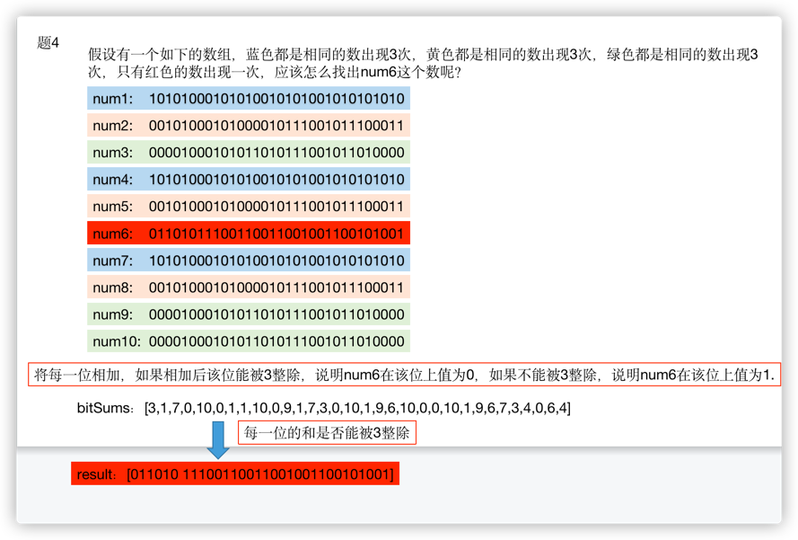

  
# 面试题4：只出现一次的数字

---

> 题目：输入一个整数数组，数组中只有一个数字出现了一次，而其他数字都出现了3次。请找出那个只出现一次的数字。例如，如果输入的数组为[0,1,0,1,0,1,100]，则只出现一次的数字就是100。


---

## 思路

这种题目，暴力解法就是计算数组中每一种数出现的次数，可以用一个map保存，然后在遍历map，找到出现次数为1的那个数。这种解法的时间复杂度为O(n),并且还要map保存，最后还要再遍历一遍map。

用位运算来解决的思路就是，将所有数的每一位相加，再判断每一位相加后的数是否能被3整除。



需要注意的几点是：

- 遍历到num时，如何获取num的二进制表示中第i位的值是0还是1呢？(num>>(31-i))&1
- 得到所有位和的数组bitSums之后，如何得到result呢？从第0位开始到第31位，依次赋值，result = (result << 1) + bitSums[i] % 3;

最后的代码如下：

```Java
public int singleNumber(int[] nums) {
    int[] bitSums = new int[32];
    for (int i = 0; i < nums.length; i++) {
        for (int j = 0; j < 32; j++) {
            bitSums[j] += (nums[i] >> (31-j)) & 1;
        }
    }
    int result = 0;
    for (int i = 0; i< 32; i++) {
        result = (result << 1) + bitSums[i] % 3;
    }
    return result;
}
```
