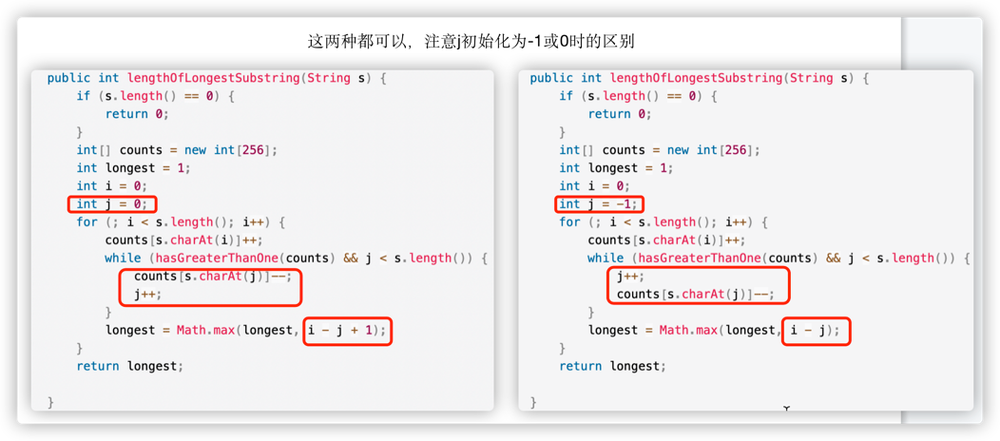
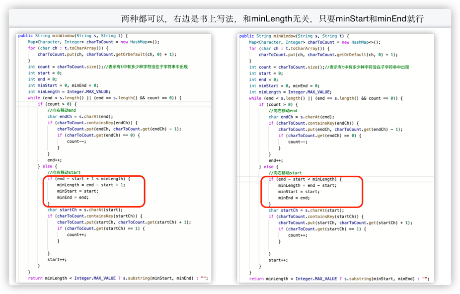
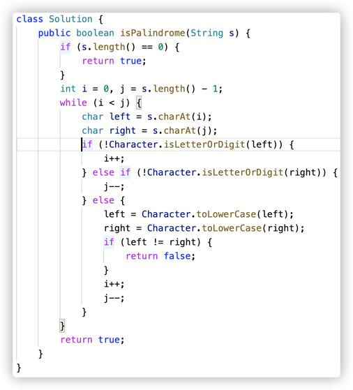
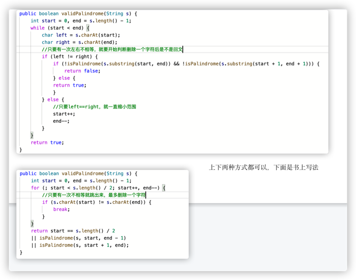

# 双指针  

## 面试题14：字符串中的变位词


### 思路

---

## 面试题15：字符串中的所有变位词


### 思路

---

## 面试题16：不含重复字符的最长子字符串

### 思路



---

## 面试题17：包含所有字符的最短字符串

### 思路



---

# 回文字符串

---

## 面试题18：有效的回文

### 思路



---

## 面试题19：最多删除一个字符得到回文

### 思路



---

## 面试题20：回文子字符串的个数

### 思路

分别计算以每个字符和每个字符中间的空格为中心的回文个数，全部相加。

```Java
class Solution {
    public int countSubstrings(String s) {
        if (s == null || s.length() == 0) {
            return 0;
        }
        int count = 0;
        for (int i = 0; i < s.length(); i++) {
            count += countPalindrome(s, i, i);
            count += countPalindrome(s, i, i+1);
        }
        return count;
    }
    int countPalindrome(String s, int start, int end) {
        int count = 0;
        for (;start >=0 && end < s.length(); start--, end++) {
            if (s.charAt(start) == s.charAt(end)) {
                count++;
            } else {
                break;
            }
        }
        return count;
    }
}
```
在计算以start，end为中心能组成多少回文字符串时，countPalindrome方法有两种写法


