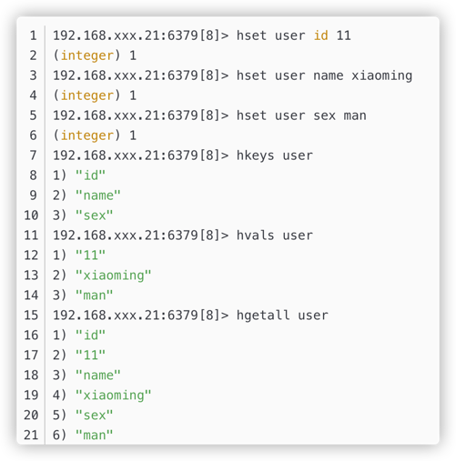
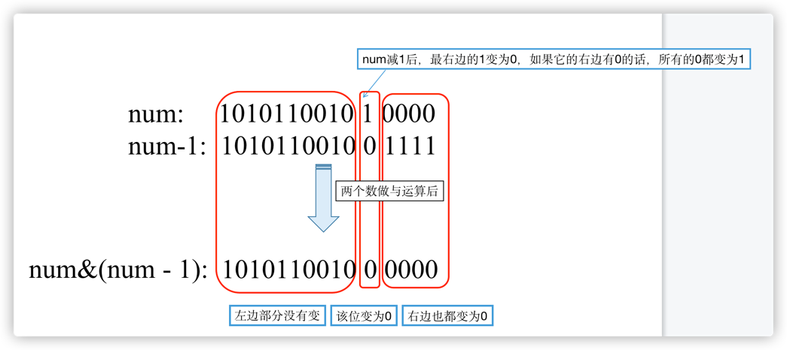
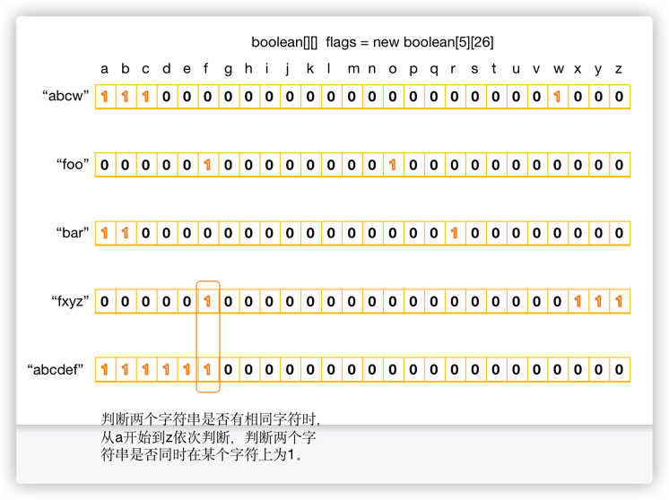
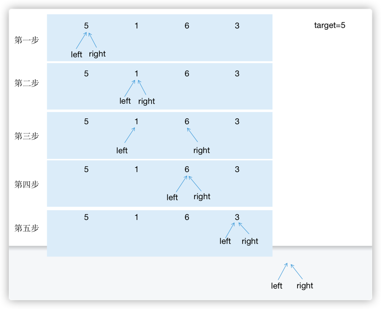
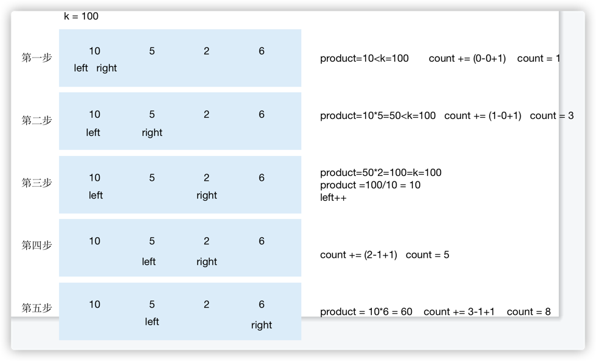
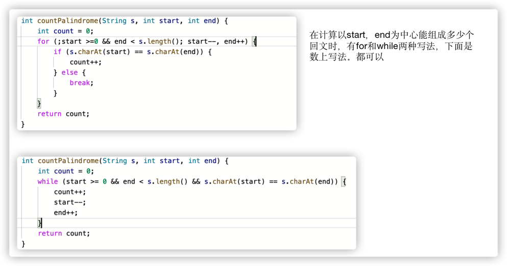
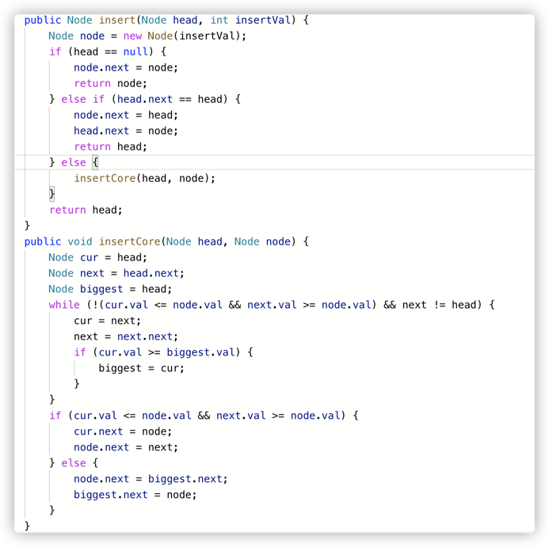
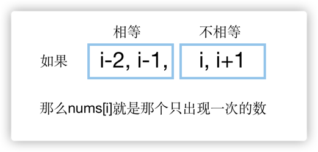
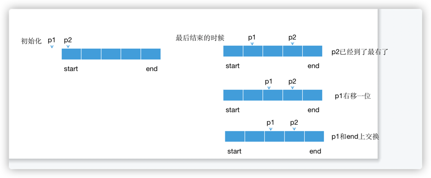

## 面试题1： 整数除法

### Java中整数的四种基本类型

- byte：1字节 8位   (-2^7^ ~ 2^7^-1)
- short：2字节 16位 (-2^15^ ~ 2^15^-1)
- int：4字节 32位   (-2^31 ~ 2^31-1)
- long：8字节 64位  (-2^63 ~ 2^63-1)

### 整数除法

> 输入2个int型整数，它们进行除法运算并返回商，要求不得使用乘号'*'、除号'/'及求余符号'%'。当发生溢出时，返回最大当整数值。假设除数不为0。例如，输入15和2，输出15/2当结果，即7。

- int型正整数的最大值是0x7fffffff = 2^31-1
- int型正整数的最小值是0x00000001 = 1
- int型负整数的最大值是0xffffffff = -1
- int型负整数的最小值是0x80000000 = -2^31

对于15/2=7这个例子，除法可以理解为求15可以由最多多少个2相加组成。最简单的解法就是一个个试。

但是这样的时间复杂度是O(n)，可不可以减少试的次数，最好试完一个2相加后下一个直接试七个2相加，这肯定没法做到，因为计算七个2相加时我们没法直接知道七个2相加就是12+2，12这个值没法在计算一个2相加时就得到。
所以回过头来看，当我们计算完一个2相加后得到的值是2，之后可以计算两个2相加即2+2=4，得到4之后就可以试四个2相加即4+4=8，之后再试八个2相加即8+8...如下图所示。

通过这个跳跃的试探我们知道15是介于四个2和八个2之间组成的，中间的五个2、六个2、七个2我们都没有试过，所以还要继续查找。这个时候我们已经知道了15肯定是比四个2大的，所以用15-（四个2）=7，继续看看剩下的7是由最多多少个组成，这就和上面同一个流程，因为刚刚计算
15-（四个2）=7的时候已经减去了4个2，所以最终的结果就是4+7/2。
同理计算7/2的时候也是从一个2相加开始试探：

所以7/2的值就是在2和4之间，要么是2要么是3。所以7/2=2+(剩下的7-4=3能由多少个2组成)。

最后剩下3-2=1，继续试探1能由多少个2组成，因为1<除数2，所以1最多由0个2组成。
至此，将上面每个阶段2的个数相加就是结果4+2+1+0=7。

最后的代码如下：
```java
//a,b为正整数的情况
public int divide1(int a, int b) {
    int result = 0;
    while (a>=b) {
        int value = a;
        int quotient = 1;
        while (a >= value + value) {
            value += value;
            quotient += quotient;//以1，2，4，8，16..的顺序试探
        }
        result += quotient;
    }
    return result;
  }
```

但是还没有结束，上面的代码只能适用与a和b都是正整数的情况，如果一方为整数，另一方为负数，那上面代码里几处大于小于号的判断就会很麻烦，所以我们要保证a和b都是正整数。
因此在使用divide方法前需要将a和b都转化为同号。当一个为正号，一个为负号的时候，就需要对最终结果修改符号了。

```java

public int divide(int a, int b) {
    int negative = 2;
    if (a<0) {
        a = -a;
        negative--;
    }
    if (b<0) {
        b = -b;
        negative--;
    }
    return negative == 1 ? -divide1(a, b) : divide1(a, b);
  }
```

上面negative初始为2，如果a，b都为正数，negative=2，如果其中一个为负数，negative=1，如果都为负数，negative=0。所以用negative是否等于1来判断a和b是否有一个为负数。

但是还没有结束，因为int最小的负数是-2^31,int最大的正数是2^31-1。此时将-2^31转化为正数2^31就会出现溢出，所以没法将负数转化为正数计算。既然没法都转化为正数，这个时候就可以将a，b两个数都转化为负数来计算，上面的代码就需要改为下面的形式：
```java
public int divide(int a, int b) {
    int negative = 2;
    if (a > 0) {
      a = -a;
      negative--;
    }
    if (b > 0) {
      b = -b;
      negative--;
    }
    return negative == 1 ? -divideForNegative(a, b) : divideForNegative(a, b);
}

//两个负整数相除
public static int divideForNegative(int a, int b) {
    int result = 0;
    while(a <= b) {
        int value = b;
        int quotient = 1;
        while(a <= value + value) {
            quotient += quotient;
            value += value;
        }
        result += quotient;
        a = a - value;
    }
    return result;
}
```

有一种特殊情况就是题目说的如果a=-2^31,b=-1,最后的计算结果是2^31,但int最大只能表示2^31-1,所以会溢出的，应该在方法开始的地方判断这个情况。
还有一种特殊情况就是如果结果是-2^31,即a=-2^31，b=1的时候，从1个-1开始试起：


所以最终的代码如下：

```java
public int divide(int a, int b) {
    if (a==0x80000000 && b==-1) {
        return Integer.MAX_VALUE;
    } 
    int negative = 2;
    if (a > 0) {
      a = -a;
      negative--;
    }
    if (b > 0) {
      b = -b;
      negative--;
    }
    return negative == 1 ? -divideForNegative(a, b) : divideForNegative(a, b);
}

//两个负整数相除
public static int divideForNegative(int a, int b) {
    int result = 0;
    while(a <= b) {
        int value = b;
        int quotient = 1;
        while(value >= 0xc0000000 && a <= value + value) {
            quotient += quotient;
            value += value;
        }
        result += quotient;
        a -= value;
    }
    return result;
}
```


## 面试题2：二进制加法


> 输入两个表示二进制的字符串，请计算它们的和，并以二进制字符串的形式输出。例如，输入的二进制字符串分别是"11"和"10"，则输出"101"。

对于二进制加法，先将两个参数右对齐，从右开始向左，取a的字符，取b的字符，然后在判断该位上应该得到'0'还是'1'，由于还有进位要处理，所以还要用一个变量carry表示进位。
这里需要记住的两个点是：
- 对于循环条件，一开始可能会认为应该用下面的方式，i从0开始循环直到长度的最小值。但这种不太简练还繁琐，书上做法是，从右往左遍历，对于短的字符串，如果下标已经超过了最前面，直接用'0'补齐就可以了。


- 第二个点是，假设取出来a中字符是digitA，b中字符是digitB，应该如何确定和中结果字符以及进位分别是多少呢？
  

所以最终的代码如下：

```java
public static String addBinary(String a, String b) {
        StringBuffer sb = new StringBuffer();
        int i = a.length() - 1;
        int j = b.length() - 1;
        int carry = 0;
        while (i >= 0 || j >= 0) {
            int digitA = i >= 0 ? a.charAt(i--) - '0' : 0;
            int digitB = j >= 0 ? b.charAt(j--) - '0' : 0;
            int sum = digitA + digitB + carry;
            carry = sum >= 2 ? 1 : 0;
            sum = sum >= 2 ? sum - 2 : sum;
            sb.append(sum);
        }
        if (carry == 1) {
            sb.append(carry);
        }
        return sb.reverse().toString();
    }
```


## 面试题3：前n个数字二进制形式中1的个数


> 题目：输入一个非负数n，请计算0到n之间每个数字的二进制形式中1的个数，并输出一个数组。例如，输入的n为4，由于0、1、2、3、4的二进制形式中1的个数分别为0、1、1、2、1，因此输出数组[0,1,1,2,1]


### 思路

这个题目让我想起了校招面试华为时候面试官出的一道题，就是求一个数的二进制表示中有多少个1，当年太菜了，竟然一点都没有想到用二进制来做。这道题目就是用一个for循环，对于每一个数，计算该数的二进制表示有多少个1组成，然后加入对应数组中。   
先看一下最开始我能想到的方法：如何计算一个数的二进制表示中有多少个1组成这个问题。应该从右到左，判断每一位是不是1。那如何求一个数num的最后一位二进制表示呢？用1和num做与运算，num&1，如果最后一位是0，结果就是0，如果最后一位是1，结果就是1。那么接下来如何把最后一位删掉呢？到这里我就想不出来了。那既然没有什么办法判断删掉num的最后一位，那就用num与10做与运算，num&(10)，
这样结果为00的话说明num倒数第二位是0，结果为10的话num倒数第二位是1。然后再用100判断倒数第三位。1000判断倒数第四位...

这种做法的问题是
1.首先每一位都要做与判断该位是不是1，则判断一个数num的时间复杂度就是O(n),n位num的二进制表示长度；
2.怎么得到1、10、100、1000、10000...呢？

所以这种做法是肯定通过不了的。书上的解法是，依次删除num最右边的1，直到num变为0，说明num中的1都被删除完了，只要判断删除了多少次，就说明num中有多少1。



因此最终代码如下：

```java
public static int[] countBits(int num) {
    int[] result = new int[num + 1];
    for (int i = 0; i <= num; i++) {
        int j = i;
        while (j != 0) {
            result[i]++;
            j = j & (j - 1);
        }
    }
    return result;
}
```

这种解法的时间复杂度是O(kn),n表示题目中n数，k表示每个数字平均有多少个1。

还有一种时间复杂度更低的解法，由于我们已经知道num&(num-1)就是num去掉最后一个1所得到的，所以num的1的个数肯定是num&(num-1)的1的个数+1。因此result[num] = result[num&(num-1)] + 1;

- 需要注意一点的是，由于每求一个result[num],都是要求result[num&(num-1)],所以循环的时候num要从1开始算起，如果从0开始算，就是得到result[0]=result[0&(-1)]+1,会出错。

最终代码如下：
```Java
public static int[] countBits(int num) {
    int[] result = new int[num + 1];
    for (int i = 1; i <= num; i++) {
        result[i] = result[i & (i-1)] + 1;
    }
    return result;
}
```
这种时间复杂度是O(n)


## 面试题4：只出现一次的数字

> 题目：输入一个整数数组，数组中只有一个数字出现了一次，而其他数字都出现了3次。请找出那个只出现一次的数字。例如，如果输入的数组为[0,1,0,1,0,1,100]，则只出现一次的数字就是100。


### 思路

这种题目，暴力解法就是计算数组中每一种数出现的次数，可以用一个map保存，然后在遍历map，找到出现次数为1的那个数。这种解法的时间复杂度为O(n),并且还要map保存，最后还要再遍历一遍map。

用位运算来解决的思路就是，将所有数的每一位相加，再判断每一位相加后的数是否能被3整除。


需要注意的几点是：

- 遍历到num时，如何获取num的二进制表示中第i位的值是0还是1呢？(num>>(31-i))&1
- 得到所有位和的数组bitSums之后，如何得到result呢？从第0位开始到第31位，依次赋值，result = (result << 1) + bitSums[i] % 3;

最后的代码如下：

```java
public int singleNumber(int[] nums) {
    int[] bitSums = new int[32];
    for (int i = 0; i < nums.length; i++) {
        for (int j = 0; j < 32; j++) {
            bitSums[j] += (nums[i] >> (31-j)) & 1;
        }
    }
    int result = 0;
    for (int i = 0; i< 32; i++) {
        result = (result << 1) + bitSums[i] % 3;
    }
    return result;
}
```

## 面试题5：单词长度的最大乘积
> 输入一个字符串数组words，请计算不包含相同字符的两个字符串words[i]和words[j]的长度乘积的最大值。
> 如果所有字符串都包含至少一个相同字符，那么返回0。假设字符串中只包含英文小写字母。
> 例如，输入的字符串数组words位["abcw","foo","bar","fxyz","abcdef"],数组中
> 的字符串"bar"与"foo"没有相同的字符，它们长度的乘积为9。"abcw"与"fxyz"也没有相同的字符，它们长度的乘积为16，
> 这是该数组不包含相同字符的一对字符串的长度乘积的最大值。


### 思路

### 解法1

首先直观想法是对于每个字符串，判断它与另一个字符串是否有相同字符，如果没有，则更新长度乘积最大值。
所以问题就是如何判断两个字符串有没有相同字符，解法1的思路是用一个26长度的boolean型数组表示26个字母在
字符串1中出现情况，然后用字符串1的数组和字符串2的数组进行每一位的比较，如果每一位都不同时为1，说明两个字符串
没有重复的字符。




代码如下：

```java
    public static int maxProduct(String[] words) {
        boolean[][] flags = new boolean[words.length][26];
        for (int i = 0; i < words.length; i++) {
            for (int j = 0; j < words[i].length(); j++) {
                char ch = words[i].charAt(j);
                flags[i][ch-'a'] = true;
            }
        }

        int result = 0;
        for (int i = 0; i < words.length; i++) {
            for (int j = i; j < words.length; j++) {
                //这里把k的定义放到for循环外面来，方便for循环之后后面的if判断，要学会这种写法
                int k = 0;
                for (; k < 26; k++) {
                    if (flags[i][k] && flags[j][k]) {
                        break;
                    }
                    
                }
                if (k == 25) {
                  int prod = words[i].length() * words[j].length();
                  result = Math.max(result, prod);
                }
            }
        }
        return result;
    }
```


### 解法2


## 面试题6：排序数组中的两个数字之和

> 题目：输入一个递增排序的数组和一个值k，请问如何在数组中找出两个和为k的数字并返回它们的下标？假设
> 数组中存在且只存在一对符合条件的数字，同时一个数字不能使用两次。例如，输入数组[1,2,4,6,10],k的值为8，
> 数组中的数字2与6的和为8，它们的下标分别是1月3。


### 解法1

因为数组是已经排好序了的，所以可以用双指针下标，i指向最左边，j指向最右边，
如何和比k大，j向左移；如果和比k小，i向右移；循环条件i<j;
这种做法需要依赖一些题目条件：
- 首先数组一定要是事先拍好序的，如果没拍好序，就没法根据和与k的大小移动两个指针了。
- 另外题目只要求输入一对和为k的下标就行，如果数组中有两个数相同，则可能会有多组符合条件的结果，如果要求把所有结果都输出应该如何解决。

代码如下：

```java
public int[] twoSum(int[] numbers, int target) {
    int i = 0;
    int j = numbers.length - 1;
    while(i < j && numbers[i] + numbers[j] != target) {
        if (numbers[i] + numbers[j] < target) {
            i++;
        } else {
            j++;
        }
    }
    return new int[]{i, j};
}
```

### 解法2

另外一种解法就是针对数组没有排序的情况，应该如何找出。当然也可以一开始就先对数组排序，在用上面对方法也行。
另一种解法就是遍历每一个数，同时用一个map数组保存每一个出现的数字和它对应的下标，当遍历到num数字时，判断map中时候存在值为（target-num）的数，
用map.containsKey(target-num)这个方法查找，如果有，就说明数组中有一个数和num相加，和为target。


## 面试题7：数组中和为0的3个数字
> 输入一个数组，如何找出数组中所有和为0的3个数字的三元组？需要注意的是，返回值中不得包含重复的三元组。
> 例如，在数组[-1,0,1,2,-1,-4]中有两个三元组的和为0，它们分别是[-1,0,1]和[-1,-1,2].


### 思路

需要这里题目的几点：1. 数组没有排序；2.数组中可能有重复的数字，所以可能会有重复的符合条件的三元组。
书上的做法是，先对数组进行排序，然后先固定遍历到一个数x，然后对后面的数组应用双指针查找和为-x的二元组，
由于可能有重复的值，所以每次移动指针的时候，一定要跳过和当前数相同的数。
需要注意的点是：
- 找到符合条件的三元组后如何跳过相同的值；
- 如何随时记录符合条件的三元组

> 每次做这种题的时候都不知道怎么记录结果集，应该用嵌套列表List<List<Integer>>来随时保存符合条件的结果。


```java
public static List<List<Integer>> threeSum(int[] nums) {
    List<List<Integer>> result = new LinkedList<>();
    if (nums.length >= 3) {
        Arrays.sort(nums);
        // 这里不要用for循环，应该用for循环不好控制i的增加。
        int i = 0;
        while (i < nums.length - 2) {
            twoSum(nums, i, result);
            int tmp = nums[i];
            while (i < nums.length -2 && nums[i] == tmp) {
                i++;
            }
        }
    }
    return result;
}
public static void twoSum(int[] nums, int i, List<List<Integer>> result) {
    int j = i + 1;
    int k = nums.length - 1;
    while (j < k) {
        if (nums[i] + nums[j] + nums[k] == 0) {
            result.add(Arrays.asList(nums[i], nums[j], nums[k]));
            //只有出现符合条件的三元组时，才判断跳过重复值
            int tmp = nums[j];
            while (j<nums.length && tmp == nums[j]) {
                j++;
            }
        }
        // 如果不符合条件就不用判断跳过相同值了
        else if (nums[i] + nums[j] + nums[k] < 0) {
            j++;
        } else {
            k--;
        }
    }
}
```

## 面试题8：和大于或等于k的最短子数组

> 输入一个正整数组成的数组和一个正整数k，请问数组中和大于或等于k的连续子数组的最短长度是多少？
> 如果不存在所有数字之和大于或等于k的子数组，则返回0。
> 例如，输入数组[5,1,4,3],k的值为7，和大于或等于7的最短连续子数组是[4,3],因此输出它的长度为2。


### 思路

用两个指针表示一个子数组的区间，当区间内的和大于或等于target时，left指针右移，更新minLength；



- 连续子数组
- 最短长度，也就是说数组内的和刚刚好大于或等于k值。
- 这种用两个指针伸缩式的移动窗口解法一定要记住！！！！先定义left=0，然后对right一个for循环，循环中加一个能让left一直++的条件的while条件循环

代码：

```java
public int minSubArrayLen(int target, int[] nums) {
    int minLength = Integer.MAX_VALUE;
    int left = 0;
    int sum = 0;
    for (int right = 0; right < nums.length; right++) {
        sum += nums[right];
        while (left <= right && sum >= target) {
            minLength = Math.min(minLength, right - left + 1);
            sum -= nums[left];
            left++;
        }
    }
    return minLength == Integer.MAX_VALUE ? 0 : minLength;
}
```


## 面试题9：乘积小于k的子数组
> 输入一个由正整数组成的数组和一个正整数k，请问数组中有多少个数字乘积小于k的连续子数组？例如，
> 输入数组[10,5,2,6]，k的值为100，有8个子数组的所有数字的乘积小于100，它们分别是[10],[5],[2],[6],[10,5],[5,2],[2,6],[5,2,6].


### 思路

还是用双指针，left到right之间的数全部相乘，如果乘积大于等于k，应该将left++，知道left到right之间的连续数组的乘积小于k，当小于k时，说明left到right之间的以right为右边的所有连续子数组的乘积都是小于k的，
right-left+1个子数组都是符合条件的连续子数组，例如


整个遍历过程如下：


## 面试题10：和为k的子数组

> 输入一个整数数组和一个整数k，请问数组中有多少个数字之和等于k的连续子数组？例如，输入数组[1,1,1],
> k的值为2，有2个连续子数组之和等于2。


### 思路

- 这道题没有强调数组是正整数，所以不可以用双向指针
- 累加数组数字求子数组之和


## 面试题11：0和1个数相同的子数组


### 思路

和面试题10类似，把0的数字当成-1，所以如果一个连续子数组中0和1的个数相同，说明它们的和一定为0。
当遍历到数字num时，得到当前左边和为sum，同时查找前面有没有和也为sum的子数组，如果有，更新最长长度，
更新完长度之后记得不用在把当前的下标和sum对放入map中了。只有当map中没有当前sum值时，才需要
将当前(下标，sum)对加入map中，因为只需要得到最长的子数组长度就行了。


## 面试题12：左右两边子数组的和相等


### 思路

先用一遍循环求所有数字之和，当遍历到下标i时，左边所有数之和为sum，
判断sum - nums[i] == total - sum;如果相等，输出i。


## 面试题13：二维子矩阵到数字之和


### 思路

这个题难点就是如何构建sum矩阵，每次这种+1，-1的就很容易搞错。sum矩阵里的下标都+1。


# 双指针  

## 面试题14：字符串中的变位词


### 思路


## 面试题15：字符串中的所有变位词


### 思路


## 面试题16：不含重复字符的最长子字符串

### 思路


## 面试题17：包含所有字符的最短字符串

### 思路


# 回文字符串


## 面试题18：有效的回文

### 思路


## 面试题19：最多删除一个字符得到回文

### 思路


## 面试题20：回文子字符串的个数

### 思路

分别计算以每个字符和每个字符中间的空格为中心的回文个数，全部相加。

```java
class Solution {
    public int countSubstrings(String s) {
        if (s == null || s.length() == 0) {
            return 0;
        }
        int count = 0;
        for (int i = 0; i < s.length(); i++) {
            count += countPalindrome(s, i, i);
            count += countPalindrome(s, i, i+1);
        }
        return count;
    }
    int countPalindrome(String s, int start, int end) {
        int count = 0;
        for (;start >=0 && end < s.length(); start--, end++) {
            if (s.charAt(start) == s.charAt(end)) {
                count++;
            } else {
                break;
            }
        }
        return count;
    }
}
```
在计算以start，end为中心能组成多少回文字符串时，countPalindrome方法有两种写法




# 链表


### 使用哨兵节点添加或删除节点

给一个链表末尾加上一个节点


删除链表中指定值的某一个节点


## 面试题21 ：删除倒数第k个节点

### 思路


## 面试题22：链表中环的入口节点

### 思路

分两步，先一快一慢得到环中相遇节点；然后另一个从头开始相同步伐走到入口节点。


## 面试题23：两个链表的第1个重合节点

### 思路

leetcode后来增加了测试用例，增加了没有公共节点的情况，所有要主要不能用
原来的方法一直循环，不然后一直循环下去，最后超时。用一个count变量记录循环次数。


## 面试题24：反转链表

### 思路

```java
//方法1：前后指针，用空指针开始，严格来说，这不是头插法。但是书上是用这种解法
class Solution {
    public ListNode reverseList(ListNode head) {
        ListNode pre = null;
        ListNode cur = head;
        while(cur != null) {
            ListNode next = cur.next;
            cur.next = pre;
            pre = cur;
            cur = next;
        }
        return pre;
    }
}
```

```java
//这种才是真正的头插法
class Solution {
    public ListNode reverseList(ListNode head) {
        ListNode dummy = new ListNode(-1);
        ListNode node = head;
        while (node != null) {
            ListNode next = node.next;
            node.next = dummy.next;
            dummy.next = node;
            node = next;
        }
        return dummy.next;
    }
}
```
```java
//这种是递归解法
class Solution {
    public ListNode reverseList(ListNode head) {
        if (head == null) {
            return null;
        }
        if (head.next == null) {
            return head;
        }
        ListNode next = reverseList(head.next);
        head.next.next = head;
        head.next = null;
        return next;
    }
}
```


## 面试题25 链表中的数字相加

### 思路

反转后的两个链表相加的时候，要用哨兵节点保存头节点；还要记住进位的计算方式


## 面试题26 重排链表

### 思路

先对半分，获得第二办的头节点；把第二半的链表反转；用prev指针辅助重排。
最重要的就是下面的将两个链表重排操作


## 面试题27 回文链表

### 思路

先对半分，将第二个链表反转，再一个个判断节点是否相同。要注意的是：

- 对半分的时候，链表如果有奇数个节点，那么第一个链表的最后一个多出来的节点就不要了。


## 面试题28 展开多级双向链表

### 思路


## 面试题29 排序的循环链表

### 思路
循环判断当前节点和下一节点，是不是可以插在当前节点和下一节点之间，并且在循环过程中记录链表中最大值；
如果循环一圈之后都不能插在当前节点和下一节点之间，说明新加入节点的是最大值或最小值，需要插在最大值和最小值之间，
这个时候就利用记录下来的最大值节点插入。




## 面试题30 插入、删除和随机访问都是O(1)的容器

### 思路

```java
class RandomizedSet {
    HashMap<Integer, Integer> numToLocation;
    ArrayList<Integer> nums;//数组用ArrayList实现

    /** Initialize your data structure here. */
    public RandomizedSet() {
        numToLocation = new HashMap<>();
        nums = new ArrayList<>();
    }
    
    /** Inserts a value to the set. Returns true if the set did not already contain the specified element. */
    public boolean insert(int val) {
        if (numToLocation.containsKey(val)) {
            return false;
        } else {
            nums.add(val);
            numToLocation.put(val, nums.size() - 1);
            return true;
        }
    }
    
    /** Removes a value from the set. Returns true if the set contained the specified element. */
    public boolean remove(int val) {
        if (!numToLocation.containsKey(val)) {
            return false;
        } else {
            //删除一个元素的时候要注意，数组将最后一个元素和待删除元素交换位置，然后直接删除最后一个位置上的元素就行。避免后面的元素移动位置。
            int location = numToLocation.get(val);
            numToLocation.put(nums.get(nums.size() - 1), location);
            numToLocation.remove(val);
            nums.set(location, nums.get(nums.size() - 1));
            nums.remove(nums.size() - 1);
            return true;
        }
    }
    
    /** Get a random element from the set. */
    public int getRandom() {
        Random random = new Random();
        int r = random.nextInt(nums.size());
        return nums.get(r);
    }
}

/**
 * Your RandomizedSet object will be instantiated and called as such:
 * RandomizedSet obj = new RandomizedSet();
 * boolean param_1 = obj.insert(val);
 * boolean param_2 = obj.remove(val);
 * int param_3 = obj.getRandom();
 */
```


## 面试题31： 最近最少使用缓存

### 思路

用哈希表和双向链表实现，哈希表中键是key，值是双向链表的节点；双向链表中一个节点有key，value，next，prev指针。
- 插入元素的时候，如果缓存中有，直接将该节点移到尾节点；如果缓存没有，需要先看缓存时候慢了，如果满了，要先把双向链表中头节点和哈希表中该节点移除，然后插入双向链表尾部。

```java
class LRUCache {

    class ListNode {
        public int key;
        public int value;

        public ListNode next;
        public ListNode prev;
        public ListNode(int k, int v) {
            key = k;
            value = v;
        }
    }

    private ListNode head;
    private ListNode tail;
    private Map<Integer, ListNode> map;
    int cap;

    public LRUCache(int capacity) {
        map = new HashMap<>();
        head = new ListNode(-1, -1);
        tail = new ListNode(-1, -1);
        head.next = tail;
        tail.prev = head;

        cap = capacity; //构造函数的参数和成员变量参数不能相同
    }
    
    public int get(int key) {
        ListNode node = map.get(key);
        if (node == null) {
            return -1;
        }
        moveToTail(node, node.value);
        return node.value;
    }
    
    public void put(int key, int value) {
        if (map.containsKey(key)) {
            moveToTail(map.get(key), value);
        } else {
            if (map.size() == cap) {
                ListNode toBeDeleted = head.next;
                deleteNode(toBeDeleted);
                map.remove(toBeDeleted.key);
            }
            ListNode node = new ListNode(key, value);
            insertToTail(node);
            map.put(key, node);
        }
    }
    //辅助函数
    private void moveToTail(ListNode node, int newValue) {
        deleteNode(node);
        node.value = newValue;
        insertToTail(node);
    }
    private void deleteNode(ListNode node) {
        node.prev.next = node.next;
        node.next.prev = node.prev;
    }
    private void insertToTail(ListNode node) {
        tail.prev.next = node;
        node.prev = tail.prev;
        node.next = tail;
        tail.prev = node;
    }
}

/**
 * Your LRUCache object will be instantiated and called as such:
 * LRUCache obj = new LRUCache(capacity);
 * int param_1 = obj.get(key);
 * obj.put(key,value);
 */
```


## 面试题32：有效的变位词

### 思路

这个题在leetcode和书上有点不一样，leetcode要求字符顺序不完全相同，如果两个字符一样要返回false，书上没考虑这些。

```java
class Solution {
    public boolean isAnagram(String s, String t) {
        if (s.length() != t.length() || s.equals(t)) {
            return false;
        }
        Map<Character, Integer> map = new HashMap<>();
        for (char ch : s.toCharArray()) {
            map.put(ch, map.getOrDefault(ch, 0) + 1);
        }
        for (char ch : t.toCharArray()) {
            if (!map.containsKey(ch) || map.get(ch) == 0) {
                return false;
            }
            map.put(ch, map.get(ch) - 1);
        }
        return true;
    }
}
```


## 面试题33：变位词组

### 思路

因为一组变位词将字符串按字母排序后会归为同一个字符串，所以用一个map，key为一组排序后的变位词的字符串，value为该组变位词。

```java
class Solution {
    public List<List<String>> groupAnagrams(String[] strs) {
        Map<String, List<String>> map = new HashMap<>();
        for (String str : strs) {
            char[] charArray = str.toCharArray();
            Arrays.sort(charArray);
            String sortedStr = new String(charArray);
            map.putIfAbsent(sortedStr, new LinkedList<>());
            map.get(sortedStr).add(str);
        }
        return new LinkedList<>(map.values());
    }
}
```


## 面试题34：外星语言是否排序

### 思路

用一个数组表示每个字符在新排序表中排在什么位置上，数字越小排名越考前

```java
class Solution {
    public boolean isAlienSorted(String[] words, String order) {
        int[] orderArray = new int[order.length()];
        for (int i = 0; i < order.length(); i++) {
            orderArray[order.charAt(i) - 'a'] = i;  //保存当前字母在字母表中的位置
        }

        for (int i = 0; i < words.length - 1; i++) {
            if (!isSorted(words[i], words[i + 1], orderArray)) {
                return false;
            }
        }
        return true;
    }

    public boolean isSorted(String word1, String word2, int[] orderArray) {
        int i = 0;
        for (; i < word1.length() && i < word2.length(); i++) {
            char ch1 = word1.charAt(i);
            char ch2 = word2.charAt(i);
            //这里要注意，如果word1比word2先，那么就可以直接判断是一个合法的顺序了。
            if (orderArray[ch1 - 'a'] < orderArray[ch2 - 'a']) {
                return true;
            }
            if (orderArray[ch1 - 'a'] > orderArray[ch2 - 'a']) {
                return false;
            }
        }
        return i == word1.length();//这里要用到i，所以把i放到for循环外定义
        
    }
}
```


## 面试题35：最小时间差

## 思路

一天有1440个分钟，用一个1440长的数组表示出现的时间，然后计算每个相邻时间的下标之差

```java
class Solution {
    public int findMinDifference(List<String> timePoints) {
        if (timePoints.size() > 1440) {
            return 0;
        }
        boolean[] minuteFlags = new boolean[1440];
        for (String str : timePoints) {
            String t[] = str.split(":");
            int min = Integer.parseInt(t[0]) * 60 + Integer.parseInt(t[1]);
            
            if (minuteFlags[min] == true) { //表示有两个相同的时间
                return 0;
            }
            minuteFlags[min] = true;
        }
        return helper(minuteFlags);
    }

    //找到最近的两个相邻的true，计算下标之差。first表示第一个true的下标，last表示最后一个true的下标。
    public int helper(boolean[] minuteFlags) { 
        int prev = -1;
        int first = minuteFlags.length - 1;
        int last = -1;
        int minDiff = minuteFlags.length - 1;
        for (int i = 0; i < minuteFlags.length; i++) {
            if (minuteFlags[i]) {
                if (prev >= 0) {
                    minDiff = Math.min(minDiff, i - prev);
                }
                prev = i;
                first = Math.min(first, i);
                last = Math.max(last, i);
            }
        }
        minDiff = Math.min(first + minuteFlags.length - last, minDiff);
        return minDiff;
    }
}
```


## 面试题36：后缀表达式

### 思路

一定要注意，减法和除法的时候要注意顺序

```java
class Solution {
    public int evalRPN(String[] tokens) {
        Stack<Integer> stack = new Stack<>();
        for (String token : tokens) {
            switch(token) {
                case "+":
                case "-":
                case "*":
                case "/":
                    int num1 = stack.pop();
                    int num2 = stack.pop();
                    stack.push(calculate(num1, num2, token));
                    break; //记得要加break
                default:
                    stack.push(Integer.parseInt(token));
            }
        }
        return stack.pop();
    }
    public int calculate(int num1, int num2, String operator) {
        switch(operator) {
            case "+":
                return num1 + num2;
            case "-":
                return num2 - num1; //减法的时候要反过来
            case "*":
                return num1 * num2;
            case "/":
                return num2 / num1; //除法的时候要反过来
            default:
                return 0;
        }
    }
}
```

## 面试题37：小行星碰撞

### 思路

```java
class Solution {
    public int[] asteroidCollision(int[] asteroids) {
        Stack<Integer> stack = new Stack<>();
        for (int as : asteroids) {
            //当栈顶向右移动，且as向左移动，并且栈顶行星小
            while (!stack.isEmpty() && stack.peek() > 0 && as < 0 && -as > stack.peek()) {
                stack.pop();
            }
            //如果一个向右，一个向左，并且大小相等
            if (!stack.empty() && as < 0 && stack.peek() == -as) {
                stack.pop();
            } else if (as > 0 || stack.empty() || stack.peek() < 0) { // 其他情况，as入栈
                stack.push(as);
            }
        }
        return stack.stream().mapToInt(i -> i).toArray();

    }
}
```


## 面试题38: 每日温度

### 思路

```java
class Solution {
    public int[] dailyTemperatures(int[] temperatures) {
        //用一个栈保存每日温度在数组中的下标，然后每次取一个温度与栈顶那天的温度比较，如果高，则得到栈顶那天的结果
        int[] result = new int[temperatures.length];
        Stack<Integer> stack = new Stack<>();
        for (int i = 0; i < temperatures.length; i++) {
            //栈顶那天的温度小于今天的温度
            while (!stack.isEmpty() && temperatures[stack.peek()] < temperatures[i]) {
                int prev = stack.peek();
                result[prev] = i - prev;
                stack.pop();
            }
            stack.push(i);
        }
        return result;
    }
}
```


## 面试题39：直方图最大矩形面积

### 思路

代码中要注意一点是一开始向栈中加入-1，判断是否还有元素时也是判断栈顶元素是不是-1来判断的。

```java
class Solution {
    public int largestRectangleArea(int[] heights) {
        //用一个单调递增的栈，存放递增的柱子下标
        Stack<Integer> stack = new Stack<>();
        stack.push(-1);

        int maxArea= 0;
        for (int i = 0; i < heights.length; i++) {
            //栈顶元素比当前元素大，因为要保存栈单调递增，所以弹出栈顶元素
            while (stack.peek() != -1 && heights[stack.peek()] >= heights[i]) {
                int height = heights[stack.pop()];
                int width = i - stack.peek() - 1;
                maxArea = Math.max(maxArea, height * width);   
            }

            stack.push(i);
        }

        while (stack.peek() != -1) {
            int height = heights[stack.pop()];
            int width = heights.length - stack.peek() - 1;
            maxArea = Math.max(maxArea, height * width);
        }
        return maxArea;

    }
}
```


## 面试题40：矩阵中的最大矩形

### 思路

```java
class Solution {
    public int maximalRectangle(String[] matrix) {
        if (matrix.length == 0) {
            return 0;
        }
        int cols = matrix[0].length();
        int[] heights = new int[cols];
        int maxArea = 0;
        for (String str : matrix) {
            if (str.length() != cols) {
                return 0;
            }
            for (int i = 0; i < str.length(); i++) {
                char ch = str.charAt(i);
                if (ch == '0') {
                    heights[i] = 0;
                } else {
                    heights[i]++;
                } 
            }
            //这一句记得放在这里
            maxArea = Math.max(maxArea, getMaxArea(heights));
        }
        return maxArea;
    }
    //这个方法就是上一题求最大矩形的题
    public int getMaxArea(int[] heights) {
        Stack<Integer> stack = new Stack<>();
        stack.push(-1);
        int maxArea = 0;
        for (int i = 0; i < heights.length; i++) {
            while (stack.peek() != -1 && heights[stack.peek()] >= heights[i]) {
                int height = heights[stack.pop()];
                int area = height * (i - stack.peek() - 1);
                maxArea = Math.max(maxArea, area);
            }
            stack.push(i);
        }
        while (stack.peek() != -1) {
            int height = heights[stack.pop()];
            int area = height * (heights.length - stack.peek() - 1);
            maxArea = Math.max(maxArea, area);
        }
        return maxArea;
    }
}
```


- ArrayList不是队列，他只是列表，没有保证先进先出；LinkedList才是实现了Queue接口的队列
- 队列(实现了Queue接口的都可以，LinkedList、PriorityQueue、ArrayDeque)的添加元素和移除队头元素的方法是offer(),poll()。
  当然也可以用add(),remove，但是用add，remove会抛出异常，但用offer,poll就不会，比如向一个空队列调用poll就会返回null，而不是抛出异常。

通常基于队列来实现二叉树的广度优先搜索。从二叉树的根节点开始，先把根节点放入一个队列之中，然后每次从队列中取出一个节点遍历。
如果该节点有左右子节点，则分别将它们添加到队列当中。重复这个过程，直到所有节点都遍历完为止，此时队列为空。实现二叉树
广度优先搜索的经典代码如下所示：
```java
public List<Integer> bfs(TreeNode root) {
    Queue<TreeNode> queue = new LinkedList<>();
    if (root != null) {
        queue.offer(root);
    }
    List<Integer> result = new ArrayList<>();
    while (!queue.isEmpty()) {
        TreeNode node = queue.poll();
        result.add(node.val);
        
        if (node.left != null){
            queue.offer(node.left);
        }
        if (node.right != null) {
            queue.offer(node.right);
        }
    }
    return result;
}
```

如果需要区分二叉树不同的层，那么最好用两个队列分别存放当前层和下一层的节点。如果当前层对应的队列被清空，那么改层所有的节点就已经被遍历完，可以开始遍历下一层

## 面试题41：滑动窗口的平均值

### 思路

用一个队列保存元素，同时被加一个数都记录所有数的和。

```java
class MovingAverage {
    Queue<Integer> queue;
    int capacity;
    int sum = 0;
    /** Initialize your data structure here. */
    public MovingAverage(int size) {
        capacity = size;
        queue = new LinkedList<>();
    }
    
    public double next(int val) {
        queue.offer(val);
        sum += val;
        if (queue.size() > capacity) {
            sum -= queue.poll();
        }
        //记得转化为double
        return (double)sum / queue.size();
    }
}
```


## 面试题42：最近请求次数

### 思路
用一个队列保存t，加入队列头，如果队尾与现在加的时间差超过3000，则将队尾元素移出。
最后返回的是队列的大小

```java
class RecentCounter {
    Queue<Integer> queue;
    int windowSize;

    public RecentCounter() {
        queue = new LinkedList<>();
        windowSize = 3000;
    }
    
    public int ping(int t) {
        queue.offer(t);
        while (queue.peek() + windowSize < t) {
            queue.poll();
        }
        return queue.size();
    }
}
```


## 面试题43：在完全二叉树中添加节点

### 思路

用一个队列只保存缺少左子节点或右子节点的节点，如果一个节点既有左子节点，又有右子节点，就从队列中删除。

```java
class CBTInserter {

    private Queue<TreeNode> queue;
    private TreeNode root;

    public CBTInserter(TreeNode root) {
        this.root = root;
        queue = new LinkedList<>();
        queue.offer(root);
        while (queue.peek().left != null && queue.peek().right != null) {
            TreeNode node = queue.poll();
            queue.offer(node.left);
            queue.offer(node.right);
        }
    }
    
    public int insert(int v) {
        TreeNode node = new TreeNode(v);
        TreeNode parent = queue.peek();
        if (parent.left == null) {
            parent.left = node;
        } else {
            parent.right = node;//此时parent左右子节点都有了，需要从队列删除，并把parent的左右子节点加入队列
            queue.poll();
            queue.offer(parent.left);
            queue.offer(parent.right);
        }
        return parent.val;
    }
    
    public TreeNode get_root() {
        return this.root;
    }
}
```


## 面试题44：二叉树中每层的最大值

### 思路

结果用一个List<Integer>表示，遍历每一层的最大值，要记录是不是遍历完了该层，此时需要先用一个列表记录下一层节点，当队列为空的时候，说明上一层已经遍历完了，在把列表中的所有节点加入队列。
所以用queue1和queue2两个队列分别存放当前层节点和下一层节点

```java
class Solution {
    public List<Integer> largestValues(TreeNode root) {
        Queue<TreeNode> queue1 = new LinkedList<>();
        Queue<TreeNode> queue2 = new LinkedList<>();
        if (root != null) {
            queue1.offer(root);
        }

        List<Integer> result = new LinkedList<>();

        int max = Integer.MIN_VALUE;

        while (!queue1.isEmpty()) {
            TreeNode node = queue1.poll();
            max = Math.max(max, node.val);
            if (node.left != null) {
                queue2.offer(node.left);
            }
            if (node.right != null) {
                queue2.offer(node.right);
            }
            //在while里面判断是否为空了，
            if (queue1.isEmpty()) {
                result.add(max);
                max = Integer.MIN_VALUE; //max也要记得还原
                queue1 = queue2;
                queue2 = new LinkedList<>();
            }
        }
        return result;
    }
}
```


## 面试题45：二叉树最底层最左边的值

### 思路
判断什么时候到最底层和判断什么时候到了下一层一样，queue2的peek()就是最底层最左边的节点

```java
class Solution {
    public int findBottomLeftValue(TreeNode root) {
        Queue<TreeNode> queue1 = new LinkedList<>();
        Queue<TreeNode> queue2 = new LinkedList<>();
        if (root != null) {
            queue1.offer(root);
        }
        int bottomLeft = root.val;
        while (!queue1.isEmpty()) {
            TreeNode node = queue1.poll();

            if (node.left != null) {
                queue2.offer(node.left);
            }
            if (node.right != null) {
                queue2.offer(node.right);
            }
            if (queue1.isEmpty()) {
                queue1 = queue2;
                queue2 = new LinkedList<>();
                if (!queue1.isEmpty()) { //如果下一层还有节点，更新最底层最左边节点
                    bottomLeft = queue1.peek().val;
                }
            }
        }
        return bottomLeft;
    }
}
```


## 面试题46：二叉树的右侧视图

### 思路

相当于返回每一层最右侧节点值

```java
class Solution {
    public List<Integer> rightSideView(TreeNode root) {
        List<Integer> view = new LinkedList<>();
        if (root == null) {
            return view;
        }
        Queue<TreeNode> queue1 = new LinkedList<>();
        Queue<TreeNode> queue2 = new LinkedList<>();
        queue1.offer(root);
        while (!queue1.isEmpty()) {
            TreeNode node = queue1.poll();
            if (node.left != null) {
                queue2.offer(node.left);
            }
            if (node.right != null) {
                queue2.offer(node.right);
            }
            //到达了当前层最右侧
            if (queue1.isEmpty()) {
                view.add(node.val);
                queue1 = queue2;
                queue2 = new LinkedList<>();
            }
        }
        return view;

    }
}
```


## 二叉树的深度优先搜索

### 中序遍历

#### 递归实现

```java
//中序遍历递归版
public List<Integer> inorderTraversal(TreeNode root) {
    List<Integer> nodes = new LinkedList<>();
    dfs(root, nodes);
    return nodes;
}

private void dfs(TreeNode root, List<Integer> nodes) {
    if (root != null) {
        dfs(root.left, nodes);
        nodes.add(root.val);
        dfs(root.right, nodes);
    }
}
```

#### 基于栈的迭代实现

```java
public List<Integer> inorderTraversal2(TreeNode root) {
    List<Integer> nodes = new LinkedList<>();
    Stack<TreeNode> stack = new Stack<>();
    TreeNode cur = root;
    while (cur != null || !stack.isEmpty()) {
        while (cur != null) { //到达最左子节点
            stack.push(cur);
            cur = cur.left;
        }
        cur = stack.pop();
        nodes.add(cur.val);
        cur = cur.right;
    }
    return nodes;
}
```

### 前序遍历

#### 递归实现

```java
//前序遍历递归版
public List<Integer> preorderTraversal(TreeNode root) {
    List<Integer> nodes = new LinkedList<>();
    dfs2(root, nodes);
    return nodes;
}
private void dfs2(TreeNode root, List<Integer> nodes) {
    if (root != null) {
        nodes.add(root.val);
        dfs2(root.left, nodes);
        dfs2(root.right, nodes);
    }
}
```

#### 基于栈的迭代实现

```java
//前序遍历迭代版
public List<Integer> preorderTraversal2(TreeNode root) {
    List<Integer> result = new LinkedList<>();
    Stack<TreeNode> stack = new Stack<>();
    TreeNode cur = root;
    while (cur != null || !stack.isEmpty()) {
        while (cur != null) {
            result.add(cur.val); //先加该节点，再到最左节点
            stack.push(cur);
            cur = cur.left;
        }
        cur = stack.pop();
        cur = cur.right;
    }
    return result;
}
```

### 后序遍历

#### 递归版

```java
//后序遍历递归版
public List<Integer> postorderTraversal(TreeNode root) {
    List<Integer> nodes = new LinkedList<>();
    dfs(root, nodes);
    return nodes;
}
private void dfs3(TreeNode root, List<Integer> nodes) {
    if (root != null) {
        dfs(root.left, nodes);
        dfs(root.right, nodes);
        nodes.add(root.val);
    }
}
```

#### 基于栈的迭代版

```java
//后序遍历迭代版
public List<Integer> postorderTraversal3(TreeNode root) {
    List<Integer> result = new LinkedList<>();
    Stack<TreeNode> stack = new Stack<>();
    TreeNode cur = root;
    TreeNode prev = null;
    while (cur != null || !stack.isEmpty()) {
        while (cur != null) { //到达最左节点
            stack.push(cur);
            cur = cur.left;
        }
        cur = stack.peek();
        if (cur.right != null && cur.right != prev) { //说明cur右子节点的子树还没遍历完
            cur = cur.right;
        } else { 
            stack.pop();
            result.add(cur.val); //说明右子树都遍历完了，现在遍历当前节点
            prev = cur;
            cur = null;
        }
    }
    return result;
}
```

## 面试题47：二叉树剪枝

### 思路

所谓删除一个节点，就是返回null给它的父节点

```java
class Solution {
    public TreeNode pruneTree(TreeNode root) {
        if (root != null) {
            root.left = pruneTree(root.left); //要把结果返回给root.left,root.right
            root.right = pruneTree(root.right);
            if (root.left == null && root.right == null && root.val == 0) {
                return null;
            } else {
                return root;
            }
        } else {
            return null;
        }
    }
}
```

## 面试题48：序列化和反序列化二叉树

### 思路

- java的基本数据类型，是值传递，传递的是一个实参的拷贝，在方法内对形参的修改不会影响到实参数
- java的引用数据类型，比如对象引用，接口引用，数组引用。是引用传递，传递的是对象的内存地址，方法对引用的操作会影响实际对象。

```java
public class Codec {

    // Encodes a tree to a single string.
    public String serialize(TreeNode root) {
        if (root == null) {
            return "#";
        }
        String leftStr = serialize(root.left);
        String rightStr = serialize(root.right);
        return String.valueOf(root.val) + "," + leftStr + "," + rightStr;
    }

    // Decodes your encoded data to tree.
    public TreeNode deserialize(String data) {
        String[] nodeStrs = data.split(",");
        int[] i = {0}; //一个指针
        return dfs(nodeStrs, i);
    }
    private TreeNode dfs(String[] strs, int[] i) {
        String str = strs[i[0]];
        i[0]++;//指针向后移

        if (str.equals("#")) {
            return null;
        }

        TreeNode node = new TreeNode(Integer.valueOf(str));
        node.left = dfs(strs, i);
        node.right = dfs(strs, i);
        return node;
    }
}
```
## 面试题49：从根节点到叶节点的路径数字之和

### 思路

```java
class Solution {
    public int sumNumbers(TreeNode root) {
        return dfs(root, 0);
    }
    //path是指到当前节点前面的值
    private int dfs(TreeNode root, int path) {
        if (root == null) {
            return 0;
        }
        path = path * 10 + root.val;//到当前节点的值
        if (root.left == null && root.right == null) { //到达叶子节点之后就不用向下遍历了，需要返回值了
            return path;
        }
        return dfs(root.left, path) + dfs(root.right, path);

    }
}
```


## 面试题50：向下的路径节点值之和

### 思路

leetcode上注意用int型，path会溢出，要用Long类型表示路径和

```java

class Solution {
    public int pathSum(TreeNode root, int targetSum) {
        Map<Long, Integer> map = new HashMap<>();
        map.put(0l, 1);

        return dfs(root, targetSum, map, 0l);
    }
    private int dfs(TreeNode root, int sum, Map<Long, Integer> map, long path) {
        if (root == null) {
            return 0;
        }
        path += root.val;
        int count = map.getOrDefault(path - sum, 0);
        map.put(path, map.getOrDefault(path, 0) + 1);

        count += dfs(root.left, sum, map, path);
        count += dfs(root.right, sum, map, path);
        map.put(path, map.get(path) - 1); //回溯 重要！！！因为相比递归深度优先遍历多了一个map需要记录从根节点到当前节点到路径和，所以遍历完之后需要回到父节点，此时，要把map中当前节点到记录删除掉。
        return count;
    }
}
```

## 面试题51：节点值之和最大的路径

### 思路

```java
class Solution {
    public int maxPathSum(TreeNode root) {
        int[] maxSum = {Integer.MIN_VALUE};
        dfs(root, maxSum);
        return maxSum[0];
    }
    private int dfs(TreeNode root, int[] maxSum) {
        if (root == null) {
            return 0;
        }
        int[] maxSumLeft = {Integer.MIN_VALUE};
        int left = Math.max(0, dfs(root.left, maxSumLeft));//当前节点左子树的最大路径和，不含当前节点

        int[] maxSumRight = {Integer.MIN_VALUE};
        int right = Math.max(0, dfs(root.right, maxSumRight));

        maxSum[0] = Math.max(maxSumLeft[0], maxSumRight[0]);
        maxSum[0] = Math.max(maxSum[0], root.val + left + right); //left是左子树中只经过左子节点的最大值，没有同时经过左子节点的左右子节点

        return root.val + Math.max(left, right);//返回的值是用于上面的和root.val加起来计算的，所以只经过当前节点和一边的路径和
    }
}
```

## 二叉搜索树

### 在二叉搜索树中根据节点值查找对应节点的的代码

```java
//在二叉搜索树中查找值
public TreeNode searchBST(TreeNode root, int val) {
    TreeNode cur = root;
    while (cur != null) {
        if (cur.val == val) {
            break;
        }
        if (cur.val < val) {
            cur = cur.right;
        } else {
            cur = cur.left;
        }
    }
    return cur;
}
```

## 面试题52：展开二叉搜索树

### 思路
按中序遍历，每遍历到一个节点要把前一个节点的指向右子节点的指针指向它。

```java
class Solution {
    public TreeNode increasingBST(TreeNode root) {
        Stack<TreeNode> stack = new Stack<>();
        TreeNode cur = root;
        TreeNode prev = null;
        TreeNode first = null;
        while (cur != null || !stack.isEmpty()) {
            while (cur != null) {
                stack.push(cur);
                cur = cur.left;
            }
            cur = stack.pop();

            if (prev != null) {
                prev.right = cur;
            } else {
                first = cur;
            }
            prev = cur;
            cur.left = null;

            cur = cur.right;
        }
        return first;
    }
}
```

--- 

## 面试题53：二叉搜索树的下一个节点

### 思路

- 中序遍历：同时用一个found记录是否找到p节点，如果找到了，那么下一个遍历的节点就是要找的节点。这种解法没有利用二叉搜索树的特性

```java
class Solution {
    public TreeNode inorderSuccessor(TreeNode root, TreeNode p) {
        Stack<TreeNode> stack = new Stack<>();
        TreeNode cur = root;
        boolean found = false;
        while (cur != null || !stack.isEmpty()) {
            while (cur != null) {
                stack.push(cur);
                cur = cur.left;
            }
            cur = stack.pop();
            if (found) {
                break;
            } else if (cur == p) {
                found = true;
            }
            cur = cur.right;
        }
        return cur;
    }
}
```

- 在二叉搜索树中找值比p大的最小的节点

```java
class Solution {
    public TreeNode inorderSuccessor(TreeNode root, TreeNode p) {
        TreeNode cur = root;
        TreeNode result = null;
        while (cur != null) {
            if (cur.val > p.val) {
                result = cur;
                cur = cur.left;
            } else {
                cur = cur.right;
            }
        }
        return result;
    }
}
```

## 面试题54：所有大于或等于节点的值之和

### 思路

中序遍历，但是先右后左，同时记录已遍历节点的和

```java
class Solution {
    public TreeNode convertBST(TreeNode root) {
        Stack<TreeNode> stack = new Stack<>();
        TreeNode cur = root;
        int sum = 0;
        while (cur != null || !stack.isEmpty()) {
            while (cur != null) {
                stack.push(cur);
                cur = cur.right;
            }
            cur = stack.pop();
            sum += cur.val;
            cur.val = sum;
            cur = cur.left;
        }
        return root;
    }
}
```

---
## 面试题55：二叉搜索树迭代器

### 思路

```java
class BSTIterator {

    TreeNode cur;
    Stack<TreeNode> stack;

    public BSTIterator(TreeNode root) {
        cur = root;
        stack = new Stack<>();
    }
    
    public int next() {
        while (cur != null) {
            stack.push(cur);
            cur = cur.left;
        }
        cur = stack.pop();
        int val = cur.val;
        cur = cur.right;
        return val;
    }
    
    public boolean hasNext() {
        return cur != null || !stack.isEmpty();
    }
}
```

---

## 面试题56：二叉搜索树中两个节点的值之和

### 思路

```java
class Solution {
    public boolean findTarget(TreeNode root, int k) {
        Set<Integer> set = new HashSet<>();
        Stack<TreeNode> stack = new Stack<>();
        TreeNode cur = root;
        while (cur != null || !stack.isEmpty()) {
            while (cur != null) {
                stack.push(cur);
                cur = cur.left;
            }
            cur = stack.pop();
            if (set.contains(k - cur.val)) {
                return true;
            }
            set.add(cur.val);
            cur = cur.right;
        }
        return false;
    }
}
```
---
## TreeSet和TreeMap的应用

---
## 面试题57：值和下标之差都在给定的范围内

### 思路
用TreeSet，平衡的二叉搜索树。有ceiling，和floor方法
```java
class Solution {
    public boolean containsNearbyAlmostDuplicate(int[] nums, int k, int t) {
        TreeSet<Long> set = new TreeSet<>();
        for (int i = 0; i < nums.length; i++) {
            Long lower = set.floor((long)nums[i]);
            if (lower != null && (long)nums[i] - lower <= t) {
                return true;
            }

            Long upper = set.ceiling((long)nums[i]);
            if (upper != null && upper - (long)nums[i] <= t) {
                return true;
            }
            set.add((long)nums[i]);
            if (i >= k) {
                set.remove((long)nums[i - k]);
            }
        }
        return false;
    }
}
```
---

## 面试题58：日程表

### 思路

找出小于开始时间最晚的，看它的结束时间是不是不开始时间晚；以及找出大于开始时间最早的，看它的开始时间是不是比结束时间早；


```java
class MyCalendar {

    TreeMap<Integer, Integer> events;

    public MyCalendar() {
        events = new TreeMap<>();
    }
    
    public boolean book(int start, int end) {
        Map.Entry<Integer, Integer> event = events.floorEntry(start);
        if (event != null && event.getValue() > start) {
            return false;
        }

        event = events.ceilingEntry(start);
        if (event != null && event.getKey() < end) {
            return false;
        }
        events.put(start, end);
        return true;
    }
}
```


- 主要使用的数据结构就是PriorityQueue，和Queue接口的LinkedList一样，用offer，poll，peek函数
- PriorityQueue是堆，不是队列，虽然实现了Queue接口
---

## 面试题59：数据流的第k大数字

### 思路

```java
class KthLargest {
    private PriorityQueue<Integer> minHeap;
    private int size;

    public KthLargest(int k, int[] nums) {
        size = k;
        minHeap = new PriorityQueue<>();
        for (int num : nums) {
            add(num);
        }
    }
    
    public int add(int val) {
        minHeap.offer(val);
        if (minHeap.size() > size) {
            minHeap.poll();
        }
        return minHeap.peek();
    }
}
```
---
## 面试题60：出现频率最高的k个数字

### 思路

```java
class Solution {
    public int[] topKFrequent(int[] nums, int k) {
        Queue<Map.Entry<Integer, Integer>> minHeap = new PriorityQueue<>(
            (e1, e2) -> e1.getValue() - e2.getValue()
        );
        Map<Integer, Integer> numToCount = new HashMap<>();
        for (int num : nums) {
            numToCount.put(num, numToCount.getOrDefault(num, 0) + 1);
        }

        for (Map.Entry<Integer, Integer> entry : numToCount.entrySet()) {
            if (minHeap.size() < k) {
                minHeap.offer(entry);
            } else {
                minHeap.offer(entry);
                minHeap.poll();
            }
        }
        int[] result = new int[minHeap.size()];
        int i = 0;
        for (Map.Entry<Integer, Integer> entry : minHeap) {
            result[i++] = entry.getKey();
        }
        return result;
    }
}
```
---

## 面试题61：和最小的k个数对

### 思路
重点在于怎么创建最大堆的比较规则
```java
class Solution {
    public List<List<Integer>> kSmallestPairs(int[] nums1, int[] nums2, int k) {
        Queue<int[]> maxHeap = new PriorityQueue<>(
            (p1, p2) -> (p2[0] + p2[1]) - (p1[0] + p1[1])
        );
        for (int i = 0; i < Math.min(k, nums1.length); i++) {
            for (int j = 0; j < Math.min(k, nums2.length); j++) {
                if (maxHeap.size() < k) {
                    maxHeap.offer(new int[]{nums1[i], nums2[j]});
                } else {
                    maxHeap.offer(new int[]{nums1[i], nums2[j]});
                    maxHeap.poll();
                }
            }
        }

        List<List<Integer>> result = new LinkedList<>();
        while (!maxHeap.isEmpty()) {
            int[] vals = maxHeap.poll();
            result.add(Arrays.asList(vals[0], vals[1]));
        }
        return result;


    }
}
```


### 在递增排序数组中进行二分查找

```java
public int search(int[] nums, int target) {
    int left = 0;
    int right = nums.length - 1;
    while (left <= right) {
        int mid = (left + right) / 2;
        if (nums[mid] == target) {
            return mid;
        }
        if (nums[mid] > target) {
            right = mid - 1;
        } else {
            left = mid + 1;
        }
    }
    return -1;
}
```


## 面试题62：实现前缀树

### 思路

```java
class Trie {
    //前缀树的节点结构
    static class TrieNode {
        TrieNode children[];
        boolean isWord;
        public TrieNode() {
            children = new TrieNode[26];
        }
    }
    private TrieNode root;
    /** Initialize your data structure here. */
    public Trie() {
        root = new TrieNode();
    }
    
    /** Inserts a word into the trie. */
    public void insert(String word) {
        TrieNode node = root;
        for (char ch : word.toCharArray()) {
            if (node.children[ch - 'a'] == null) {
                node.children[ch - 'a'] = new TrieNode();
            }
            node = node.children[ch - 'a'];
        }
        node.isWord = true;
    }
    
    /** Returns if the word is in the trie. */
    public boolean search(String word) {
        TrieNode node = root;
        for (char ch : word.toCharArray()) {
            if (node.children[ch - 'a'] == null) {
                return false;
            }
            node = node.children[ch - 'a'];
        }
        return node.isWord == true;
    }
    
    /** Returns if there is any word in the trie that starts with the given prefix. */
    public boolean startsWith(String prefix) {
        TrieNode node = root;
        for (char ch : prefix.toCharArray()) {
            if (node.children[ch - 'a'] == null) {
                return false;
            }
            node = node.children[ch - 'a'];
        }
        return true;
    }
}

/**
 * Your Trie object will be instantiated and called as such:
 * Trie obj = new Trie();
 * obj.insert(word);
 * boolean param_2 = obj.search(word);
 * boolean param_3 = obj.startsWith(prefix);
 */
```
---
## 面试题63：替换单词

### 思路

```java
class Solution {
    static class TrieNode {
        TrieNode[] children;
        boolean isWord;
        public TrieNode() {
            children = new TrieNode[26];
        }
    }
    public String replaceWords(List<String> dictionary, String sentence) {
        TrieNode root = buildTrie(dictionary);
        String[] words = sentence.split(" ");
        for (int i = 0; i < words.length; i++) {
            String replaceWord = findPrefix(root, words[i]);
            //if (replaceWord != null) {
            if (!replaceWord.isEmpty()) { //!!!! 没有词根的时候是返回“”，要用isEmpty()判断，而不是判断是不是null
                words[i] = replaceWord;
            }
        }
        return String.join(" ", words);
    }

    private TrieNode buildTrie(List<String> dictionary) {
        TrieNode root = new TrieNode();
        for (String word : dictionary) {
            TrieNode node = root;
            for (char ch : word.toCharArray()) {
                if (node.children[ch - 'a'] == null) {
                    node.children[ch - 'a'] = new TrieNode();
                }
                node = node.children[ch - 'a'];
            }
            node.isWord = true;
        }
        return root;
    }

    private String findPrefix(TrieNode root, String word) {
        TrieNode node = root;
        StringBuilder sb = new StringBuilder();
        for (char ch : word.toCharArray()) {
            if (node.children[ch - 'a'] == null || node.isWord) {
                break;
            }
            sb.append(ch);
            node = node.children[ch - 'a'];
        }
        return node.isWord ? sb.toString() : "";
    }
}
```
---
## 面试题64：神奇的字典

### 思路


```java
class MagicDictionary {

    static class TrieNode {
        TrieNode[] children;
        boolean isWord;
        public TrieNode() {
            children = new TrieNode[26];
        }
    }

    TrieNode root;

    /** Initialize your data structure here. */
    public MagicDictionary() {
        root = new TrieNode();
    }
    
    public void buildDict(String[] dictionary) {
        for (String word : dictionary) {
            TrieNode node = root;
            for (char ch : word.toCharArray()) {
                if (node.children[ch - 'a'] == null) {
                    node.children[ch - 'a'] = new TrieNode();
                }
                node = node.children[ch - 'a'];
            }
            node.isWord = true;
        }
    }
    
    public boolean search(String searchWord) {
        return dfs(root, searchWord, 0, 0);
    }
    //第三个参数表示正在遍历的字符下标，第四个参数表示修改字符串的字符次数
    private boolean dfs(TrieNode root, String word, int index, int edit) {
        if (root == null) {
            return false;
        }
        if (root.isWord && index == word.length() && edit == 1) {
            return true;
        }
        if (index < word.length() && edit <= 1) {
            boolean found = false;
            for (int j = 0; j < 26 && !found; j++) {
                int nextEditNum = (j == word.charAt(index) - 'a') ? edit : edit + 1;
                found = dfs(root.children[j], word, index + 1, nextEditNum);
            }
            return found;
        }
        return false;
    }
}

/**
 * Your MagicDictionary object will be instantiated and called as such:
 * MagicDictionary obj = new MagicDictionary();
 * obj.buildDict(dictionary);
 * boolean param_2 = obj.search(searchWord);
 */
```

---

## 面试题65：最短的单词编码

### 思路

```java
class Solution {
    static class TrieNode {
        public TrieNode[] children;
        public TrieNode() {
            children = new TrieNode[26];
        }
    }
    public int minimumLengthEncoding(String[] words) {
        TrieNode root = buildTrie(words);
        int[] total = {0};
        dfs(root, 1, total);
        return total[0];
    }
    private TrieNode buildTrie(String[] words) {
        TrieNode root = new TrieNode();
        for (String word : words) {
            TrieNode node = root;
            for (int i = word.length() - 1; i >= 0; i--) {
                if (node.children[word.charAt(i) - 'a'] == null) {
                    node.children[word.charAt(i) - 'a'] = new TrieNode();
                }
                node = node.children[word.charAt(i) - 'a'];
            }
        }
        return root;
    }
    //要记住遍历的方法
    private void dfs(TrieNode root, int length, int[] total) {
        boolean isLeaf = true;
        for (TrieNode child : root.children) {
            if (child != null) {
                isLeaf = false;
                dfs(child, length + 1, total);
            }
        }
        if (isLeaf) {
            total[0] += length;
        }
    }
}
```
---
## 面试题66：单词之和

### 思路

```java
class MapSum {

    static class TrieNode {
        public TrieNode[] children;
        public int value;
        public TrieNode() {
            children = new TrieNode[26];
        }
    }
    private TrieNode root;
    /** Initialize your data structure here. */
    public MapSum() {
        root = new TrieNode();
    }
    
    public void insert(String key, int val) {
        TrieNode node = root;
        for (int i = 0; i < key.length(); i++) {
            char ch = key.charAt(i);
            if (node.children[ch - 'a'] == null) {
                node.children[ch - 'a'] = new TrieNode();
            }
            node = node.children[ch - 'a'];
        }
        node.value = val;
    }
    
    public int sum(String prefix) {
        TrieNode node = root;
        for (int i = 0; i < prefix.length(); i++) {
            char ch = prefix.charAt(i);
            if (node.children[ch - 'a'] == null) {
                return 0;
            }
            node = node.children[ch - 'a'];
        }
        return getSum(node);
    }
    private int getSum(TrieNode node) {
        if (node == null) {
            return 0;
        }
        int result = node.value;
        for (TrieNode n : node.children) {
            result += getSum(n);
        }
        return result;
    }
}

/**
 * Your MapSum object will be instantiated and called as such:
 * MapSum obj = new MapSum();
 * obj.insert(key,val);
 * int param_2 = obj.sum(prefix);
 */
```
---

## 面试题67：最大的异或

### 思路

```java
class Solution {
    static class TrieNode {
        public TrieNode[] children;
        public TrieNode() {
            children = new TrieNode[2];
        }
    }
    public int findMaximumXOR(int[] nums) {
        TrieNode root = buildTrie(nums);
        int max = 0;
        for (int num : nums) {
            int xor = 0;

            TrieNode node = root;
            for (int i = 31; i >= 0; i--) {
                int bit = (num >> i) & 1;
                if (node.children[1 - bit] != null) {
                    xor = (xor << 1) + 1;
                    node = node.children[1 - bit];
                } else {
                    xor = xor << 1;
                    node = node.children[bit];
                }
            }

            max = Math.max(max, xor);
        }
        return max;
    }
    private TrieNode buildTrie(int[] nums) {
        TrieNode root = new TrieNode();
        for (int num : nums) {
            TrieNode node = root;
            for (int i = 31; i >= 0; i--) {
                int bit = (num >> i) & 1;
                if (node.children[bit] == null) {
                    node.children[bit] = new TrieNode();
                }
                node = node.children[bit];
            }
        }
        return root;
    }
}
```

---

## 面试题68：查找插入位置

### 思路

```java
class Solution {
    public int searchInsert(int[] nums, int target) {
        int left = 0;
        int right = nums.length - 1;
        while (left <= right) {
            int mid = (left + right) / 2;
            if (nums[mid] >= target) {
                if ( mid == 0 || nums[mid - 1] < target) {
                    return mid;
                }
                right = mid - 1;
            } else {
                left = mid + 1;
            }
        }
        return nums.length;

    }
}
```
---
## 面试题69：山峰数组的顶部

### 思路

```java
class Solution {
    public int peakIndexInMountainArray(int[] arr) {
        int left = 1;
        int right = arr.length - 2;
        while (left <= right) {
            int mid = (left + right) / 2;
            if (arr[mid] > arr[mid - 1] && arr[mid] > arr[mid + 1]) {
                return mid;
            }
            if (arr[mid] > arr[mid - 1]) {
                left = mid + 1;
            } else {
                right = mid - 1;
            }
        }
        return -1;
    }
}
```
---

## 面试题70：排序数组中只出现一次的数字

### 思路



```java
class Solution {
    public int singleNonDuplicate(int[] nums) {
        int left = 0;
        int right = nums.length / 2;
        while (left <= right) {
            int mid = (left + right) / 2;
            int i = mid * 2;
            if (i < nums.length - 1 && nums[i] != nums[i + 1]) {
                if (mid == 0 || nums[i - 1] == nums[i - 2]) {
                    return nums[i];
                }
                right = mid - 1;
            } else {
                left = mid + 1;
            }
        }
        return nums[nums.length - 1];
    }
}
```
---
## 面试题71：按权重生成随机数

### 思路

```java
class Solution {
    private int[] sums;
    private int total;

    public Solution(int[] w) {
        sums = new int[w.length];
        for (int i = 0; i < w.length; i++) {
            total += w[i];
            sums[i] = total;
        }
    }
    
    public int pickIndex() {
        Random random = new Random();
        int p = random.nextInt(total);

        int left = 0;
        int right = sums.length - 1;
        while (left <= right) {
            int mid = (left + right) / 2;
            if (sums[mid] > p) {
                if (mid == 0 || sums[mid - 1] <= p) {
                    return mid;
                }
                right = mid - 1;
            } else {
                left = mid + 1;
            }
        }
        return -1;
    }
}

/**
 * Your Solution object will be instantiated and called as such:
 * Solution obj = new Solution(w);
 * int param_1 = obj.pickIndex();
 */
```

---

## 在数值范围内二分查找

---

## 面试题72：求平方根

### 思路

```java
class Solution {
    public int mySqrt(int x) {
        int left = 1;
        int right = x;
        while (left <= right) {
            int mid = left + (right - left) / 2;
            if (mid <= x / mid) {
                if ((mid + 1) > x / (mid + 1)) {
                    return mid;
                }
                left = mid + 1;
            } else {
                right = mid - 1;
            }
        }
        return 0;

    }
}
```
---
## 面试题73：狒狒吃香蕉

### 思路

当吃香蕉速度为k的时候，计算以k的速度吃完所有香蕉需要的时间。
> 假设一堆有pile根，那么以k的速度吃完该堆所需要的时间是：pile / k 向上取整，简化为(pile + k - 1)/k

```java
class Solution {
    public int minEatingSpeed(int[] piles, int h) {
        int max = 0;
        for (int pile : piles) {
            max = Math.max(max, pile);
        }

        int left = 1;
        int right = max;
        while (left <= right) {
            int mid = (left + right) / 2;
            if (getHour(piles, mid) <= h) {
                if (mid == 1 || getHour(piles, mid - 1) > h) {
                    return mid;
                }
                right = mid - 1;//可以再慢点吃
            } else {
                left = mid + 1;
            }
        }
        return -1;
    }

    private int getHour(int[] piles, int h) {
        int hour = 0;
        for (int pile : piles) {
            hour += (pile + h - 1) / h;
        }
        return hour;
    }
}
```


## 插入排序

## 冒泡排序

## 堆排序

## 计数排序

## 归并排序

## 快速排序

---

## 面试题74：合并区间

### 思路

```java
class Solution {
    public int[][] merge(int[][] intervals) {
        Arrays.sort(intervals, (i1, i2) ->  (i1[0] - i2[0]));
        int i = 0;
        List<int[]> merged = new LinkedList<>();
        while (i < intervals.length) {
            int[] temp = new int[]{intervals[i][0], intervals[i][1]};
            int j = i + 1;
            while (j < intervals.length && intervals[j][0] <= temp[1]) {
                temp[1] = Math.max(intervals[j][1], temp[1]);
                j++;
            }
            merged.add(temp);
            i = j;
        }
        int[][] result = new int[merged.size()][];
        return merged.toArray(result);
    }
}
```
---
## 计数排序

---
## 面试题75：数组相对排序

### 思路
先统计每个数字出现次数，然后按照nums2数组的顺序一个个放入新数组中
```java
class Solution {
    public int[] relativeSortArray(int[] arr1, int[] arr2) {
        int[] counts = new int[1001];
        for (int num : arr1) {
            counts[num]++;
        }

        int i = 0;
        for (int num : arr2) {
            while (counts[num] > 0) {
                arr1[i] = num;
                counts[num]--;
                i++;
            }
        }

        for (int num = 0; num < 1001; num++) {
            while (counts[num] > 0) {
                arr1[i] = num;
                counts[num]--;
                i++;
            }
         }
         return arr1;
    }
}
```
---
## 快速排序

---

## 面试题76：数组中第k大的数字

### 思路

第k大的数在一个排序的数组中，它的下表应该是length - k，所以用快速排序，一个partition得到index，判断
index是不是length - k，如果得到的index大于length - k，则从左边子数组中继续分区。



```java
class Solution {
    public int findKthLargest(int[] nums, int k) {
        int target = nums.length - k;
        int start = 0;
        int end = nums.length - 1;
        int index = partition(nums, start, end);
        while (index != target) {
            if (index > target) {
                end = index - 1;
            } else {
                start = index + 1;
            }
            index = partition(nums, start, end);
        }
        return nums[index];
    }

    private int partition(int[] nums, int start, int end) {
        int random = new Random().nextInt(end - start + 1) + start;
        swap(nums, random, end);
        int p1 = start - 1;
        for (int p2 = start; p2 < end; p2++) {
            if (nums[p2] < nums[end]) {
                p1++;
                swap(nums, p1, p2);
            }
        }
        p1++;
        swap(nums, p1, end);
        return p1;
    }
    private void swap(int[] nums, int p, int q) {
        int temp = nums[p];
        nums[p] = nums[q];
        nums[q] = temp;
    }
}
```
---
## 归并排序

---

## 面试题77：链表排序

### 思路
```java
/**
 * Definition for singly-linked list.
 * public class ListNode {
 *     int val;
 *     ListNode next;
 *     ListNode() {}
 *     ListNode(int val) { this.val = val; }
 *     ListNode(int val, ListNode next) { this.val = val; this.next = next; }
 * }
 */
class Solution {
    public ListNode sortList(ListNode head) {
        if (head == null || head.next == null) {
            return head;
        }
        ListNode head1 = head;
        ListNode head2 = split(head);
        head1 = sortList(head1);
        head2 = sortList(head2);
        return merge(head1, head2);
    }
    private ListNode split(ListNode head) {
        ListNode dummy = new ListNode(0);
        dummy.next = head;

        ListNode fast = dummy;
        ListNode slow = dummy;
        while (fast != null && fast.next != null) {
            slow = slow.next;
            fast = fast.next;
            if (fast.next != null) {
                fast = fast.next;
            }
        }
        ListNode head2 = slow.next;
        slow.next = null;
        return head2;
    }
    private ListNode merge(ListNode head1, ListNode head2) {
        ListNode dummy = new ListNode(0);
        ListNode cur = dummy;
        while (head1 != null && head2 != null) {
            if (head1.val < head2.val) {
                cur.next = head1;
                head1 = head1.next;
            } else {
                cur.next = head2;
                head2 = head2.next;
            }
            cur = cur.next;
        }
        cur.next = head1 == null ? head2 : head1;
        return dummy.next;
    }
}
```
---
## 面试题78：合并排序链表

### 思路

最小堆 或 归并排序

```java
class Solution {
    public ListNode mergeKLists(ListNode[] lists) {
        PriorityQueue<ListNode> minHeap = new PriorityQueue<>((l1, l2) -> (l1.val - l2.val));
        ListNode dummy = new ListNode(0);
        ListNode cur = dummy;
        for (ListNode node : lists) {
            if (node != null) {
                minHeap.offer(node);
            }
        }

        while (!minHeap.isEmpty()) {
            ListNode minNode = minHeap.poll();
            cur.next = minNode;
            cur = minNode;
            if (minNode.next != null) {
                minHeap.offer(minNode.next);
            }
        }
        return dummy.next;
    }
}
```


## 集合的组合、排列

---

## 面试题79：所有子集

### 思路
注意参数是列表时，要加类型
```java
class Solution {
    public List<List<Integer>> subsets(int[] nums) {
        List<List<Integer>> result = new LinkedList<>();
        helper(nums, 0, new LinkedList<Integer>(), result);
        return result;
    }

    private void helper(int[] nums, int index, LinkedList<Integer> subset, List<List<Integer>> result) {
        if (index == nums.length) {
            result.add(new LinkedList<>(subset));
        } else if (index < nums.length) {
            helper(nums, index + 1, subset, result);
            subset.add(nums[index]);
            helper(nums, index + 1, subset, result);
            subset.removeLast();
        }
    }
}
```
---
## 面试题80：包含k个元素的组合

### 思路

```java
class Solution {
    public List<List<Integer>> combine(int n, int k) {
        List<List<Integer>> result = new LinkedList<>();
        helper(n, k, 1, new LinkedList<>(), result);
        return result;
    }
    private void helper(int n, int k, int num, LinkedList<Integer> subset, List<List<Integer>> result) {
        if (subset.size() == k) {
            result.add(new LinkedList<>(subset));
        } else {
            if (num <= n) {
                helper(n, k, num + 1, subset, result);
                
                subset.add(num);
                helper(n, k, num + 1, subset, result);
                subset.removeLast();
            }
        }
    }
}
```
---

## 面试题81：允许重复选择元素的组合

### 思路

```java
class Solution {
    public List<List<Integer>> combinationSum(int[] candidates, int target) {
        List<List<Integer>> result = new LinkedList<>();
        helper(candidates, target, 0, new LinkedList<>(), result);
        return result;
    }
    private void helper(int[] candidates, int target, int i, LinkedList<Integer> subset, List<List<Integer>> result) {
        if (target == 0) {
            result.add(new LinkedList<>(subset));
        } else {
            if (i < candidates.length && target > 0) {
                helper(candidates, target, i + 1, subset, result);

                subset.add(candidates[i]);
                helper(candidates, target - candidates[i], i, subset, result); //因为可以重复选，所以下标还是i
                subset.removeLast();
            }
        }
    }
}
```
---
## 面试题82：包含重复元素集合的组合

### 思路

```java
class Solution {
    public List<List<Integer>> combinationSum2(int[] candidates, int target) {
        Arrays.sort(candidates);
        List<List<Integer>> result = new LinkedList<>();
        helper(candidates, target, 0, new LinkedList<>(), result);
        return result;
    }
    private void helper(int[] candidates, int target, int i, LinkedList<Integer> subset, List<List<Integer>> result) {
        if (target == 0) {
            result.add(new LinkedList<>(subset));
        } else {
            if (target > 0 && i < candidates.length) {
                helper(candidates, target, getNextIndex(candidates, i), subset, result);

                subset.add(candidates[i]);
                helper(candidates, target - candidates[i], i + 1, subset, result);
                subset.removeLast();
            }
        }
    }
    private int getNextIndex(int[] candidates, int i) {
        int j = i + 1;
        while (j < candidates.length && candidates[i] == candidates[j]) {
            j++;
        }
        return j;
    }
}
```
---
## 面试题83：没有重复元素集合的全排列

### 思路
排列和上面几道组合的题目有点不一样
```java
class Solution {
    public List<List<Integer>> permute(int[] nums) {
        List<List<Integer>> result = new LinkedList<>();
        helper(nums, 0, result);
        return result;
    }
    private void helper(int[] nums, int i, List<List<Integer>> result) {
        if (i == nums.length) { //表示len-1位置上的值已经安排好了
            List<Integer> subset = new LinkedList<>();
            for (int num : nums) {
                subset.add(num);
            }
            result.add(subset);
        } else {
            for (int j = i; j < nums.length; j++) {
                swap(nums, i, j);
                helper(nums, i + 1, result);
                swap(nums, i, j); //这一步是回溯
            }
        }
    }
    private void swap(int[] nums, int i, int j) {
        int temp = nums[i];
        nums[i] = nums[j];
        nums[j] = temp;
    }
}
```
---
## 面试题84：包含重复元素集合的全排列

### 思路
```java
class Solution {
    public List<List<Integer>> permuteUnique(int[] nums) {
        List<List<Integer>> result = new LinkedList<>();
        helper(nums, 0, result);
        return result;
    }
    private void helper(int[] nums, int i, List<List<Integer>> result) {
        if (i == nums.length) {
            List<Integer> subset = new LinkedList<>();
            for (int num : nums) {
                subset.add(num);
            }
            result.add(subset);
        } else {
            Set<Integer> set = new HashSet<>();
            for (int j = i; j < nums.length; j++) {
                if (!set.contains(nums[j])) {
                    set.add(nums[j]);

                    swap(nums, i, j);
                    helper(nums, i + 1, result);
                    swap(nums, i, j);
                }
            }
        }
    }
    private void swap(int[] nums, int i, int j) {
        int temp = nums[i];
        nums[i] = nums[j];
        nums[j] = temp;
    }
}
```
## 使用回溯法解决其他类型的问题

---
## 面试题85：生成匹配的括号

### 思路

- 什么时候可以用左括号：只要还可以用左括号，就选一个左括号
- 什么时候可以用右括号：只有当剩下的左括号个数小于右括号的时候，才可以选右括号

```java
class Solution {
    public List<String> generateParenthesis(int n) {
        List<String> result = new LinkedList<>();
        helper(n, n, "", result);
        return result;
    }
    private void helper(int left, int right, String curStr, List<String> result) {
        if (left == 0 && right == 0) {
            result.add(curStr);
        } else {
            if (left > 0) {
                helper(left - 1, right, curStr + "(", result);
            }
            if (left < right) {
                helper(left, right - 1, curStr + ")", result);
            }
        }
    }
}
```
---
## 面试题86：分割回文子字符串

### 思路

```java
class Solution {
    public String[][] partition(String s) {
        List<List<String>> result = new LinkedList<>();
        helper(s, 0, new LinkedList<>(), result);
        String[][] r = new String[result.size()][];
        for (int i = 0; i < result.size(); i++) {
            List<String> list = result.get(i);
            r[i] = result.get(i).toArray(new String[list.size()]);
        }
        return r;
    }
    private void helper(String s, int index, LinkedList<String> substrings, List<List<String>> result) {
        if (index == s.length()) {
            result.add(new LinkedList<>(substrings));
            return;
        } else {
            for (int j = index; j < s.length(); j++) {
                if (isPalindrom(s, index, j)) {
                    substrings.add(s.substring(index, j + 1));
                    helper(s, j + 1, substrings, result);
                    substrings.removeLast();
                }
            }
        }
    }
    private boolean isPalindrom(String s, int start, int end) {
        while (start < end) {
            if (s.charAt(start++) != s.charAt(end--)) {
                return false;
            }
        }
        return true;
    }
}
```
---
## 面试题87：恢复IP地址

### 思路

```java
class Solution {
    public List<String> restoreIpAddresses(String s) {
        List<String> result = new LinkedList<>();
        helper(s, 0, 0, "", "", result);
        return result;
    }
    private void helper(String s, int i, int segI, String seg, String ip, List<String> result) {
        if (i == s.length() && segI == 3 && isValid(seg)) {
            result.add(ip + seg);
        } else {
            if (segI <= 3 && i < s.length()) {
                char ch = s.charAt(i);
                if (isValid(seg + ch)) {
                    helper(s, i + 1, segI, seg + ch, ip, result);
                }
                if (seg.length() > 0 && segI < 3) {
                    helper(s, i + 1, segI + 1, "" + ch, ip + seg + ".", result);
                }
            }
        }
    }
    private boolean isValid(String s) {
        if ((Integer.valueOf(s) < 256) && (s.charAt(0) != '0' || s.equals("0"))) {
            return true;
        }
        return false;
    }
}
```


## 面试题88：爬楼梯的最少成本

### 思路

用dp[i]表示从i级台阶向上爬的最少成本，则dp[i] = Math.min(dp[i-1], dp[i-2]) + cost[i];
其中dp[0] = cost[0],dp[1] = dp[1].
但是最后的结果不是dp[len - 1],而是Math.min(dp[len - 1], dp[len - 2])
```java
class Solution {
    public int minCostClimbingStairs(int[] cost) {
        int[] dp = new int[cost.length];
        dp[0] = cost[0];
        dp[1] = cost[1];
        for (int i = 2; i < cost.length; i++) {
            dp[i] = Math.min(dp[i - 1], dp[i - 2]) + cost[i];
        }
        return Math.min(dp[cost.length - 1], dp[cost.length - 2]);
    }
}
```

---

## 单序列问题

---

## 面试题89：房屋偷盗

### 思路

```java
class Solution {
    public int rob(int[] nums) {
        if (nums.length == 1) {
            return nums[0];
        }
        int len = nums.length;
        int[] dp = new int[len];
        dp[0] = nums[0];//从第0号房屋到第0号房屋能偷到的最大值
        dp[1] = Math.max(nums[0], nums[1]);//从第0号偷到第1号，能偷到的最大值
        for (int i = 2; i < len; i++) {
            dp[i] = Math.max(dp[i - 1], dp[i - 2] + nums[i]);
        }
        return dp[len - 1];
    }
}
```
---
## 面试题90：环形房屋偷盗

### 思路
偷了下标为0的房屋就不能偷下标为n-1的房屋，偷了下标为n-1的房屋就不能偷下标为0的房屋。
所以可以分为两种偷法，一种是从0偷到n-2，一种是从1偷到n-1，再比较那种偷的多。这样就转变为线性的房屋了。

```java
class Solution {
    public int rob(int[] nums) {
        if (nums.length == 0) {
            return 0;
        }
        if (nums.length == 1) {
            return nums[0];
        }
        int result1 = helper(nums, 0, nums.length - 2);
        int result2 = helper(nums, 1, nums.length - 1);
        return Math.max(result1, result2);
    }
    //从下标start偷到end，最多能偷多少
    private int helper(int[] nums, int start, int end) {
        int[] dp = new int[2];
        dp[0] = nums[start];

        if (start < end) {
            dp[1] = Math.max(nums[start], nums[start + 1]);
        }
        for (int i = start + 2; i <= end; i++) {
            int j = i - start;
            dp[j % 2] = Math.max(dp[(j - 1) % 2], dp[(j - 2) % 2] + nums[i]); 
        }
        return dp[(end - start) % 2];
    }
}
```
---
## 面试题91：粉刷房子

### 思路

```java
class Solution {
    public int minCost(int[][] costs) {
        if (costs.length == 0) {
            return 0;
        }
        int[][] dp = new int[3][2];
        //对下标为0的房子初始化刷，刷不同颜色的成本
        for (int j = 0; j < 3; j++) {
            dp[j][0] = costs[0][j];
        }
        for (int i = 1; i < costs.length; i++) {
            for (int j = 0; j < 3; j++) {
                int prev1 = dp[(j + 2) % 3][(i - 1) % 2];
                int prev2 = dp[(j + 1) % 3][(i - 1) % 2];
                dp[j][i % 2] = Math.min(prev1, prev2) + costs[i][j];
            }
        }
        int last = (costs.length - 1) % 2;
        return Math.min(dp[0][last], Math.min(dp[1][last], dp[2][last]));
    }
}
```

---

## 面试题92：翻转字符

### 思路

```java
class Solution {
    public int minFlipsMonoIncr(String s) {
        if (s.length() == 0) {
            return 0;
        }
        int len = s.length();

        int[][] dp = new int[2][2];
        char ch = s.charAt(0);
        dp[0][0] = (ch == '0' ? 0 : 1);
        dp[1][0] = (ch == '0' ? 1 : 0);

        for (int i = 1; i < len; i++) {
            ch = s.charAt(i);
            int prev0 = dp[0][(i-1) % 2];
            int prev1 = dp[1][(i-1) % 2];
            dp[0][i % 2] = prev0 + (ch == '0' ? 0 : 1);
            dp[1][i % 2] = Math.min(prev1, prev0) + (ch == '1' ? 0 : 1);
        }
        return Math.min(dp[0][(len - 1) % 2], dp[1][(len - 1) % 2]);
    }
}
```
---
## 面试题93：最长斐波那契数列

### 思路

```java
class Solution {
    public int lenLongestFibSubseq(int[] arr) {
        Map<Integer, Integer> map = new HashMap<>();
        for (int i = 0; i < arr.length; i++) {
            map.put(arr[i], i);
        }

        int[][] dp = new int[arr.length][arr.length];
        int maxLength = 2;
        for (int i = 1; i < arr.length; i++) {
            for (int j = 0; j < i; j++) {
                int k = map.getOrDefault(arr[i] - arr[j], -1);//是否存在arr[k],使arr[k] + arr[j] = arr[i]
                if (k >= 0 && k < j) {
                    dp[i][j] = dp[j][k] + 1;
                } else {
                    dp[i][j] = 2;
                }
                maxLength = Math.max(maxLength, dp[i][j]);
            }
        }
        return maxLength <= 2 ? 0 : maxLength;
    }
}
```

---
## 面试题94：最少回文分割

### 思路

```java
class Solution {
    public int minCut(String s) {
        int len = s.length();
        boolean[][] isPal = new boolean[len][len];
        for (int i = 0; i < len; i++) {
            for (int j = 0; j <= i; j++) {
                char chI = s.charAt(i);
                char chJ = s.charAt(j);
                if ((chI == chJ) && (i <= j + 1 || isPal[j+1][i-1])) {
                    isPal[j][i] = true;
                }
            }
        }

        int[] dp = new int[len];
        for (int i = 0; i < len; i++) {
            if (isPal[0][i]) {
                dp[i] = 0;
            } else {
                dp[i] = i;
                for (int j = 1; j <= i; j++) {
                    if (isPal[j][i]) {
                        dp[i] = Math.min(dp[j-1] + 1, dp[i]);
                    }
                }
            }
        }
        return dp[len - 1];


    }
}
```
---
## 双序列问题

---
## 面试题95：最长公共子序列

### 思路

```java
class Solution {
    public int longestCommonSubsequence(String text1, String text2) {
        int len1 = text1.length();
        int len2 = text2.length();
        int[][] dp = new int[len1+1][len2+1];
        for (int i = 0; i < len1; i++) {
            for (int j = 0; j < len2; j++) {
                if (text1.charAt(i) == text2.charAt(j)) {
                    dp[i+1][j+1] = dp[i][j] + 1;
                } else {
                    dp[i+1][j+1] = Math.max(dp[i][j+1], dp[i+1][j]);
                }
            }
        }
        return dp[len1][len2];
    }
}
```
---
## 面试题96：字符串交织

### 思路

```java
class Solution {
    public boolean isInterleave(String s1, String s2, String s3) {
        if (s1.length() + s2.length() != s3.length()) {
            return false;
        }
        boolean[][] dp = new boolean[s1.length() + 1][s2.length() +1];
        dp[0][0] = true;
        for (int i = 0; i < s1.length(); i++) {
            if (s1.charAt(i) == s3.charAt(i)) {
                dp[i+1][0] = dp[i][0];
            }
        }
        for (int j = 0; j < s2.length(); j++) {
            if (s2.charAt(j) == s3.charAt(j)) {
                dp[0][j+1] = dp[0][j];
            }
        }
        for (int i = 0; i < s1.length(); i++) {
            for (int j = 0; j < s2.length(); j++) {
                char ch1 = s1.charAt(i);
                char ch2 = s2.charAt(j);
                char ch3 = s3.charAt(i + j + 1);
                dp[i+1][j+1] = (ch1 == ch3 && dp[i][j+1]) || (ch2 == ch3 && dp[i+1][j]);
            }
        }
        return dp[s1.length()][s2.length()];
    }
}
```
---
## 面试题97：子序列的数目

### 思路

```java
class Solution {
    public int numDistinct(String s, String t) {
        int[][] dp = new int[s.length() + 1][t.length() + 1];
        dp[0][0] = 1;
        for (int i = 0; i < s.length(); i++) {
            dp[i+1][0] = 1;
            for (int j = 0; j <= i && j < t.length(); j++) {
                if (s.charAt(i) == t.charAt(j)) {
                    dp[i+1][j+1] = dp[i][j+1] + dp[i][j];
                } else {
                    dp[i+1][j+1] = dp[i][j+1];
                }
            }
        }
        return dp[s.length()][t.length()];
    }
}
```

---
## 矩阵路径问题

---

## 面试题98：路径的数目

### 思路

```java
class Solution {
    public int uniquePaths(int m, int n) {
        int[][] dp = new int[m][n];
        for (int i = 0; i < m; i++) {
            dp[i][0] = 1;
        }
        for (int j = 0; j < n; j++) {
            dp[0][j] = 1;
        }
        for (int i = 1; i < m; i++) {
            for (int j = 1; j < n; j++) {
                dp[i][j] = dp[i-1][j] + dp[i][j-1];
            }
        }
        return dp[m-1][n-1];

    }
}
```

---
## 面试题99：最小路径之和

### 思路

```java
class Solution {
    public int minPathSum(int[][] grid) {
        int[][] dp = new int[grid.length][grid[0].length];
        dp[0][0] = grid[0][0];
        for (int i = 1; i < grid.length; i++) {
            dp[i][0] = dp[i-1][0] + grid[i][0];
        }
        for (int j = 1; j < grid[0].length; j++) {
            dp[0][j] = dp[0][j-1] + grid[0][j];
        }

        for (int i = 1; i < grid.length; i++) {
            for (int j = 1; j < grid[0].length; j++) {
                dp[i][j] = Math.min(dp[i-1][j], dp[i][j-1]) + grid[i][j];
            }
        }
        return dp[grid.length - 1][grid[0].length - 1];
    }
}
```
## 面试题100：三角形中最小路径之和

### 思路

```java
class Solution {
    public int minimumTotal(List<List<Integer>> triangle) {
        int len = triangle.size();
        int[][] dp = new int[len][len];
        for (int i = 0; i < len; i++) {
            for (int j = 0; j <= i; j++) {
                if (i == 0) {
                    dp[i][j] = triangle.get(i).get(j);
                } else if (i > 0 && j == 0) {
                    dp[i][j] = dp[i-1][j] + triangle.get(i).get(j);
                } else if (i > 0 && i == j) {
                    dp[i][j] = dp[i-1][j-1] + triangle.get(i).get(j);
                } else {
                    dp[i][j] = Math.min(dp[i-1][j], dp[i-1][j-1]) + triangle.get(i).get(j);
                }
            }
        }


        int result = Integer.MAX_VALUE;
        for (int j = 0; j < len; j++) {
            result = Math.min(dp[len-1][j], result);
        }
        return result;
    }
}
```
---
## 背包问题

---
## 面试题101：分割等和子集

### 思路

```java
class Solution {
    public boolean canPartition(int[] nums) {
        int sum = 0;
        for (int num : nums) {
            sum += num;
        }
        int target = sum / 2;
        if (sum % 2 != 0) {
            return false;
        }


        boolean[][] dp = new boolean[nums.length + 1][target + 1];
        for (int i = 0; i <= nums.length; i++) {
            dp[i][0] = true;
        }
        for (int i = 1; i < nums.length + 1; i++) {
            for (int j = 1; j < target + 1; j++) {
                dp[i][j] = dp[i-1][j];
                if (!dp[i][j] && j >= nums[i-1]) {
                    dp[i][j] = dp[i-1][j-nums[i-1]];
                }
            }
        }
        return dp[nums.length][target];
    }
}
```
---
## 面试题102：加减的目标值

### 思路!!!
为啥这个不行？
```java
class Solution {
    public int findTargetSumWays(int[] nums, int target) {
        int sum = 0;
        for (int num : nums) {
            sum += num;
        }
        if (sum < target || (sum + target) % 2 != 0) {
            return 0;
        }
        int t = (target + sum) / 2;

        int[][] dp = new int[nums.length+1][t+1];
        dp[0][0] = 1;

        for (int i = 1; i <= nums.length; i++) {
            if (nums[i-1] == 0) {
                dp[i][0] = dp[i-1][0];
            }
        }
        for (int j = 1; j <= t; j++) {
            dp[0][j] = 0;
        }

        for (int i = 1; i <= nums.length; i++) {
            for (int j = 1; j <= t; j++) {
                dp[i][j] = dp[i-1][j];
                if (j >= nums[i-1]) {
                    dp[i][j] += dp[i-1][j-nums[i-1]];
                }
            }
        }
        return dp[nums.length][t];
    }
}
```
书上是这个：
```java
class Solution {
    public int findTargetSumWays(int[] nums, int target) {
        int sum = 0;
        for (int num : nums) {
            sum += num;
        }
        if (sum < target || (sum + target) % 2 != 0) {
            return 0;
        }
        int t = (target + sum) / 2;

        int[] dp = new int[t+1];
        dp[0] = 1;
        for (int num : nums) {
            for (int j = t; j >= num; j--) {
                dp[j] += dp[j - num];
            }
        }
        return dp[t];
    }
}
```
---
## 面试题103：最少的硬币数目

### 思路!!!
```java
class Solution {
    public int coinChange(int[] coins, int amount) {
        int len = coins.length;
        int[][] dp = new int[len+1][amount+1];
        for (int i = 0; i<=len; i++) {
            for (int j = 0; j<=amount; j++) {
                dp[i][j] = amount + 1;
            }
        }
        for (int i = 0; i <= len; i++) {
            dp[i][0] = 0;
        }


        for (int i = 1; i <= len; i++) {
            for (int j = amount; j >= 1; j--) {
                dp[i][j] = Math.min(dp[i][j], dp[i-1][j]); //重要！！！，一定要搞清楚每个比较项
                for (int k = 1; j >= k * coins[i-1]; k++) {
                    dp[i][j] = Math.min(dp[i][j], dp[i-1][j-k*coins[i-1]] + k);
                }
            }
        }
        return dp[len][amount] > amount ? -1 : dp[len][amount];
    }
}
```
---
## 面试题104：排列的数目

### 思路!!!

为什么不能用二维数组解决呢？用f(i, j)表示用前i个数字组成和为j的组合数，应该怎么做？如何解决"顺序不同的序列视为不同的组合"这个问题？
```java
class Solution {
    public int combinationSum4(int[] nums, int target) {
        int len = nums.length;
        int[] dp = new int[target+1];
        dp[0] = 1;
        for (int j = 1; j <= target; j++) {
            for (int num : nums) {
                if (j >= num) {
                    dp[j] += dp[j - num];
                }
                
            }
        }
        return dp[target];
    }
}
```

## 面试题105：最大岛屿

### 思路

```java
class Solution {
    public int maxAreaOfIsland(int[][] grid) {
        int maxArea = 0;
        boolean[][] visited = new boolean[grid.length][grid[0].length];
        for (int i = 0; i < grid.length; i++) {
            for (int j = 0; j < grid[0].length; j++) {
                if (grid[i][j] == 1 && !visited[i][j]) {
                    int area = getArea(grid, visited, i, j);
                    maxArea = Math.max(maxArea, area);
                }
                
            }
        }
        return maxArea;
    }
    private int getArea(int[][] grid, boolean[][] visited, int i, int j) {
        int area = 0;
        Queue<int[]> queue = new LinkedList<>();
        queue.add(new int[]{i, j});
        int[][] dirs = { {-1, 0}, {1, 0}, {0, 1}, {0, -1}
        };
        visited[i][j] = true;
        while (!queue.isEmpty()) {
            int[] pos = queue.poll();
            int row = pos[0];
            int col = pos[1];
            
            area++;
            for (int[] dir : dirs) {
                int newRow = row + dir[0];
                int newCol = col + dir[1];
                if (newRow >= 0 && newRow < grid.length && newCol >= 0 && newCol < grid[0].length && grid[newRow][newCol] == 1 && !visited[newRow][newCol]) {
                    queue.offer(new int[]{newRow, newCol});
                    visited[newRow][newCol] = true;
                }
            }
            
        }
        return area;
    }
}
```

---
## 面试题106：二分图

### 思路

```java
class Solution {
    public boolean isBipartite(int[][] graph) {
        int[] colors = new int[graph.length];
        Arrays.fill(colors, -1);
        for (int i = 0; i < graph.length; i++) {//遍历每一个节点，如果该节点没着色，就对该节点所在的连通子图着色
            if (colors[i] == -1) {
                if (!setColor(graph, colors, i, 0)) { //对每一个连通子图查看是否能分成两部分
                    return false;
                } 
            }
            
        }
        return true;
    }
    private boolean setColor(int[][] graph, int[] colors, int i, int color) {
        Queue<Integer> queue = new LinkedList<>();
        queue.offer(i);
        colors[i] = color;
        while (!queue.isEmpty()) {
            int v = queue.poll();
            for (int neightbor : graph[v]) {
                if (colors[neightbor] >= 0) {
                    if (colors[neightbor] == colors[v]) {
                        return false;
                    }
                } else {
                    queue.offer(neightbor);
                    colors[neightbor] = 1 - colors[v];
                }
            }
        }
        return true;
    }
}
```
---
## 面试题107：矩阵中的距离

### 思路

```java
class Solution {
    public int[][] updateMatrix(int[][] mat) {
        //遍历队列中每一个节点，该节点邻近的节点的距离就是当前节点的距离+1，因此更新四个临近节点的距离
        Queue<int[]> queue = new LinkedList<>();
        int[][] dists = new int[mat.length][mat[0].length];
        for (int i = 0; i < mat.length; i++) {
            for (int j = 0; j < mat[0].length; j++) {
                if (mat[i][j] == 0) {
                    dists[i][j] = 0;
                    queue.offer(new int[]{i, j});
                } else {
                    dists[i][j] = Integer.MAX_VALUE;
                }
            }
        }

        int[][] dirs = { {-1, 0}, {1, 0}, {0, -1}, {0, 1}
        };
        while (!queue.isEmpty()) {
            int[] cur = queue.poll();

            for (int[] dir : dirs) {
                int r = cur[0] + dir[0];
                int c = cur[1] + dir[1];
                if (r >= 0 && c >= 0 && r < mat.length && c < mat[0].length) {
                    if (dists[r][c] > dists[cur[0]][cur[1]] + 1) {
                        dists[r][c] = dists[cur[0]][cur[1]] + 1;
                        queue.offer(new int[]{r, c});
                    }
                }
            }

        }
        return dists;
    }
}
```

---
## 面试题108：单词演变

### 思路

```java
class Solution {
    public int ladderLength(String beginWord, String endWord, List<String> wordList) {
        //计算从开始节点到结束节点的最短路径长度。用两个队列，交替存放每一层的节点
        Queue<String> queue1 = new LinkedList<>();
        Queue<String> queue2 = new LinkedList<>();
        queue1.offer(beginWord);
        int length = 1;
        Set<String> notVisited = new HashSet<>(wordList);
        while (!queue1.isEmpty()) {
            String cur = queue1.poll();
            if (cur.equals(endWord)) {
                return length;
            }
            List<String> neighbors = getNeighbors(cur);
            for (String neighbor : neighbors) {
                if (notVisited.contains(neighbor)) {
                    queue2.offer(neighbor);
                    notVisited.remove(neighbor);
                }
            }
            if (queue1.isEmpty()) {
                length++;
                queue1 = queue2;
                queue2 = new LinkedList<>();
            }
        }
        return 0;

    }
    private List<String> getNeighbors(String cur) {
        List<String> neighbors = new LinkedList<>();
        char[] chars = cur.toCharArray();
        for (int i = 0; i < cur.length(); i++) {
            char old = cur.charAt(i);
            for (char ch = 'a'; ch <= 'z'; ch++) {
                if (ch != old) {
                    chars[i] = ch;
                    neighbors.add(new String(chars));
                }
            }
            chars[i] = old;
        }
        return neighbors;
    }
}
```

---
## 面试题109：开密码锁

### 思路

```java
class Solution {
    public int openLock(String[] deadends, String target) {
        String start = "0000";
        Set<String> deadendsSet = new HashSet<>(Arrays.asList(deadends));
        if (deadendsSet.contains(start) || deadendsSet.contains(target)) {
            return -1;
        }
        Set<String> visited = new HashSet<>();
        
        Queue<String> queue1 = new LinkedList<>();
        Queue<String> queue2 = new LinkedList<>();

        queue1.offer(start);
        visited.add(start);
        int length = 0;
        while (!queue1.isEmpty()) {
            String cur = queue1.poll();
            if (cur.equals(target)) {
                return length;
            }
            List<String> neighbors = getNeighbors(cur);
            for (String neighbor : neighbors) {
                if (!visited.contains(neighbor) && !deadendsSet.contains(neighbor)) {
                    queue2.offer(neighbor);
                    visited.add(neighbor);
                }
            }
            if (queue1.isEmpty()) {
                length++;
                queue1 = queue2;
                queue2 = new LinkedList<>();
            }
        }
        return -1;

    }
    private List<String> getNeighbors(String cur) {
        char[] chars = cur.toCharArray();
        List<String> neighbors = new LinkedList<>();
        for (int i = 0; i < cur.length(); i++) {
            char old = chars[i];
            char preNew = old == '0' ? '9' : (char)(old - 1);
            chars[i] = preNew;
            neighbors.add(new String(chars));

            char postNew = old == '9' ? '0' : (char)(old + 1);
            chars[i] = postNew;
            neighbors.add(new String(chars));
            chars[i] = old;//这一步一定要还原！！！
        }
        return neighbors;
    }
    private List<String> getNeighbors1(String cur) {
        List<String> nexts = new LinkedList<>();
        for (int i = 0; i < cur.length(); i++) {
            char ch = cur.charAt(i);

            char newCh = ch == '0' ? '9' : (char)(ch - 1);
            StringBuilder builder = new StringBuilder(cur);
            builder.setCharAt(i, newCh);
            nexts.add(builder.toString());

            newCh = ch == '9' ? '0' : (char)(ch + 1);
            builder.setCharAt(i, newCh);
            nexts.add(builder.toString());
        }
        return nexts;
    }
}
```

---

## 面试题110：所有路径

### 思路

```java
class Solution {
    public List<List<Integer>> allPathsSourceTarget(int[][] graph) {
        List<List<Integer>> result = new LinkedList<>();
        List<Integer> path = new LinkedList<>();
        dfs(0, graph, path, result);
        return result;
    }
    private void dfs(int source, int[][] graph, List<Integer> path, List<List<Integer>> result) {
        path.add(source);
        if (source == graph.length - 1) {
            result.add(new LinkedList<>(path));
        } else {
            for (int next : graph[source]) {
                dfs(next, graph, path, result);
            }
        }
        //回溯到source上一层的节点
        path.remove(path.size() - 1);
    }
}
```

---
## 面试题111：计算除法

### 思路

```java
class Solution {
    public double[] calcEquation(List<List<String>> equations, double[] values, List<List<String>> queries) {

        Map<String, Map<String, Double>> graph = buildGraph(equations, values);
        double[] result = new double[queries.size()];

        for (int i = 0; i < queries.size(); i++) {
            String from = queries.get(i).get(0);
            String to = queries.get(i).get(1);
            if (!graph.containsKey(from) || !graph.containsKey(to)) {
                result[i] = -1;
            } else {
                Set<String> visited = new HashSet<>();
                result[i] = dfs(graph, from, to, visited);
            }
        }
        return result;
    }

    private Map<String, Map<String, Double>> buildGraph(List<List<String>> equations, double[] values) {
        Map<String, Map<String, Double>> graph = new HashMap<>();
        for (int i = 0; i < equations.size(); i++) {
            String from = equations.get(i).get(0);
            String to = equations.get(i).get(1);
            double ans = values[i];

            graph.putIfAbsent(from, new HashMap<String, Double>());
            graph.get(from).put(to, ans);

            graph.putIfAbsent(to, new HashMap<String, Double>());
            graph.get(to).put(from, 1.0 / ans);
        }
        return graph;
    }

//从from找到to的一条路径，并将权重相乘。用深度优先遍历，递归实现
    private double dfs(Map<String, Map<String, Double>> graph, String from, String to, Set<String> visited) {
        if (from.equals(to)) {
            return 1.0;
        }
        visited.add(from);
        for (Map.Entry<String, Double> entry : graph.get(from).entrySet()) {
            String next = entry.getKey();
            if (!visited.contains(next)) {
                double nextValue = dfs(graph, next, to, visited);
                if (nextValue > 0) {
                    return entry.getValue() * nextValue;
                }
            }
        }
        visited.remove(from);
        return -1.0;
    }  
}
```
---
## 面试题112：最长递增路径

### 思路

```java
class Solution {
    public int longestIncreasingPath(int[][] matrix) {
        if (matrix.length == 0 || matrix[0].length == 0) {
            return 0;
        }
        int[][] lengths = new int[matrix.length][matrix[0].length];
        int maxLength = 0;
        for (int i = 0; i < matrix.length; i++) {
            for (int j = 0; j < matrix[0].length; j++) {
                int length = dfs(matrix, lengths, i, j);
                maxLength = Math.max(maxLength, length);
            }
        }
        return maxLength;
    }
    //用递归的方式深度优先遍历
    private int dfs(int[][] matrix, int[][] lengths, int i, int j) {
        if (lengths[i][j] != 0) {
            return lengths[i][j];
        }
        int[][] dirs = { {-1, 0}, {1, 0}, {0, -1}, {0, 1}
        };
        int length = 1;
        for (int[] dir : dirs) {
            int r = i + dir[0];
            int c = j + dir[1];
            if (r >= 0 && c >= 0 && r < matrix.length && c < matrix[0].length && matrix[r][c] > matrix[i][j]) {
                int path = dfs(matrix, lengths, r, c);
                length = Math.max(path + 1, length);
            }
        }
        lengths[i][j] = length;
        return length;
    }
}
```
---
## 拓扑排序

---

## 面试题113：课程顺序

### 思路

> 将LinkedLis<>() 列表转化为int[]数组的方式： list.stream().mapToInt(i->i).toArray()
```java
class Solution {
    public int[] findOrder(int numCourses, int[][] prerequisites) {
        //先构建图，<Integer, List<Integer>> 用邻接表表示每个节点的下一个节点
        Map<Integer, List<Integer>> graph = new HashMap<>();
        for (int i = 0; i < numCourses; i++) {
            graph.put(i, new LinkedList<>());
        }
        int[] inNum = new int[numCourses];//保存每个节点的入度
        for (int[] pre : prerequisites) {
            int prev = pre[1];
            int after = pre[0];
            graph.get(prev).add(after);
            inNum[after]++;
        }

        Queue<Integer> queue = new LinkedList<>();//入度为0的节点，从入度为0的节点遍历
        //先找出所有入度为0的节点
        for (int i = 0; i < numCourses; i++) {
            if (inNum[i] == 0) {
                queue.offer(i);
            }
        }

        List<Integer> result = new LinkedList<>(); //一个合理的顺序
        while (!queue.isEmpty()) {
            int node = queue.poll();
            result.add(node);
            for (int next : graph.get(node)) {
                inNum[next]--;
                if (inNum[next] == 0) {
                    queue.offer(next);
                }
            }
        }
        return result.size() == numCourses ? result.stream().mapToInt(i->i).toArray() : new int[0]; 


    }
}
```

---

## 面试题114：外星人字典

### 思路

```java
class Solution {
    public String alienOrder(String[] words) {
        //先用邻接表构建图
        Map<Character, Set<Character>> graph = new HashMap<>();
        Map<Character, Integer> inDegree = new HashMap<>();//表示每个字符的入度
        for (String word : words) {
            for (char ch : word.toCharArray()) {
                graph.putIfAbsent(ch, new HashSet<Character>());
                inDegree.putIfAbsent(ch, 0);
            }
        }

        for (int i = 1; i < words.length; i++) {
            String w1 = words[i-1];
            String w2 = words[i];
            if (w1.startsWith(w2) && !w1.equals(w2)) {
                return "";
            }

            for (int j = 0; j < w1.length() && j < w2.length(); j++) {
                char ch1 = w1.charAt(j);
                char ch2 = w2.charAt(j);
                //要在第一个不同的字符处！！！
                if (ch1 != ch2) {
                    if (!graph.get(ch1).contains(ch2)) {
                        graph.get(ch1).add(ch2);
                        inDegree.put(ch2, inDegree.get(ch2) + 1);
                    }
                    break;
                }
            }
        }
        //构建完了有向图和入度之后，开始从入度为0的节点搜索
        Queue<Character> queue = new LinkedList<>();
        // for (Map.Entry<Character, Integer> entry : inDegree.entrySet()) {
        //     if (entry.getValue() == 0) {
        //         queue.add(entry.getKey());
        //     }
        // }
        for (char ch : inDegree.keySet()) {
            if (inDegree.get(ch) == 0) {
                queue.add(ch);
            }
        }

        StringBuilder sb = new StringBuilder();
        while (!queue.isEmpty()) {
            char ch = queue.remove();
            sb.append(ch);
            for (char next : graph.get(ch)) {
                inDegree.put(next, inDegree.get(next) - 1);
                if (inDegree.get(next) == 0) {
                    queue.add(next);
                }
            }
        }

        return sb.length() == graph.size() ? sb.toString() : "";


    }
}
```
---

## 面试题115：重建序列

### 思路

```java
class Solution {
    public boolean sequenceReconstruction(int[] nums, int[][] sequences) {
        //一个数字是一个节点
        Map<Integer, Set<Integer>> graph = new HashMap<>();
        Map<Integer, Integer> inDegree = new HashMap<>();
        for (int[] seq : sequences) {
            for (int i = 0; i < seq.length; i++) {
                graph.putIfAbsent(seq[i], new HashSet<>());
                inDegree.putIfAbsent(seq[i], 0);
            }

            for (int i = 1; i < seq.length; i++) {
                int prevNum = seq[i-1];
                int afterNum = seq[i];
                if (!graph.get(prevNum).contains(afterNum)) {
                    graph.get(prevNum).add(afterNum);
                    inDegree.put(afterNum, inDegree.get(afterNum) + 1);
                }
            }
        }


        Queue<Integer> queue = new LinkedList<>();
        for (int num : inDegree.keySet()) {
            if (inDegree.get(num) == 0) {
                queue.add(num);
            }
        }

        List<Integer> result = new LinkedList<>();
        while (queue.size() == 1) {
            int num = queue.poll();
            result.add(num);

            for (int next : graph.get(num)) {
                inDegree.put(next, inDegree.get(next) - 1);
                if (inDegree.get(next) == 0) {
                    queue.add(next);
                }
            }
        }
        int[] resArray = result.stream().mapToInt(i -> i).toArray();
        return Arrays.equals(resArray, nums);
    }
}
```
---
## 并查集

---

## 面试题116：朋友圈

### 思路

图的广度优先搜索
```java
class Solution {
    public int findCircleNum(int[][] isConnected) {
        //对每一个城市，搜索该城市的圈子
        boolean[] visited = new boolean[isConnected.length];
        int count = 0;
        for (int i = 0; i < isConnected.length; i++) {
            if (!visited[i]) {
                findCircle(isConnected, visited, i);
                count++;
            }
        }
        return count;
    }
    private void findCircle(int[][] isConnected, boolean[] visited, int i) {
        Queue<Integer> queue = new LinkedList<>();
        queue.add(i);
        visited[i] = true;
        while (!queue.isEmpty()) {
            int x = queue.poll();
            for (int j = 0; j < isConnected.length; j++) {
                if (isConnected[x][j] == 1 && !visited[j]) {
                    queue.add(j);
                    visited[j] = true;
                }
            }
        }
    }
}
```
并查集
```java
class Solution {
    public int findCircleNum(int[][] isConnected) {
        //一开始每个人都是一个圈子，然后遍历isConnected，是同一个圈子的，就减一个圈子，并且同一个圈子的共享同一个根节点
        int[] fathers = new int[isConnected.length];
        for (int i = 0; i < isConnected.length; i++) {
            fathers[i] = i;
        }

        int count = isConnected.length;
        for (int i = 0; i < isConnected.length; i++) {
            for (int j = i + 1; j < isConnected.length; j++) {
                if (isConnected[i][j] == 1 && union(fathers, i, j)) {
                    count--;
                }
            }
        }
        return count;
    }
    private boolean union(int[] fathers, int i, int j) {
        int fatherOfI = findFather(fathers, i);
        int fatherOfJ = findFather(fathers, j);
        if (fatherOfI != fatherOfJ) {
            fathers[fatherOfI] = fatherOfJ;
            return true;
        } else {
            return false;//表示两个人已经是同一个圈子了。就不用再多余地count--了
        }
    }

    private int findFather(int[] fathers, int i) {
        if (fathers[i] != i) {
            fathers[i] = findFather(fathers, fathers[i]);
        }
        return fathers[i]; //当fathers[i] == i 的时候，说明已经到了根节点了
    }
    
}
```

---
## 面试题117：相似的字符串

### 思路
并查集先初始化每个节点的father为自己，然后遍历每一对关系，查看是不是在同一个集合里，如果是，集合数减一。
```java
class Solution {
    public int numSimilarGroups(String[] strs) {
        int[] fathers = new int[strs.length];
        for (int i = 0; i < strs.length; i++) {
            fathers[i] = i;
        }

        int groups = strs.length;
        for (int i = 0; i < strs.length; i++) {
            for (int j = i + 1; j < strs.length; j++) {
                if (similar(strs[i], strs[j]) && union(fathers, i, j)) {
                    groups--;
                }
            }
        }
        return groups;
        
    }
    private boolean similar(String s1, String s2) {
        int count = 0;
        for (int i = 0; i < s1.length(); i++) {
            if (s1.charAt(i) != s2.charAt(i)) {
                count++;
            }
        }
        return count <= 2;
    }
    private boolean union(int[] fathers, int i, int j) {
        int fatherOfI = findFather(fathers, i);
        int fatherOfJ = findFather(fathers, j);
        if (fatherOfI != fatherOfJ) {
            fathers[fatherOfI] = fatherOfJ;
            return true;
        }
        return false;
    }
    private int findFather(int[] fathers, int i) {
        if (fathers[i] != i) {
            fathers[i] = findFather(fathers, fathers[i]);
        }
        return fathers[i];

    }
}
```
---

## 面试题118：多余的边

### 思路

先找出有多少个节点，然后初始化每个节点的father为自己，然后遍历每一条边，将这条边的两个节点union起来，如果这两个节点位于同一个子图中，则连接这两条边会导致出现环，
就找到了这条边。
```java
class Solution {
    public int[] findRedundantConnection(int[][] edges) {
        int n = 0;
        for (int[] edge : edges) {
            n = Math.max(n, edge[0]);
            n = Math.max(n, edge[1]);
        }

        //总共有n个节点,从1～n
        int[] fathers = new int[n+1];
        for (int i = 1; i<=n; i++) {
            fathers[i] = i;
        }

        for (int[] edge : edges) {
            if (!union(fathers, edge[0], edge[1])) { //表示两个节点位于同一个子图中
                return edge;
            }
        }
        return new int[2];
    }
    private boolean union(int[] fathers, int i, int j) {
        int fatherOfI = findFather(fathers, i);
        int fatherOfJ = findFather(fathers, j);
        if (fatherOfI != fatherOfJ) {
            fathers[fatherOfI] = fatherOfJ;
            return true; //表示两个节点位于不同的子图中
        }
        return false;
    }
    private int findFather(int[] fathers, int i) {
        if (fathers[i] != i) {
            fathers[i] = findFather(fathers, fathers[i]);
        }
        return fathers[i];
    }
}
```

---
## 面试题119：最长连续序列

### 思路

```java
class Solution {
    public int longestConsecutive(int[] nums) {
        //以每一个数组中的num为节点，遍历
        Set<Integer> set = new HashSet<>();
        for (int num : nums) {
            set.add(num);
        }

        int longest = 0;
        while (!set.isEmpty()) {
            Iterator<Integer> iter = set.iterator();
            longest = Math.max(longest, dfs(set, iter.next()));
        }
        return longest;
    }
    private int dfs(Set<Integer> set, int num) {
        Queue<Integer> queue = new LinkedList<>();
        queue.offer(num);
        set.remove(num);
        int length = 1;
        while (!queue.isEmpty()) {
            int x = queue.poll();
            int[] neighbors = new int[]{x-1, x+1};
            for (int neigh : neighbors) {
                if (set.contains(neigh)) {
                    queue.offer(neigh);
                    set.remove(neigh);
                    length++;
                }
            }
        }
        return length;
    }
}
```

