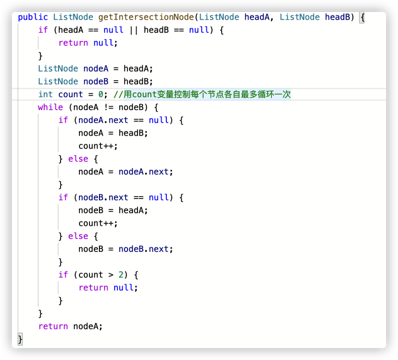

## 面试题1： 整数除法

### Java中整数的四种基本类型

- byte：1字节 8位   (-2^7^ ~ 2^7^-1)
- short：2字节 16位 (-2^15^ ~ 2^15^-1)
- int：4字节 32位   (-2^31 ~ 2^31-1)
- long：8字节 64位  (-2^63 ~ 2^63-1)

### 整数除法

> 输入2个int型整数，它们进行除法运算并返回商，要求不得使用乘号'*'、除号'/'及求余符号'%'。当发生溢出时，返回最大当整数值。假设除数不为0。例如，输入15和2，输出15/2当结果，即7。

- int型正整数的最大值是0x7fffffff = 2^31-1
- int型正整数的最小值是0x00000001 = 1
- int型负整数的最大值是0xffffffff = -1
- int型负整数的最小值是0x80000000 = -2^31

对于15/2=7这个例子，除法可以理解为求15可以由最多多少个2相加组成。最简单的解法就是一个个试。

但是这样的时间复杂度是O(n)，可不可以减少试的次数，最好试完一个2相加后下一个直接试七个2相加，这肯定没法做到，因为计算七个2相加时我们没法直接知道七个2相加就是12+2，12这个值没法在计算一个2相加时就得到。
所以回过头来看，当我们计算完一个2相加后得到的值是2，之后可以计算两个2相加即2+2=4，得到4之后就可以试四个2相加即4+4=8，之后再试八个2相加即8+8...如下图所示。

通过这个跳跃的试探我们知道15是介于四个2和八个2之间组成的，中间的五个2、六个2、七个2我们都没有试过，所以还要继续查找。这个时候我们已经知道了15肯定是比四个2大的，所以用15-（四个2）=7，继续看看剩下的7是由最多多少个组成，这就和上面同一个流程，因为刚刚计算
15-（四个2）=7的时候已经减去了4个2，所以最终的结果就是4+7/2。
同理计算7/2的时候也是从一个2相加开始试探：

所以7/2的值就是在2和4之间，要么是2要么是3。所以7/2=2+(剩下的7-4=3能由多少个2组成)。

最后剩下3-2=1，继续试探1能由多少个2组成，因为1<除数2，所以1最多由0个2组成。
至此，将上面每个阶段2的个数相加就是结果4+2+1+0=7。

最后的代码如下：
```java
//a,b为正整数的情况
public int divide1(int a, int b) {
    int result = 0;
    while (a>=b) {
        int value = a;
        int quotient = 1;
        while (a >= value + value) {
            value += value;
            quotient += quotient;//以1，2，4，8，16..的顺序试探
        }
        result += quotient;
    }
    return result;
  }
```

但是还没有结束，上面的代码只能适用与a和b都是正整数的情况，如果一方为整数，另一方为负数，那上面代码里几处大于小于号的判断就会很麻烦，所以我们要保证a和b都是正整数。
因此在使用divide方法前需要将a和b都转化为同号。当一个为正号，一个为负号的时候，就需要对最终结果修改符号了。

```java

public int divide(int a, int b) {
    int negative = 2;
    if (a<0) {
        a = -a;
        negative--;
    }
    if (b<0) {
        b = -b;
        negative--;
    }
    return negative == 1 ? -divide1(a, b) : divide1(a, b);
  }
```

上面negative初始为2，如果a，b都为正数，negative=2，如果其中一个为负数，negative=1，如果都为负数，negative=0。所以用negative是否等于1来判断a和b是否有一个为负数。

但是还没有结束，因为int最小的负数是-2^31,int最大的正数是2^31-1。此时将-2^31转化为正数2^31就会出现溢出，所以没法将负数转化为正数计算。既然没法都转化为正数，这个时候就可以将a，b两个数都转化为负数来计算，上面的代码就需要改为下面的形式：
```java
public int divide(int a, int b) {
    int negative = 2;
    if (a > 0) {
      a = -a;
      negative--;
    }
    if (b > 0) {
      b = -b;
      negative--;
    }
    return negative == 1 ? -divideForNegative(a, b) : divideForNegative(a, b);
}

//两个负整数相除
public static int divideForNegative(int a, int b) {
    int result = 0;
    while(a <= b) {
        int value = b;
        int quotient = 1;
        while(a <= value + value) {
            quotient += quotient;
            value += value;
        }
        result += quotient;
        a = a - value;
    }
    return result;
}
```

有一种特殊情况就是题目说的如果a=-2^31,b=-1,最后的计算结果是2^31,但int最大只能表示2^31-1,所以会溢出的，应该在方法开始的地方判断这个情况。
还有一种特殊情况就是如果结果是-2^31,即a=-2^31，b=1的时候，从1个-1开始试起：


所以最终的代码如下：

```java
public int divide(int a, int b) {
    if (a==0x80000000 && b==-1) {
        return Integer.MAX_VALUE;
    } 
    int negative = 2;
    if (a > 0) {
      a = -a;
      negative--;
    }
    if (b > 0) {
      b = -b;
      negative--;
    }
    return negative == 1 ? -divideForNegative(a, b) : divideForNegative(a, b);
}

//两个负整数相除
public static int divideForNegative(int a, int b) {
    int result = 0;
    while(a <= b) {
        int value = b;
        int quotient = 1;
        while(value >= 0xc0000000 && a <= value + value) {
            quotient += quotient;
            value += value;
        }
        result += quotient;
        a -= value;
    }
    return result;
}
```


## 面试题2：二进制加法


> 输入两个表示二进制的字符串，请计算它们的和，并以二进制字符串的形式输出。例如，输入的二进制字符串分别是"11"和"10"，则输出"101"。

对于二进制加法，先将两个参数右对齐，从右开始向左，取a的字符，取b的字符，然后在判断该位上应该得到'0'还是'1'，由于还有进位要处理，所以还要用一个变量carry表示进位。
这里需要记住的两个点是：
- 对于循环条件，一开始可能会认为应该用下面的方式，i从0开始循环直到长度的最小值。但这种不太简练还繁琐，书上做法是，从右往左遍历，对于短的字符串，如果下标已经超过了最前面，直接用'0'补齐就可以了。


- 第二个点是，假设取出来a中字符是digitA，b中字符是digitB，应该如何确定和中结果字符以及进位分别是多少呢？
  

所以最终的代码如下：

```java
public static String addBinary(String a, String b) {
        StringBuffer sb = new StringBuffer();
        int i = a.length() - 1;
        int j = b.length() - 1;
        int carry = 0;
        while (i >= 0 || j >= 0) {
            int digitA = i >= 0 ? a.charAt(i--) - '0' : 0;
            int digitB = j >= 0 ? b.charAt(j--) - '0' : 0;
            int sum = digitA + digitB + carry;
            carry = sum >= 2 ? 1 : 0;
            sum = sum >= 2 ? sum - 2 : sum;
            sb.append(sum);
        }
        if (carry == 1) {
            sb.append(carry);
        }
        return sb.reverse().toString();
    }
```


## 面试题3：前n个数字二进制形式中1的个数


> 题目：输入一个非负数n，请计算0到n之间每个数字的二进制形式中1的个数，并输出一个数组。例如，输入的n为4，由于0、1、2、3、4的二进制形式中1的个数分别为0、1、1、2、1，因此输出数组[0,1,1,2,1]


### 思路

这个题目让我想起了校招面试华为时候面试官出的一道题，就是求一个数的二进制表示中有多少个1，当年太菜了，竟然一点都没有想到用二进制来做。这道题目就是用一个for循环，对于每一个数，计算该数的二进制表示有多少个1组成，然后加入对应数组中。   
先看一下最开始我能想到的方法：如何计算一个数的二进制表示中有多少个1组成这个问题。应该从右到左，判断每一位是不是1。那如何求一个数num的最后一位二进制表示呢？用1和num做与运算，num&1，如果最后一位是0，结果就是0，如果最后一位是1，结果就是1。那么接下来如何把最后一位删掉呢？到这里我就想不出来了。那既然没有什么办法判断删掉num的最后一位，那就用num与10做与运算，num&(10)，
这样结果为00的话说明num倒数第二位是0，结果为10的话num倒数第二位是1。然后再用100判断倒数第三位。1000判断倒数第四位...

这种做法的问题是
1.首先每一位都要做与判断该位是不是1，则判断一个数num的时间复杂度就是O(n),n位num的二进制表示长度；
2.怎么得到1、10、100、1000、10000...呢？

所以这种做法是肯定通过不了的。书上的解法是，依次删除num最右边的1，直到num变为0，说明num中的1都被删除完了，只要判断删除了多少次，就说明num中有多少1。


因此最终代码如下：

```java
public static int[] countBits(int num) {
    int[] result = new int[num + 1];
    for (int i = 0; i <= num; i++) {
        int j = i;
        while (j != 0) {
            result[i]++;
            j = j & (j - 1);
        }
    }
    return result;
}
```

这种解法的时间复杂度是O(kn),n表示题目中n数，k表示每个数字平均有多少个1。

还有一种时间复杂度更低的解法，由于我们已经知道num&(num-1)就是num去掉最后一个1所得到的，所以num的1的个数肯定是num&(num-1)的1的个数+1。因此result[num] = result[num&(num-1)] + 1;

- 需要注意一点的是，由于每求一个result[num],都是要求result[num&(num-1)],所以循环的时候num要从1开始算起，如果从0开始算，就是得到result[0]=result[0&(-1)]+1,会出错。

最终代码如下：
```Java
public static int[] countBits(int num) {
    int[] result = new int[num + 1];
    for (int i = 1; i <= num; i++) {
        result[i] = result[i & (i-1)] + 1;
    }
    return result;
}
```
这种时间复杂度是O(n)


## 面试题4：只出现一次的数字

> 题目：输入一个整数数组，数组中只有一个数字出现了一次，而其他数字都出现了3次。请找出那个只出现一次的数字。例如，如果输入的数组为[0,1,0,1,0,1,100]，则只出现一次的数字就是100。


### 思路

这种题目，暴力解法就是计算数组中每一种数出现的次数，可以用一个map保存，然后在遍历map，找到出现次数为1的那个数。这种解法的时间复杂度为O(n),并且还要map保存，最后还要再遍历一遍map。

用位运算来解决的思路就是，将所有数的每一位相加，再判断每一位相加后的数是否能被3整除。


需要注意的几点是：

- 遍历到num时，如何获取num的二进制表示中第i位的值是0还是1呢？(num>>(31-i))&1
- 得到所有位和的数组bitSums之后，如何得到result呢？从第0位开始到第31位，依次赋值，result = (result << 1) + bitSums[i] % 3;

最后的代码如下：

```java
public int singleNumber(int[] nums) {
    int[] bitSums = new int[32];
    for (int i = 0; i < nums.length; i++) {
        for (int j = 0; j < 32; j++) {
            bitSums[j] += (nums[i] >> (31-j)) & 1;
        }
    }
    int result = 0;
    for (int i = 0; i< 32; i++) {
        result = (result << 1) + bitSums[i] % 3;
    }
    return result;
}
```

## 面试题5：单词长度的最大乘积
> 输入一个字符串数组words，请计算不包含相同字符的两个字符串words[i]和words[j]的长度乘积的最大值。
> 如果所有字符串都包含至少一个相同字符，那么返回0。假设字符串中只包含英文小写字母。
> 例如，输入的字符串数组words位["abcw","foo","bar","fxyz","abcdef"],数组中
> 的字符串"bar"与"foo"没有相同的字符，它们长度的乘积为9。"abcw"与"fxyz"也没有相同的字符，它们长度的乘积为16，
> 这是该数组不包含相同字符的一对字符串的长度乘积的最大值。


### 思路

### 解法1

首先直观想法是对于每个字符串，判断它与另一个字符串是否有相同字符，如果没有，则更新长度乘积最大值。
所以问题就是如何判断两个字符串有没有相同字符，解法1的思路是用一个26长度的boolean型数组表示26个字母在
字符串1中出现情况，然后用字符串1的数组和字符串2的数组进行每一位的比较，如果每一位都不同时为1，说明两个字符串
没有重复的字符。


代码如下：

```java
    public static int maxProduct(String[] words) {
        boolean[][] flags = new boolean[words.length][26];
        for (int i = 0; i < words.length; i++) {
            for (int j = 0; j < words[i].length(); j++) {
                char ch = words[i].charAt(j);
                flags[i][ch-'a'] = true;
            }
        }

        int result = 0;
        for (int i = 0; i < words.length; i++) {
            for (int j = i; j < words.length; j++) {
                //这里把k的定义放到for循环外面来，方便for循环之后后面的if判断，要学会这种写法
                int k = 0;
                for (; k < 26; k++) {
                    if (flags[i][k] && flags[j][k]) {
                        break;
                    }
                    
                }
                if (k == 25) {
                  int prod = words[i].length() * words[j].length();
                  result = Math.max(result, prod);
                }
            }
        }
        return result;
    }
```


### 解法2


## 面试题6：排序数组中的两个数字之和

> 题目：输入一个递增排序的数组和一个值k，请问如何在数组中找出两个和为k的数字并返回它们的下标？假设
> 数组中存在且只存在一对符合条件的数字，同时一个数字不能使用两次。例如，输入数组[1,2,4,6,10],k的值为8，
> 数组中的数字2与6的和为8，它们的下标分别是1月3。


### 解法1

因为数组是已经排好序了的，所以可以用双指针下标，i指向最左边，j指向最右边，
如何和比k大，j向左移；如果和比k小，i向右移；循环条件i<j;
这种做法需要依赖一些题目条件：
- 首先数组一定要是事先拍好序的，如果没拍好序，就没法根据和与k的大小移动两个指针了。
- 另外题目只要求输入一对和为k的下标就行，如果数组中有两个数相同，则可能会有多组符合条件的结果，如果要求把所有结果都输出应该如何解决。

代码如下：

```java
public int[] twoSum(int[] numbers, int target) {
    int i = 0;
    int j = numbers.length - 1;
    while(i < j && numbers[i] + numbers[j] != target) {
        if (numbers[i] + numbers[j] < target) {
            i++;
        } else {
            j++;
        }
    }
    return new int[]{i, j};
}
```

### 解法2

另外一种解法就是针对数组没有排序的情况，应该如何找出。当然也可以一开始就先对数组排序，在用上面对方法也行。
另一种解法就是遍历每一个数，同时用一个map数组保存每一个出现的数字和它对应的下标，当遍历到num数字时，判断map中时候存在值为（target-num）的数，
用map.containsKey(target-num)这个方法查找，如果有，就说明数组中有一个数和num相加，和为target。


## 面试题7：数组中和为0的3个数字
> 输入一个数组，如何找出数组中所有和为0的3个数字的三元组？需要注意的是，返回值中不得包含重复的三元组。
> 例如，在数组[-1,0,1,2,-1,-4]中有两个三元组的和为0，它们分别是[-1,0,1]和[-1,-1,2].


### 思路

需要这里题目的几点：1. 数组没有排序；2.数组中可能有重复的数字，所以可能会有重复的符合条件的三元组。
书上的做法是，先对数组进行排序，然后先固定遍历到一个数x，然后对后面的数组应用双指针查找和为-x的二元组，
由于可能有重复的值，所以每次移动指针的时候，一定要跳过和当前数相同的数。
需要注意的点是：
- 找到符合条件的三元组后如何跳过相同的值；
- 如何随时记录符合条件的三元组

> 每次做这种题的时候都不知道怎么记录结果集，应该用嵌套列表List<List<Integer>>来随时保存符合条件的结果。


```java
public static List<List<Integer>> threeSum(int[] nums) {
    List<List<Integer>> result = new LinkedList<>();
    if (nums.length >= 3) {
        Arrays.sort(nums);
        // 这里不要用for循环，应该用for循环不好控制i的增加。
        int i = 0;
        while (i < nums.length - 2) {
            twoSum(nums, i, result);
            int tmp = nums[i];
            while (i < nums.length -2 && nums[i] == tmp) {
                i++;
            }
        }
    }
    return result;
}
public static void twoSum(int[] nums, int i, List<List<Integer>> result) {
    int j = i + 1;
    int k = nums.length - 1;
    while (j < k) {
        if (nums[i] + nums[j] + nums[k] == 0) {
            result.add(Arrays.asList(nums[i], nums[j], nums[k]));
            //只有出现符合条件的三元组时，才判断跳过重复值
            int tmp = nums[j];
            while (j<nums.length && tmp == nums[j]) {
                j++;
            }
        }
        // 如果不符合条件就不用判断跳过相同值了
        else if (nums[i] + nums[j] + nums[k] < 0) {
            j++;
        } else {
            k--;
        }
    }
}
```

## 面试题8：和大于或等于k的最短子数组

> 输入一个正整数组成的数组和一个正整数k，请问数组中和大于或等于k的连续子数组的最短长度是多少？
> 如果不存在所有数字之和大于或等于k的子数组，则返回0。
> 例如，输入数组[5,1,4,3],k的值为7，和大于或等于7的最短连续子数组是[4,3],因此输出它的长度为2。


### 思路

用两个指针表示一个子数组的区间，当区间内的和大于或等于target时，left指针右移，更新minLength；


- 连续子数组
- 最短长度，也就是说数组内的和刚刚好大于或等于k值。
- 这种用两个指针伸缩式的移动窗口解法一定要记住！！！！先定义left=0，然后对right一个for循环，循环中加一个能让left一直++的条件的while条件循环

代码：

```java
public int minSubArrayLen(int target, int[] nums) {
    int minLength = Integer.MAX_VALUE;
    int left = 0;
    int sum = 0;
    for (int right = 0; right < nums.length; right++) {
        sum += nums[right];
        while (left <= right && sum >= target) {
            minLength = Math.min(minLength, right - left + 1);
            sum -= nums[left];
            left++;
        }
    }
    return minLength == Integer.MAX_VALUE ? 0 : minLength;
}
```


## 面试题9：乘积小于k的子数组
> 输入一个由正整数组成的数组和一个正整数k，请问数组中有多少个数字乘积小于k的连续子数组？例如，
> 输入数组[10,5,2,6]，k的值为100，有8个子数组的所有数字的乘积小于100，它们分别是[10],[5],[2],[6],[10,5],[5,2],[2,6],[5,2,6].


### 思路

还是用双指针，left到right之间的数全部相乘，如果乘积大于等于k，应该将left++，知道left到right之间的连续数组的乘积小于k，当小于k时，说明left到right之间的以right为右边的所有连续子数组的乘积都是小于k的，
right-left+1个子数组都是符合条件的连续子数组，例如


整个遍历过程如下：


## 面试题10：和为k的子数组

> 输入一个整数数组和一个整数k，请问数组中有多少个数字之和等于k的连续子数组？例如，输入数组[1,1,1],
> k的值为2，有2个连续子数组之和等于2。


### 思路

- 这道题没有强调数组是正整数，所以不可以用双向指针
- 累加数组数字求子数组之和


## 面试题11：0和1个数相同的子数组


### 思路

和面试题10类似，把0的数字当成-1，所以如果一个连续子数组中0和1的个数相同，说明它们的和一定为0。
当遍历到数字num时，得到当前左边和为sum，同时查找前面有没有和也为sum的子数组，如果有，更新最长长度，
更新完长度之后记得不用在把当前的下标和sum对放入map中了。只有当map中没有当前sum值时，才需要
将当前(下标，sum)对加入map中，因为只需要得到最长的子数组长度就行了。


## 面试题12：左右两边子数组的和相等


### 思路

先用一遍循环求所有数字之和，当遍历到下标i时，左边所有数之和为sum，
判断sum - nums[i] == total - sum;如果相等，输出i。


## 面试题13：二维子矩阵到数字之和


### 思路

这个题难点就是如何构建sum矩阵，每次这种+1，-1的就很容易搞错。sum矩阵里的下标都+1。


# 双指针  

## 面试题14：字符串中的变位词


### 思路


## 面试题15：字符串中的所有变位词


### 思路


## 面试题16：不含重复字符的最长子字符串

### 思路


## 面试题17：包含所有字符的最短字符串

### 思路


# 回文字符串


## 面试题18：有效的回文

### 思路


## 面试题19：最多删除一个字符得到回文

### 思路


## 面试题20：回文子字符串的个数

### 思路

分别计算以每个字符和每个字符中间的空格为中心的回文个数，全部相加。

```java
class Solution {
    public int countSubstrings(String s) {
        if (s == null || s.length() == 0) {
            return 0;
        }
        int count = 0;
        for (int i = 0; i < s.length(); i++) {
            count += countPalindrome(s, i, i);
            count += countPalindrome(s, i, i+1);
        }
        return count;
    }
    int countPalindrome(String s, int start, int end) {
        int count = 0;
        for (;start >=0 && end < s.length(); start--, end++) {
            if (s.charAt(start) == s.charAt(end)) {
                count++;
            } else {
                break;
            }
        }
        return count;
    }
}
```
在计算以start，end为中心能组成多少回文字符串时，countPalindrome方法有两种写法


# 链表


### 使用哨兵节点添加或删除节点

给一个链表末尾加上一个节点


删除链表中指定值的某一个节点


## 面试题21 ：删除倒数第k个节点

### 思路


## 面试题22：链表中环的入口节点

### 思路

分两步，先一快一慢得到环中相遇节点；然后另一个从头开始相同步伐走到入口节点。


## 面试题23：两个链表的第1个重合节点

### 思路

leetcode后来增加了测试用例，增加了没有公共节点的情况，所有要主要不能用
原来的方法一直循环，不然后一直循环下去，最后超时。用一个count变量记录循环次数。




## 面试题24：反转链表

### 思路

```java
//方法1：前后指针，用空指针开始，严格来说，这不是头插法。但是书上是用这种解法
class Solution {
    public ListNode reverseList(ListNode head) {
        ListNode pre = null;
        ListNode cur = head;
        while(cur != null) {
            ListNode next = cur.next;
            cur.next = pre;
            pre = cur;
            cur = next;
        }
        return pre;
    }
}
```

```java
//这种才是真正的头插法
class Solution {
    public ListNode reverseList(ListNode head) {
        ListNode dummy = new ListNode(-1);
        ListNode node = head;
        while (node != null) {
            ListNode next = node.next;
            node.next = dummy.next;
            dummy.next = node;
            node = next;
        }
        return dummy.next;
    }
}
```
```java
//这种是递归解法
class Solution {
    public ListNode reverseList(ListNode head) {
        if (head == null) {
            return null;
        }
        if (head.next == null) {
            return head;
        }
        ListNode next = reverseList(head.next);
        head.next.next = head;
        head.next = null;
        return next;
    }
}
```


## 面试题25 链表中的数字相加

### 思路

反转后的两个链表相加的时候，要用哨兵节点保存头节点；还要记住进位的计算方式


## 面试题26 重排链表

### 思路

先对半分，获得第二办的头节点；把第二半的链表反转；用prev指针辅助重排。
最重要的就是下面的将两个链表重排操作


## 面试题27 回文链表

### 思路

先对半分，将第二个链表反转，再一个个判断节点是否相同。要注意的是：

- 对半分的时候，链表如果有奇数个节点，那么第一个链表的最后一个多出来的节点就不要了。


## 面试题28 展开多级双向链表

### 思路


## 面试题29 排序的循环链表

### 思路
循环判断当前节点和下一节点，是不是可以插在当前节点和下一节点之间，并且在循环过程中记录链表中最大值；
如果循环一圈之后都不能插在当前节点和下一节点之间，说明新加入节点的是最大值或最小值，需要插在最大值和最小值之间，
这个时候就利用记录下来的最大值节点插入。


