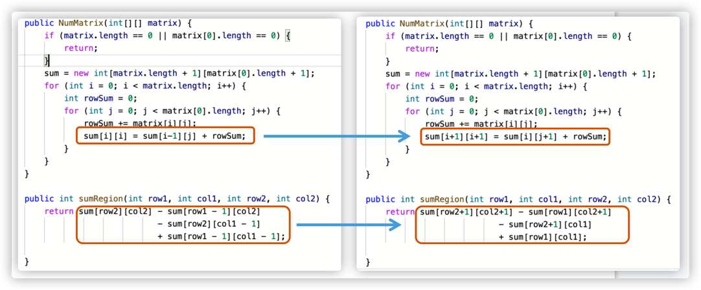

  
# 面试题11：0和1个数相同的子数组

---

## 思路

和面试题10类似，把0的数字当成-1，所以如果一个连续子数组中0和1的个数相同，说明它们的和一定为0。
当遍历到数字num时，得到当前左边和为sum，同时查找前面有没有和也为sum的子数组，如果有，更新最长长度，
更新完长度之后记得不用在把当前的下标和sum对放入map中了。只有当map中没有当前sum值时，才需要
将当前(下标，sum)对加入map中，因为只需要得到最长的子数组长度就行了。

---

# 面试题12：左右两边子数组的和相等

---

## 思路

先用一遍循环求所有数字之和，当遍历到下标i时，左边所有数之和为sum，
判断sum - nums[i] == total - sum;如果相等，输出i。

---

# 面试题13：二维子矩阵到数字之和

---

## 思路

这个题难点就是如何构建sum矩阵，每次这种+1，-1的就很容易搞错。sum矩阵里的下标都+1。

