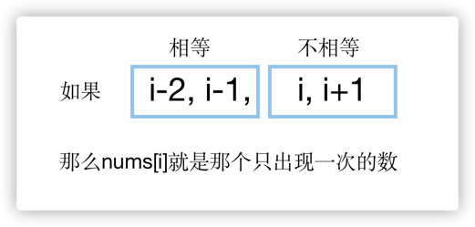

  
## 在递增排序数组中进行二分查找

```java
public int search(int[] nums, int target) {
    int left = 0;
    int right = nums.length - 1;
    while (left <= right) {
        int mid = (left + right) / 2;
        if (nums[mid] == target) {
            return mid;
        }
        if (nums[mid] > target) {
            right = mid - 1;
        } else {
            left = mid + 1;
        }
    }
    return -1;
}
```

---

## 面试题68：查找插入位置

### 思路

```java
class Solution {
    public int searchInsert(int[] nums, int target) {
        int left = 0;
        int right = nums.length - 1;
        while (left <= right) {
            int mid = (left + right) / 2;
            if (nums[mid] >= target) {
                if ( mid == 0 || nums[mid - 1] < target) {
                    return mid;
                }
                right = mid - 1;
            } else {
                left = mid + 1;
            }
        }
        return nums.length;

    }
}
```
---
## 面试题69：山峰数组的顶部

### 思路

```java
class Solution {
    public int peakIndexInMountainArray(int[] arr) {
        int left = 1;
        int right = arr.length - 2;
        while (left <= right) {
            int mid = (left + right) / 2;
            if (arr[mid] > arr[mid - 1] && arr[mid] > arr[mid + 1]) {
                return mid;
            }
            if (arr[mid] > arr[mid - 1]) {
                left = mid + 1;
            } else {
                right = mid - 1;
            }
        }
        return -1;
    }
}
```
---

## 面试题70：排序数组中只出现一次的数字

### 思路



```java
class Solution {
    public int singleNonDuplicate(int[] nums) {
        int left = 0;
        int right = nums.length / 2;
        while (left <= right) {
            int mid = (left + right) / 2;
            int i = mid * 2;
            if (i < nums.length - 1 && nums[i] != nums[i + 1]) {
                if (mid == 0 || nums[i - 1] == nums[i - 2]) {
                    return nums[i];
                }
                right = mid - 1;
            } else {
                left = mid + 1;
            }
        }
        return nums[nums.length - 1];
    }
}
```
---
## 面试题71：按权重生成随机数

### 思路

```java
class Solution {
    private int[] sums;
    private int total;

    public Solution(int[] w) {
        sums = new int[w.length];
        for (int i = 0; i < w.length; i++) {
            total += w[i];
            sums[i] = total;
        }
    }
    
    public int pickIndex() {
        Random random = new Random();
        int p = random.nextInt(total);

        int left = 0;
        int right = sums.length - 1;
        while (left <= right) {
            int mid = (left + right) / 2;
            if (sums[mid] > p) {
                if (mid == 0 || sums[mid - 1] <= p) {
                    return mid;
                }
                right = mid - 1;
            } else {
                left = mid + 1;
            }
        }
        return -1;
    }
}

/**
 * Your Solution object will be instantiated and called as such:
 * Solution obj = new Solution(w);
 * int param_1 = obj.pickIndex();
 */
```

---

## 在数值范围内二分查找

---

## 面试题72：求平方根

### 思路

```java
class Solution {
    public int mySqrt(int x) {
        int left = 1;
        int right = x;
        while (left <= right) {
            int mid = left + (right - left) / 2;
            if (mid <= x / mid) {
                if ((mid + 1) > x / (mid + 1)) {
                    return mid;
                }
                left = mid + 1;
            } else {
                right = mid - 1;
            }
        }
        return 0;

    }
}
```
---
## 面试题73：狒狒吃香蕉

### 思路

当吃香蕉速度为k的时候，计算以k的速度吃完所有香蕉需要的时间。
> 假设一堆有pile根，那么以k的速度吃完该堆所需要的时间是：pile / k 向上取整，简化为(pile + k - 1)/k

```java
class Solution {
    public int minEatingSpeed(int[] piles, int h) {
        int max = 0;
        for (int pile : piles) {
            max = Math.max(max, pile);
        }

        int left = 1;
        int right = max;
        while (left <= right) {
            int mid = (left + right) / 2;
            if (getHour(piles, mid) <= h) {
                if (mid == 1 || getHour(piles, mid - 1) > h) {
                    return mid;
                }
                right = mid - 1;//可以再慢点吃
            } else {
                left = mid + 1;
            }
        }
        return -1;
    }

    private int getHour(int[] piles, int h) {
        int hour = 0;
        for (int pile : piles) {
            hour += (pile + h - 1) / h;
        }
        return hour;
    }
}
```
