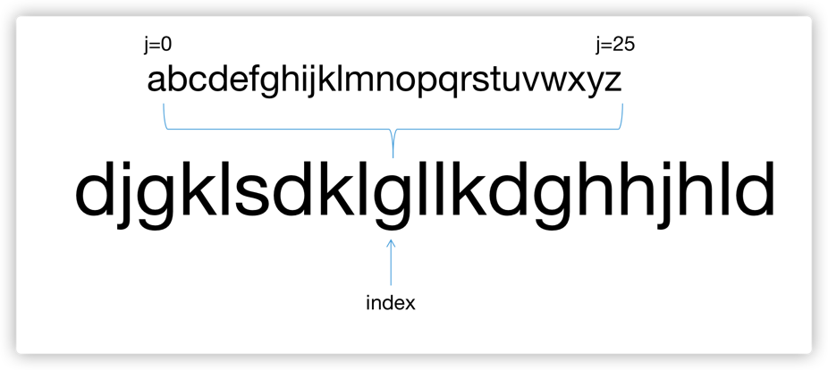

  
## 面试题62：实现前缀树

### 思路

```java
class Trie {
    //前缀树的节点结构
    static class TrieNode {
        TrieNode children[];
        boolean isWord;
        public TrieNode() {
            children = new TrieNode[26];
        }
    }
    private TrieNode root;
    /** Initialize your data structure here. */
    public Trie() {
        root = new TrieNode();
    }
    
    /** Inserts a word into the trie. */
    public void insert(String word) {
        TrieNode node = root;
        for (char ch : word.toCharArray()) {
            if (node.children[ch - 'a'] == null) {
                node.children[ch - 'a'] = new TrieNode();
            }
            node = node.children[ch - 'a'];
        }
        node.isWord = true;
    }
    
    /** Returns if the word is in the trie. */
    public boolean search(String word) {
        TrieNode node = root;
        for (char ch : word.toCharArray()) {
            if (node.children[ch - 'a'] == null) {
                return false;
            }
            node = node.children[ch - 'a'];
        }
        return node.isWord == true;
    }
    
    /** Returns if there is any word in the trie that starts with the given prefix. */
    public boolean startsWith(String prefix) {
        TrieNode node = root;
        for (char ch : prefix.toCharArray()) {
            if (node.children[ch - 'a'] == null) {
                return false;
            }
            node = node.children[ch - 'a'];
        }
        return true;
    }
}

/**
 * Your Trie object will be instantiated and called as such:
 * Trie obj = new Trie();
 * obj.insert(word);
 * boolean param_2 = obj.search(word);
 * boolean param_3 = obj.startsWith(prefix);
 */
```
---
## 面试题63：替换单词

### 思路

```java
class Solution {
    static class TrieNode {
        TrieNode[] children;
        boolean isWord;
        public TrieNode() {
            children = new TrieNode[26];
        }
    }
    public String replaceWords(List<String> dictionary, String sentence) {
        TrieNode root = buildTrie(dictionary);
        String[] words = sentence.split(" ");
        for (int i = 0; i < words.length; i++) {
            String replaceWord = findPrefix(root, words[i]);
            //if (replaceWord != null) {
            if (!replaceWord.isEmpty()) { //!!!! 没有词根的时候是返回“”，要用isEmpty()判断，而不是判断是不是null
                words[i] = replaceWord;
            }
        }
        return String.join(" ", words);
    }

    private TrieNode buildTrie(List<String> dictionary) {
        TrieNode root = new TrieNode();
        for (String word : dictionary) {
            TrieNode node = root;
            for (char ch : word.toCharArray()) {
                if (node.children[ch - 'a'] == null) {
                    node.children[ch - 'a'] = new TrieNode();
                }
                node = node.children[ch - 'a'];
            }
            node.isWord = true;
        }
        return root;
    }

    private String findPrefix(TrieNode root, String word) {
        TrieNode node = root;
        StringBuilder sb = new StringBuilder();
        for (char ch : word.toCharArray()) {
            if (node.children[ch - 'a'] == null || node.isWord) {
                break;
            }
            sb.append(ch);
            node = node.children[ch - 'a'];
        }
        return node.isWord ? sb.toString() : "";
    }
}
```
---
## 面试题64：神奇的字典

### 思路



```java
class MagicDictionary {

    static class TrieNode {
        TrieNode[] children;
        boolean isWord;
        public TrieNode() {
            children = new TrieNode[26];
        }
    }

    TrieNode root;

    /** Initialize your data structure here. */
    public MagicDictionary() {
        root = new TrieNode();
    }
    
    public void buildDict(String[] dictionary) {
        for (String word : dictionary) {
            TrieNode node = root;
            for (char ch : word.toCharArray()) {
                if (node.children[ch - 'a'] == null) {
                    node.children[ch - 'a'] = new TrieNode();
                }
                node = node.children[ch - 'a'];
            }
            node.isWord = true;
        }
    }
    
    public boolean search(String searchWord) {
        return dfs(root, searchWord, 0, 0);
    }
    //第三个参数表示正在遍历的字符下标，第四个参数表示修改字符串的字符次数
    private boolean dfs(TrieNode root, String word, int index, int edit) {
        if (root == null) {
            return false;
        }
        if (root.isWord && index == word.length() && edit == 1) {
            return true;
        }
        if (index < word.length() && edit <= 1) {
            boolean found = false;
            for (int j = 0; j < 26 && !found; j++) {
                int nextEditNum = (j == word.charAt(index) - 'a') ? edit : edit + 1;
                found = dfs(root.children[j], word, index + 1, nextEditNum);
            }
            return found;
        }
        return false;
    }
}

/**
 * Your MagicDictionary object will be instantiated and called as such:
 * MagicDictionary obj = new MagicDictionary();
 * obj.buildDict(dictionary);
 * boolean param_2 = obj.search(searchWord);
 */
```

---

## 面试题65：最短的单词编码

### 思路

```java
class Solution {
    static class TrieNode {
        public TrieNode[] children;
        public TrieNode() {
            children = new TrieNode[26];
        }
    }
    public int minimumLengthEncoding(String[] words) {
        TrieNode root = buildTrie(words);
        int[] total = {0};
        dfs(root, 1, total);
        return total[0];
    }
    private TrieNode buildTrie(String[] words) {
        TrieNode root = new TrieNode();
        for (String word : words) {
            TrieNode node = root;
            for (int i = word.length() - 1; i >= 0; i--) {
                if (node.children[word.charAt(i) - 'a'] == null) {
                    node.children[word.charAt(i) - 'a'] = new TrieNode();
                }
                node = node.children[word.charAt(i) - 'a'];
            }
        }
        return root;
    }
    //要记住遍历的方法
    private void dfs(TrieNode root, int length, int[] total) {
        boolean isLeaf = true;
        for (TrieNode child : root.children) {
            if (child != null) {
                isLeaf = false;
                dfs(child, length + 1, total);
            }
        }
        if (isLeaf) {
            total[0] += length;
        }
    }
}
```
---
## 面试题66：单词之和

### 思路

```java
class MapSum {

    static class TrieNode {
        public TrieNode[] children;
        public int value;
        public TrieNode() {
            children = new TrieNode[26];
        }
    }
    private TrieNode root;
    /** Initialize your data structure here. */
    public MapSum() {
        root = new TrieNode();
    }
    
    public void insert(String key, int val) {
        TrieNode node = root;
        for (int i = 0; i < key.length(); i++) {
            char ch = key.charAt(i);
            if (node.children[ch - 'a'] == null) {
                node.children[ch - 'a'] = new TrieNode();
            }
            node = node.children[ch - 'a'];
        }
        node.value = val;
    }
    
    public int sum(String prefix) {
        TrieNode node = root;
        for (int i = 0; i < prefix.length(); i++) {
            char ch = prefix.charAt(i);
            if (node.children[ch - 'a'] == null) {
                return 0;
            }
            node = node.children[ch - 'a'];
        }
        return getSum(node);
    }
    private int getSum(TrieNode node) {
        if (node == null) {
            return 0;
        }
        int result = node.value;
        for (TrieNode n : node.children) {
            result += getSum(n);
        }
        return result;
    }
}

/**
 * Your MapSum object will be instantiated and called as such:
 * MapSum obj = new MapSum();
 * obj.insert(key,val);
 * int param_2 = obj.sum(prefix);
 */
```
---

## 面试题67：最大的异或

### 思路

```java
class Solution {
    static class TrieNode {
        public TrieNode[] children;
        public TrieNode() {
            children = new TrieNode[2];
        }
    }
    public int findMaximumXOR(int[] nums) {
        TrieNode root = buildTrie(nums);
        int max = 0;
        for (int num : nums) {
            int xor = 0;

            TrieNode node = root;
            for (int i = 31; i >= 0; i--) {
                int bit = (num >> i) & 1;
                if (node.children[1 - bit] != null) {
                    xor = (xor << 1) + 1;
                    node = node.children[1 - bit];
                } else {
                    xor = xor << 1;
                    node = node.children[bit];
                }
            }

            max = Math.max(max, xor);
        }
        return max;
    }
    private TrieNode buildTrie(int[] nums) {
        TrieNode root = new TrieNode();
        for (int num : nums) {
            TrieNode node = root;
            for (int i = 31; i >= 0; i--) {
                int bit = (num >> i) & 1;
                if (node.children[bit] == null) {
                    node.children[bit] = new TrieNode();
                }
                node = node.children[bit];
            }
        }
        return root;
    }
}
```
