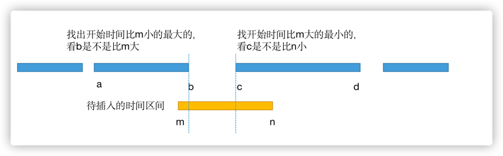

  
## 二叉树的深度优先搜索

### 中序遍历

#### 递归实现

```java
//中序遍历递归版
public List<Integer> inorderTraversal(TreeNode root) {
    List<Integer> nodes = new LinkedList<>();
    dfs(root, nodes);
    return nodes;
}

private void dfs(TreeNode root, List<Integer> nodes) {
    if (root != null) {
        dfs(root.left, nodes);
        nodes.add(root.val);
        dfs(root.right, nodes);
    }
}
```

#### 基于栈的迭代实现

```java
public List<Integer> inorderTraversal2(TreeNode root) {
    List<Integer> nodes = new LinkedList<>();
    Stack<TreeNode> stack = new Stack<>();
    TreeNode cur = root;
    while (cur != null || !stack.isEmpty()) {
        while (cur != null) { //到达最左子节点
            stack.push(cur);
            cur = cur.left;
        }
        cur = stack.pop();
        nodes.add(cur.val);
        cur = cur.right;
    }
    return nodes;
}
```

### 前序遍历

#### 递归实现

```java
//前序遍历递归版
public List<Integer> preorderTraversal(TreeNode root) {
    List<Integer> nodes = new LinkedList<>();
    dfs2(root, nodes);
    return nodes;
}
private void dfs2(TreeNode root, List<Integer> nodes) {
    if (root != null) {
        nodes.add(root.val);
        dfs2(root.left, nodes);
        dfs2(root.right, nodes);
    }
}
```

#### 基于栈的迭代实现

```java
//前序遍历迭代版
public List<Integer> preorderTraversal2(TreeNode root) {
    List<Integer> result = new LinkedList<>();
    Stack<TreeNode> stack = new Stack<>();
    TreeNode cur = root;
    while (cur != null || !stack.isEmpty()) {
        while (cur != null) {
            result.add(cur.val); //先加该节点，再到最左节点
            stack.push(cur);
            cur = cur.left;
        }
        cur = stack.pop();
        cur = cur.right;
    }
    return result;
}
```

### 后序遍历

#### 递归版

```java
//后序遍历递归版
public List<Integer> postorderTraversal(TreeNode root) {
    List<Integer> nodes = new LinkedList<>();
    dfs(root, nodes);
    return nodes;
}
private void dfs3(TreeNode root, List<Integer> nodes) {
    if (root != null) {
        dfs(root.left, nodes);
        dfs(root.right, nodes);
        nodes.add(root.val);
    }
}
```

#### 基于栈的迭代版

```java
//后序遍历迭代版
public List<Integer> postorderTraversal3(TreeNode root) {
    List<Integer> result = new LinkedList<>();
    Stack<TreeNode> stack = new Stack<>();
    TreeNode cur = root;
    TreeNode prev = null;
    while (cur != null || !stack.isEmpty()) {
        while (cur != null) { //到达最左节点
            stack.push(cur);
            cur = cur.left;
        }
        cur = stack.peek();
        if (cur.right != null && cur.right != prev) { //说明cur右子节点的子树还没遍历完
            cur = cur.right;
        } else { 
            stack.pop();
            result.add(cur.val); //说明右子树都遍历完了，现在遍历当前节点
            prev = cur;
            cur = null;
        }
    }
    return result;
}
```

## 面试题47：二叉树剪枝

### 思路

所谓删除一个节点，就是返回null给它的父节点

```java
class Solution {
    public TreeNode pruneTree(TreeNode root) {
        if (root != null) {
            root.left = pruneTree(root.left); //要把结果返回给root.left,root.right
            root.right = pruneTree(root.right);
            if (root.left == null && root.right == null && root.val == 0) {
                return null;
            } else {
                return root;
            }
        } else {
            return null;
        }
    }
}
```

## 面试题48：序列化和反序列化二叉树

### 思路

- java的基本数据类型，是值传递，传递的是一个实参的拷贝，在方法内对形参的修改不会影响到实参数
- java的引用数据类型，比如对象引用，接口引用，数组引用。是引用传递，传递的是对象的内存地址，方法对引用的操作会影响实际对象。

```java
public class Codec {

    // Encodes a tree to a single string.
    public String serialize(TreeNode root) {
        if (root == null) {
            return "#";
        }
        String leftStr = serialize(root.left);
        String rightStr = serialize(root.right);
        return String.valueOf(root.val) + "," + leftStr + "," + rightStr;
    }

    // Decodes your encoded data to tree.
    public TreeNode deserialize(String data) {
        String[] nodeStrs = data.split(",");
        int[] i = {0}; //一个指针
        return dfs(nodeStrs, i);
    }
    private TreeNode dfs(String[] strs, int[] i) {
        String str = strs[i[0]];
        i[0]++;//指针向后移

        if (str.equals("#")) {
            return null;
        }

        TreeNode node = new TreeNode(Integer.valueOf(str));
        node.left = dfs(strs, i);
        node.right = dfs(strs, i);
        return node;
    }
}
```
## 面试题49：从根节点到叶节点的路径数字之和

### 思路

```java
class Solution {
    public int sumNumbers(TreeNode root) {
        return dfs(root, 0);
    }
    //path是指到当前节点前面的值
    private int dfs(TreeNode root, int path) {
        if (root == null) {
            return 0;
        }
        path = path * 10 + root.val;//到当前节点的值
        if (root.left == null && root.right == null) { //到达叶子节点之后就不用向下遍历了，需要返回值了
            return path;
        }
        return dfs(root.left, path) + dfs(root.right, path);

    }
}
```

---

## 面试题50：向下的路径节点值之和

### 思路

leetcode上注意用int型，path会溢出，要用Long类型表示路径和

```java

class Solution {
    public int pathSum(TreeNode root, int targetSum) {
        Map<Long, Integer> map = new HashMap<>();
        map.put(0l, 1);

        return dfs(root, targetSum, map, 0l);
    }
    private int dfs(TreeNode root, int sum, Map<Long, Integer> map, long path) {
        if (root == null) {
            return 0;
        }
        path += root.val;
        int count = map.getOrDefault(path - sum, 0);
        map.put(path, map.getOrDefault(path, 0) + 1);

        count += dfs(root.left, sum, map, path);
        count += dfs(root.right, sum, map, path);
        map.put(path, map.get(path) - 1); //回溯 重要！！！因为相比递归深度优先遍历多了一个map需要记录从根节点到当前节点到路径和，所以遍历完之后需要回到父节点，此时，要把map中当前节点到记录删除掉。
        return count;
    }
}
```

## 面试题51：节点值之和最大的路径

### 思路

```java
class Solution {
    public int maxPathSum(TreeNode root) {
        int[] maxSum = {Integer.MIN_VALUE};
        dfs(root, maxSum);
        return maxSum[0];
    }
    private int dfs(TreeNode root, int[] maxSum) {
        if (root == null) {
            return 0;
        }
        int[] maxSumLeft = {Integer.MIN_VALUE};
        int left = Math.max(0, dfs(root.left, maxSumLeft));//当前节点左子树的最大路径和，不含当前节点

        int[] maxSumRight = {Integer.MIN_VALUE};
        int right = Math.max(0, dfs(root.right, maxSumRight));

        maxSum[0] = Math.max(maxSumLeft[0], maxSumRight[0]);
        maxSum[0] = Math.max(maxSum[0], root.val + left + right); //left是左子树中只经过左子节点的最大值，没有同时经过左子节点的左右子节点

        return root.val + Math.max(left, right);//返回的值是用于上面的和root.val加起来计算的，所以只经过当前节点和一边的路径和
    }
}
```

## 二叉搜索树

## 在二叉搜索树中根据节点值查找对应节点的的代码

```java
//在二叉搜索树中查找值
public TreeNode searchBST(TreeNode root, int val) {
    TreeNode cur = root;
    while (cur != null) {
        if (cur.val == val) {
            break;
        }
        if (cur.val < val) {
            cur = cur.right;
        } else {
            cur = cur.left;
        }
    }
    return cur;
}
```

## 面试题52：展开二叉搜索树

### 思路
按中序遍历，每遍历到一个节点要把前一个节点的指向右子节点的指针指向它。

```java
class Solution {
    public TreeNode increasingBST(TreeNode root) {
        Stack<TreeNode> stack = new Stack<>();
        TreeNode cur = root;
        TreeNode prev = null;
        TreeNode first = null;
        while (cur != null || !stack.isEmpty()) {
            while (cur != null) {
                stack.push(cur);
                cur = cur.left;
            }
            cur = stack.pop();

            if (prev != null) {
                prev.right = cur;
            } else {
                first = cur;
            }
            prev = cur;
            cur.left = null;

            cur = cur.right;
        }
        return first;
    }
}
```

--- 

## 面试题53：二叉搜索树的下一个节点

### 思路

- 中序遍历：同时用一个found记录是否找到p节点，如果找到了，那么下一个遍历的节点就是要找的节点。这种解法没有利用二叉搜索树的特性

```java
class Solution {
    public TreeNode inorderSuccessor(TreeNode root, TreeNode p) {
        Stack<TreeNode> stack = new Stack<>();
        TreeNode cur = root;
        boolean found = false;
        while (cur != null || !stack.isEmpty()) {
            while (cur != null) {
                stack.push(cur);
                cur = cur.left;
            }
            cur = stack.pop();
            if (found) {
                break;
            } else if (cur == p) {
                found = true;
            }
            cur = cur.right;
        }
        return cur;
    }
}
```

- 在二叉搜索树中找值比p大的最小的节点

```java
class Solution {
    public TreeNode inorderSuccessor(TreeNode root, TreeNode p) {
        TreeNode cur = root;
        TreeNode result = null;
        while (cur != null) {
            if (cur.val > p.val) {
                result = cur;
                cur = cur.left;
            } else {
                cur = cur.right;
            }
        }
        return result;
    }
}
```

## 面试题54：所有大于或等于节点的值之和

### 思路

中序遍历，但是先右后左，同时记录已遍历节点的和

```java
class Solution {
    public TreeNode convertBST(TreeNode root) {
        Stack<TreeNode> stack = new Stack<>();
        TreeNode cur = root;
        int sum = 0;
        while (cur != null || !stack.isEmpty()) {
            while (cur != null) {
                stack.push(cur);
                cur = cur.right;
            }
            cur = stack.pop();
            sum += cur.val;
            cur.val = sum;
            cur = cur.left;
        }
        return root;
    }
}
```

---
## 面试题55：二叉搜索树迭代器

### 思路

```java
class BSTIterator {

    TreeNode cur;
    Stack<TreeNode> stack;

    public BSTIterator(TreeNode root) {
        cur = root;
        stack = new Stack<>();
    }
    
    public int next() {
        while (cur != null) {
            stack.push(cur);
            cur = cur.left;
        }
        cur = stack.pop();
        int val = cur.val;
        cur = cur.right;
        return val;
    }
    
    public boolean hasNext() {
        return cur != null || !stack.isEmpty();
    }
}
```

---

## 面试题56：二叉搜索树中两个节点的值之和

### 思路

```java
class Solution {
    public boolean findTarget(TreeNode root, int k) {
        Set<Integer> set = new HashSet<>();
        Stack<TreeNode> stack = new Stack<>();
        TreeNode cur = root;
        while (cur != null || !stack.isEmpty()) {
            while (cur != null) {
                stack.push(cur);
                cur = cur.left;
            }
            cur = stack.pop();
            if (set.contains(k - cur.val)) {
                return true;
            }
            set.add(cur.val);
            cur = cur.right;
        }
        return false;
    }
}
```
---
## TreeSet和TreeMap的应用

---
## 面试题57：值和下标之差都在给定的范围内

### 思路
用TreeSet，平衡的二叉搜索树。有ceiling，和floor方法
```java
class Solution {
    public boolean containsNearbyAlmostDuplicate(int[] nums, int k, int t) {
        TreeSet<Long> set = new TreeSet<>();
        for (int i = 0; i < nums.length; i++) {
            Long lower = set.floor((long)nums[i]);
            if (lower != null && (long)nums[i] - lower <= t) {
                return true;
            }

            Long upper = set.ceiling((long)nums[i]);
            if (upper != null && upper - (long)nums[i] <= t) {
                return true;
            }
            set.add((long)nums[i]);
            if (i >= k) {
                set.remove((long)nums[i - k]);
            }
        }
        return false;
    }
}
```
---

## 面试题58：日程表

### 思路

找出小于开始时间最晚的，看它的结束时间是不是不开始时间晚；以及找出大于开始时间最早的，看它的开始时间是不是比结束时间早；



```java
class MyCalendar {

    TreeMap<Integer, Integer> events;

    public MyCalendar() {
        events = new TreeMap<>();
    }
    
    public boolean book(int start, int end) {
        Map.Entry<Integer, Integer> event = events.floorEntry(start);
        if (event != null && event.getValue() > start) {
            return false;
        }

        event = events.ceilingEntry(start);
        if (event != null && event.getKey() < end) {
            return false;
        }
        events.put(start, end);
        return true;
    }
}
```
