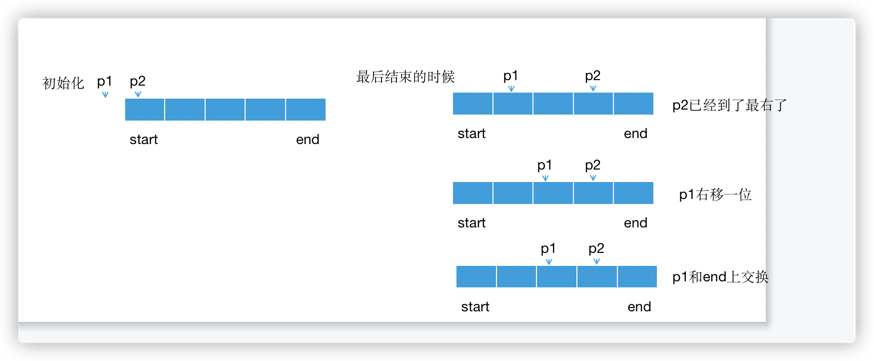

## 插入排序

## 冒泡排序

## 堆排序

## 计数排序

## 归并排序

## 快速排序

---

## 面试题74：合并区间

### 思路

```java
class Solution {
    public int[][] merge(int[][] intervals) {
        Arrays.sort(intervals, (i1, i2) ->  (i1[0] - i2[0]));
        int i = 0;
        List<int[]> merged = new LinkedList<>();
        while (i < intervals.length) {
            int[] temp = new int[]{intervals[i][0], intervals[i][1]};
            int j = i + 1;
            while (j < intervals.length && intervals[j][0] <= temp[1]) {
                temp[1] = Math.max(intervals[j][1], temp[1]);
                j++;
            }
            merged.add(temp);
            i = j;
        }
        int[][] result = new int[merged.size()][];
        return merged.toArray(result);
    }
}
```
---
## 计数排序

---
## 面试题75：数组相对排序

### 思路
先统计每个数字出现次数，然后按照nums2数组的顺序一个个放入新数组中
```java
class Solution {
    public int[] relativeSortArray(int[] arr1, int[] arr2) {
        int[] counts = new int[1001];
        for (int num : arr1) {
            counts[num]++;
        }

        int i = 0;
        for (int num : arr2) {
            while (counts[num] > 0) {
                arr1[i] = num;
                counts[num]--;
                i++;
            }
        }

        for (int num = 0; num < 1001; num++) {
            while (counts[num] > 0) {
                arr1[i] = num;
                counts[num]--;
                i++;
            }
         }
         return arr1;
    }
}
```
---
## 快速排序

---

## 面试题76：数组中第k大的数字

### 思路

第k大的数在一个排序的数组中，它的下表应该是length - k，所以用快速排序，一个partition得到index，判断
index是不是length - k，如果得到的index大于length - k，则从左边子数组中继续分区。



```java
class Solution {
    public int findKthLargest(int[] nums, int k) {
        int target = nums.length - k;
        int start = 0;
        int end = nums.length - 1;
        int index = partition(nums, start, end);
        while (index != target) {
            if (index > target) {
                end = index - 1;
            } else {
                start = index + 1;
            }
            index = partition(nums, start, end);
        }
        return nums[index];
    }

    private int partition(int[] nums, int start, int end) {
        int random = new Random().nextInt(end - start + 1) + start;
        swap(nums, random, end);
        int p1 = start - 1;
        for (int p2 = start; p2 < end; p2++) {
            if (nums[p2] < nums[end]) {
                p1++;
                swap(nums, p1, p2);
            }
        }
        p1++;
        swap(nums, p1, end);
        return p1;
    }
    private void swap(int[] nums, int p, int q) {
        int temp = nums[p];
        nums[p] = nums[q];
        nums[q] = temp;
    }
}
```
---
## 归并排序

---

## 面试题77：链表排序

### 思路
```java
/**
 * Definition for singly-linked list.
 * public class ListNode {
 *     int val;
 *     ListNode next;
 *     ListNode() {}
 *     ListNode(int val) { this.val = val; }
 *     ListNode(int val, ListNode next) { this.val = val; this.next = next; }
 * }
 */
class Solution {
    public ListNode sortList(ListNode head) {
        if (head == null || head.next == null) {
            return head;
        }
        ListNode head1 = head;
        ListNode head2 = split(head);
        head1 = sortList(head1);
        head2 = sortList(head2);
        return merge(head1, head2);
    }
    private ListNode split(ListNode head) {
        ListNode dummy = new ListNode(0);
        dummy.next = head;

        ListNode fast = dummy;
        ListNode slow = dummy;
        while (fast != null && fast.next != null) {
            slow = slow.next;
            fast = fast.next;
            if (fast.next != null) {
                fast = fast.next;
            }
        }
        ListNode head2 = slow.next;
        slow.next = null;
        return head2;
    }
    private ListNode merge(ListNode head1, ListNode head2) {
        ListNode dummy = new ListNode(0);
        ListNode cur = dummy;
        while (head1 != null && head2 != null) {
            if (head1.val < head2.val) {
                cur.next = head1;
                head1 = head1.next;
            } else {
                cur.next = head2;
                head2 = head2.next;
            }
            cur = cur.next;
        }
        cur.next = head1 == null ? head2 : head1;
        return dummy.next;
    }
}
```
---
## 面试题78：合并排序链表

### 思路

最小堆 或 归并排序

```java
class Solution {
    public ListNode mergeKLists(ListNode[] lists) {
        PriorityQueue<ListNode> minHeap = new PriorityQueue<>((l1, l2) -> (l1.val - l2.val));
        ListNode dummy = new ListNode(0);
        ListNode cur = dummy;
        for (ListNode node : lists) {
            if (node != null) {
                minHeap.offer(node);
            }
        }

        while (!minHeap.isEmpty()) {
            ListNode minNode = minHeap.poll();
            cur.next = minNode;
            cur = minNode;
            if (minNode.next != null) {
                minHeap.offer(minNode.next);
            }
        }
        return dummy.next;
    }
}
```


## 集合的组合、排列

---

## 面试题79：所有子集

### 思路
注意参数是列表时，要加类型
```java
class Solution {
    public List<List<Integer>> subsets(int[] nums) {
        List<List<Integer>> result = new LinkedList<>();
        helper(nums, 0, new LinkedList<Integer>(), result);
        return result;
    }

    private void helper(int[] nums, int index, LinkedList<Integer> subset, List<List<Integer>> result) {
        if (index == nums.length) {
            result.add(new LinkedList<>(subset));
        } else if (index < nums.length) {
            helper(nums, index + 1, subset, result);
            subset.add(nums[index]);
            helper(nums, index + 1, subset, result);
            subset.removeLast();
        }
    }
}
```
---
## 面试题80：包含k个元素的组合

### 思路

```java
class Solution {
    public List<List<Integer>> combine(int n, int k) {
        List<List<Integer>> result = new LinkedList<>();
        helper(n, k, 1, new LinkedList<>(), result);
        return result;
    }
    private void helper(int n, int k, int num, LinkedList<Integer> subset, List<List<Integer>> result) {
        if (subset.size() == k) {
            result.add(new LinkedList<>(subset));
        } else {
            if (num <= n) {
                helper(n, k, num + 1, subset, result);
                
                subset.add(num);
                helper(n, k, num + 1, subset, result);
                subset.removeLast();
            }
        }
    }
}
```
---

## 面试题81：允许重复选择元素的组合

### 思路

```java
class Solution {
    public List<List<Integer>> combinationSum(int[] candidates, int target) {
        List<List<Integer>> result = new LinkedList<>();
        helper(candidates, target, 0, new LinkedList<>(), result);
        return result;
    }
    private void helper(int[] candidates, int target, int i, LinkedList<Integer> subset, List<List<Integer>> result) {
        if (target == 0) {
            result.add(new LinkedList<>(subset));
        } else {
            if (i < candidates.length && target > 0) {
                helper(candidates, target, i + 1, subset, result);

                subset.add(candidates[i]);
                helper(candidates, target - candidates[i], i, subset, result); //因为可以重复选，所以下标还是i
                subset.removeLast();
            }
        }
    }
}
```
---
## 面试题82：包含重复元素集合的组合

### 思路

```java
class Solution {
    public List<List<Integer>> combinationSum2(int[] candidates, int target) {
        Arrays.sort(candidates);
        List<List<Integer>> result = new LinkedList<>();
        helper(candidates, target, 0, new LinkedList<>(), result);
        return result;
    }
    private void helper(int[] candidates, int target, int i, LinkedList<Integer> subset, List<List<Integer>> result) {
        if (target == 0) {
            result.add(new LinkedList<>(subset));
        } else {
            if (target > 0 && i < candidates.length) {
                helper(candidates, target, getNextIndex(candidates, i), subset, result);

                subset.add(candidates[i]);
                helper(candidates, target - candidates[i], i + 1, subset, result);
                subset.removeLast();
            }
        }
    }
    private int getNextIndex(int[] candidates, int i) {
        int j = i + 1;
        while (j < candidates.length && candidates[i] == candidates[j]) {
            j++;
        }
        return j;
    }
}
```
---
## 面试题83：没有重复元素集合的全排列

### 思路
排列和上面几道组合的题目有点不一样
```java
class Solution {
    public List<List<Integer>> permute(int[] nums) {
        List<List<Integer>> result = new LinkedList<>();
        helper(nums, 0, result);
        return result;
    }
    private void helper(int[] nums, int i, List<List<Integer>> result) {
        if (i == nums.length) { //表示len-1位置上的值已经安排好了
            List<Integer> subset = new LinkedList<>();
            for (int num : nums) {
                subset.add(num);
            }
            result.add(subset);
        } else {
            for (int j = i; j < nums.length; j++) {
                swap(nums, i, j);
                helper(nums, i + 1, result);
                swap(nums, i, j); //这一步是回溯
            }
        }
    }
    private void swap(int[] nums, int i, int j) {
        int temp = nums[i];
        nums[i] = nums[j];
        nums[j] = temp;
    }
}
```
---
## 面试题84：包含重复元素集合的全排列

### 思路
```java
class Solution {
    public List<List<Integer>> permuteUnique(int[] nums) {
        List<List<Integer>> result = new LinkedList<>();
        helper(nums, 0, result);
        return result;
    }
    private void helper(int[] nums, int i, List<List<Integer>> result) {
        if (i == nums.length) {
            List<Integer> subset = new LinkedList<>();
            for (int num : nums) {
                subset.add(num);
            }
            result.add(subset);
        } else {
            Set<Integer> set = new HashSet<>();
            for (int j = i; j < nums.length; j++) {
                if (!set.contains(nums[j])) {
                    set.add(nums[j]);

                    swap(nums, i, j);
                    helper(nums, i + 1, result);
                    swap(nums, i, j);
                }
            }
        }
    }
    private void swap(int[] nums, int i, int j) {
        int temp = nums[i];
        nums[i] = nums[j];
        nums[j] = temp;
    }
}
```
## 使用回溯法解决其他类型的问题

---
## 面试题85：生成匹配的括号

### 思路

- 什么时候可以用左括号：只要还可以用左括号，就选一个左括号
- 什么时候可以用右括号：只有当剩下的左括号个数小于右括号的时候，才可以选右括号

```java
class Solution {
    public List<String> generateParenthesis(int n) {
        List<String> result = new LinkedList<>();
        helper(n, n, "", result);
        return result;
    }
    private void helper(int left, int right, String curStr, List<String> result) {
        if (left == 0 && right == 0) {
            result.add(curStr);
        } else {
            if (left > 0) {
                helper(left - 1, right, curStr + "(", result);
            }
            if (left < right) {
                helper(left, right - 1, curStr + ")", result);
            }
        }
    }
}
```
---
## 面试题86：分割回文子字符串

### 思路

```java
class Solution {
    public String[][] partition(String s) {
        List<List<String>> result = new LinkedList<>();
        helper(s, 0, new LinkedList<>(), result);
        String[][] r = new String[result.size()][];
        for (int i = 0; i < result.size(); i++) {
            List<String> list = result.get(i);
            r[i] = result.get(i).toArray(new String[list.size()]);
        }
        return r;
    }
    private void helper(String s, int index, LinkedList<String> substrings, List<List<String>> result) {
        if (index == s.length()) {
            result.add(new LinkedList<>(substrings));
            return;
        } else {
            for (int j = index; j < s.length(); j++) {
                if (isPalindrom(s, index, j)) {
                    substrings.add(s.substring(index, j + 1));
                    helper(s, j + 1, substrings, result);
                    substrings.removeLast();
                }
            }
        }
    }
    private boolean isPalindrom(String s, int start, int end) {
        while (start < end) {
            if (s.charAt(start++) != s.charAt(end--)) {
                return false;
            }
        }
        return true;
    }
}
```
---
## 面试题87：恢复IP地址

### 思路

```java
class Solution {
    public List<String> restoreIpAddresses(String s) {
        List<String> result = new LinkedList<>();
        helper(s, 0, 0, "", "", result);
        return result;
    }
    private void helper(String s, int i, int segI, String seg, String ip, List<String> result) {
        if (i == s.length() && segI == 3 && isValid(seg)) {
            result.add(ip + seg);
        } else {
            if (segI <= 3 && i < s.length()) {
                char ch = s.charAt(i);
                if (isValid(seg + ch)) {
                    helper(s, i + 1, segI, seg + ch, ip, result);
                }
                if (seg.length() > 0 && segI < 3) {
                    helper(s, i + 1, segI + 1, "" + ch, ip + seg + ".", result);
                }
            }
        }
    }
    private boolean isValid(String s) {
        if ((Integer.valueOf(s) < 256) && (s.charAt(0) != '0' || s.equals("0"))) {
            return true;
        }
        return false;
    }
}
```


## 面试题88：爬楼梯的最少成本

### 思路

用dp[i]表示从i级台阶向上爬的最少成本，则dp[i] = Math.min(dp[i-1], dp[i-2]) + cost[i];
其中dp[0] = cost[0],dp[1] = dp[1].
但是最后的结果不是dp[len - 1],而是Math.min(dp[len - 1], dp[len - 2])
```java
class Solution {
    public int minCostClimbingStairs(int[] cost) {
        int[] dp = new int[cost.length];
        dp[0] = cost[0];
        dp[1] = cost[1];
        for (int i = 2; i < cost.length; i++) {
            dp[i] = Math.min(dp[i - 1], dp[i - 2]) + cost[i];
        }
        return Math.min(dp[cost.length - 1], dp[cost.length - 2]);
    }
}
```

---

## 单序列问题

---

## 面试题89：房屋偷盗

### 思路

```java
class Solution {
    public int rob(int[] nums) {
        if (nums.length == 1) {
            return nums[0];
        }
        int len = nums.length;
        int[] dp = new int[len];
        dp[0] = nums[0];//从第0号房屋到第0号房屋能偷到的最大值
        dp[1] = Math.max(nums[0], nums[1]);//从第0号偷到第1号，能偷到的最大值
        for (int i = 2; i < len; i++) {
            dp[i] = Math.max(dp[i - 1], dp[i - 2] + nums[i]);
        }
        return dp[len - 1];
    }
}
```
---
