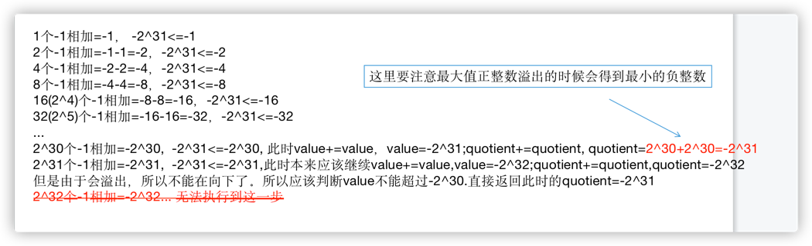

  
# 面试题1： 整数除法

---

### Java中整数的四种基本类型

- byte：1字节 8位   (-2^7^ ~ 2^7^-1)
- short：2字节 16位 (-2^15^ ~ 2^15^-1)
- int：4字节 32位   (-2^31 ~ 2^31-1)
- long：8字节 64位  (-2^63 ~ 2^63-1)


---

### 整数除法

> 输入2个int型整数，它们进行除法运算并返回商，要求不得使用乘号'*'、除号'/'及求余符号'%'。当发生溢出时，返回最大当整数值。假设除数不为0。例如，输入15和2，输出15/2当结果，即7。

- int型正整数的最大值是0x7fffffff = 2^31-1 
- int型正整数的最小值是0x00000001 = 1
- int型负整数的最大值是0xffffffff = -1
- int型负整数的最小值是0x80000000 = -2^31

对于15/2=7这个例子，除法可以理解为求15可以由最多多少个2相加组成。最简单的解法就是一个个试。

但是这样的时间复杂度是O(n)，可不可以减少试的次数，最好试完一个2相加后下一个直接试七个2相加，这肯定没法做到，因为计算七个2相加时我们没法直接知道七个2相加就是12+2，12这个值没法在计算一个2相加时就得到。
所以回过头来看，当我们计算完一个2相加后得到的值是2，之后可以计算两个2相加即2+2=4，得到4之后就可以试四个2相加即4+4=8，之后再试八个2相加即8+8...如下图所示。

通过这个跳跃的试探我们知道15是介于四个2和八个2之间组成的，中间的五个2、六个2、七个2我们都没有试过，所以还要继续查找。这个时候我们已经知道了15肯定是比四个2大的，所以用15-（四个2）=7，继续看看剩下的7是由最多多少个组成，这就和上面同一个流程，因为刚刚计算
15-（四个2）=7的时候已经减去了4个2，所以最终的结果就是4+7/2。
同理计算7/2的时候也是从一个2相加开始试探：

所以7/2的值就是在2和4之间，要么是2要么是3。所以7/2=2+(剩下的7-4=3能由多少个2组成)。

最后剩下3-2=1，继续试探1能由多少个2组成，因为1<除数2，所以1最多由0个2组成。
至此，将上面每个阶段2的个数相加就是结果4+2+1+0=7。

最后的代码如下：
```Java
//a,b为正整数的情况
public int divide1(int a, int b) {
    int result = 0;
    while (a>=b) {
        int value = a;
        int quotient = 1;
        while (a >= value + value) {
            value += value;
            quotient += quotient;//以1，2，4，8，16..的顺序试探
        }
        result += quotient;
    }
    return result;
  }
```

但是还没有结束，上面的代码只能适用与a和b都是正整数的情况，如果一方为整数，另一方为负数，那上面代码里几处大于小于号的判断就会很麻烦，所以我们要保证a和b都是正整数。
因此在使用divide方法前需要将a和b都转化为同号。当一个为正号，一个为负号的时候，就需要对最终结果修改符号了。

```Java

public int divide(int a, int b) {
    int negative = 2;
    if (a<0) {
        a = -a;
        negative--;
    }
    if (b<0) {
        b = -b;
        negative--;
    }
    return negative == 1 ? -divide1(a, b) : divide1(a, b);
  }
```

上面negative初始为2，如果a，b都为正数，negative=2，如果其中一个为负数，negative=1，如果都为负数，negative=0。所以用negative是否等于1来判断a和b是否有一个为负数。

但是还没有结束，因为int最小的负数是-2^31,int最大的正数是2^31-1。此时将-2^31转化为正数2^31就会出现溢出，所以没法将负数转化为正数计算。既然没法都转化为正数，这个时候就可以将a，b两个数都转化为负数来计算，上面的代码就需要改为下面的形式：
```Java
public int divide(int a, int b) {
    int negative = 2;
    if (a > 0) {
      a = -a;
      negative--;
    }
    if (b > 0) {
      b = -b;
      negative--;
    }
    return negative == 1 ? -divideForNegative(a, b) : divideForNegative(a, b);
}

//两个负整数相除
public static int divideForNegative(int a, int b) {
    int result = 0;
    while(a <= b) {
        int value = b;
        int quotient = 1;
        while(a <= value + value) {
            quotient += quotient;
            value += value;
        }
        result += quotient;
        a = a - value;
    }
    return result;
}
```

有一种特殊情况就是题目说的如果a=-2^31,b=-1,最后的计算结果是2^31,但int最大只能表示2^31-1,所以会溢出的，应该在方法开始的地方判断这个情况。
还有一种特殊情况就是如果结果是-2^31,即a=-2^31，b=1的时候，从1个-1开始试起：


所以最终的代码如下：

```Java
public int divide(int a, int b) {
    if (a==0x80000000 && b==-1) {
        return Integer.MAX_VALUE;
    } 
    int negative = 2;
    if (a > 0) {
      a = -a;
      negative--;
    }
    if (b > 0) {
      b = -b;
      negative--;
    }
    return negative == 1 ? -divideForNegative(a, b) : divideForNegative(a, b);
}

//两个负整数相除
public static int divideForNegative(int a, int b) {
    int result = 0;
    while(a <= b) {
        int value = b;
        int quotient = 1;
        while(value >= 0xc0000000 && a <= value + value) {
            quotient += quotient;
            value += value;
        }
        result += quotient;
        a -= value;
    }
    return result;
}
```

