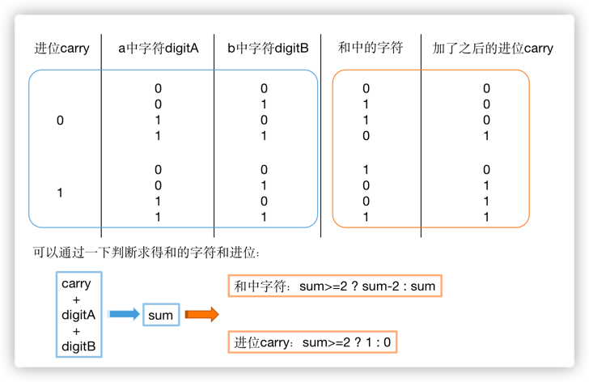

  
#面试题2：二进制加法

---

> 输入两个表示二进制的字符串，请计算它们的和，并以二进制字符串的形式输出。例如，输入的二进制字符串分别是"11"和"10"，则输出"101"。

对于二进制加法，先将两个参数右对齐，从右开始向左，取a的字符，取b的字符，然后在判断该位上应该得到'0'还是'1'，由于还有进位要处理，所以还要用一个变量carry表示进位。
这里需要记住的两个点是：
- 对于循环条件，一开始可能会认为应该用下面的方式，i从0开始循环直到长度的最小值。但这种不太简练还繁琐，书上做法是，从右往左遍历，对于短的字符串，如果下标已经超过了最前面，直接用'0'补齐就可以了。


- 第二个点是，假设取出来a中字符是digitA，b中字符是digitB，应该如何确定和中结果字符以及进位分别是多少呢？


所以最终的代码如下：

```Java
public static String addBinary(String a, String b) {
        StringBuffer sb = new StringBuffer();
        int i = a.length() - 1;
        int j = b.length() - 1;
        int carry = 0;
        while (i >= 0 || j >= 0) {
            int digitA = i >= 0 ? a.charAt(i--) - '0' : 0;
            int digitB = j >= 0 ? b.charAt(j--) - '0' : 0;
            int sum = digitA + digitB + carry;
            carry = sum >= 2 ? 1 : 0;
            sum = sum >= 2 ? sum - 2 : sum;
            sb.append(sum);
        }
        if (carry == 1) {
            sb.append(carry);
        }
        return sb.reverse().toString();
    }
```
