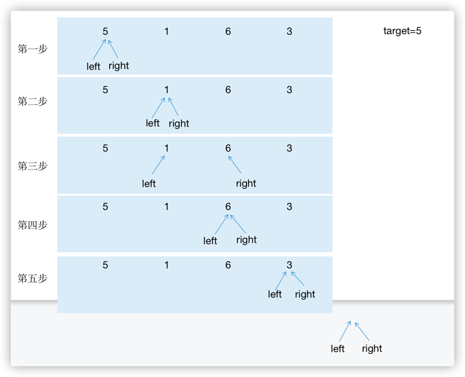

  
## 题目

> 输入一个正整数组成的数组和一个正整数k，请问数组中和大于或等于k的连续子数组的最短长度是多少？
> 如果不存在所有数字之和大于或等于k的子数组，则返回0。
> 例如，输入数组[5,1,4,3],k的值为7，和大于或等于7的最短连续子数组是[4,3],因此输出它的长度为2。

---

## 思路

用两个指针表示一个子数组的区间，当区间内的和大于或等于target时，left指针右移，更新minLength；



- 连续子数组
- 最短长度，也就是说数组内的和刚刚好大于或等于k值。
- 这种用两个指针伸缩式的移动窗口解法一定要记住！！！！

代码：

```Java
public int minSubArrayLen(int target, int[] nums) {
    int minLength = Integer.MAX_VALUE;
    int left = 0;
    int sum = 0;
    for (int right = 0; right < nums.length; right++) {
        sum += nums[right];
        while (left <= right && sum >= target) {
            minLength = Math.min(minLength, right - left + 1);
            sum -= nums[left];
            left++;
        }
    }
    return minLength == Integer.MAX_VALUE ? 0 : minLength;
}
```
