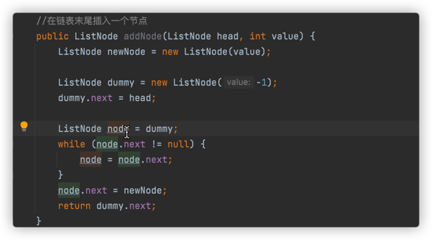

# 链表

---
## 使用哨兵节点添加或删除节点

给一个链表末尾加上一个节点


删除链表中指定值的某一个节点


---

## 面试题21 ：删除倒数第k个节点

### 思路


---

## 面试题22：链表中环的入口节点

### 思路

分两步，先一快一慢得到环中相遇节点；然后另一个从头开始相同步伐走到入口节点。

---

## 面试题23：两个链表的第1个重合节点

### 思路

leetcode后来增加了测试用例，增加了没有公共节点的情况，所有要主要不能用
原来的方法一直循环，不然后一直循环下去，最后超时。用一个count变量记录循环次数。


---

## 面试题24：反转链表

### 思路

```Java
//方法1：前后指针，用空指针开始，严格来说，这不是头插法
class Solution {
    public ListNode reverseList(ListNode head) {
        ListNode pre = null;
        ListNode cur = head;
        while(cur != null) {
            ListNode next = cur.next;
            cur.next = pre;
            pre = cur;
            cur = next;
        }
        return pre;
    }
}
```

```Java
//这种才是真正的头插法
class Solution {
    public ListNode reverseList(ListNode head) {
        ListNode dummy = new ListNode(-1);
        ListNode node = head;
        while (node != null) {
            ListNode next = node.next;
            node.next = dummy.next;
            dummy.next = node;
            node = next;
        }
        return dummy.next;
    }
}
```
```Java
//这种是递归解法
class Solution {
    public ListNode reverseList(ListNode head) {
        if (head == null) {
            return null;
        }
        if (head.next == null) {
            return head;
        }
        ListNode next = reverseList(head.next);
        head.next.next = head;
        head.next = null;
        return next;
    }
}
```
---

