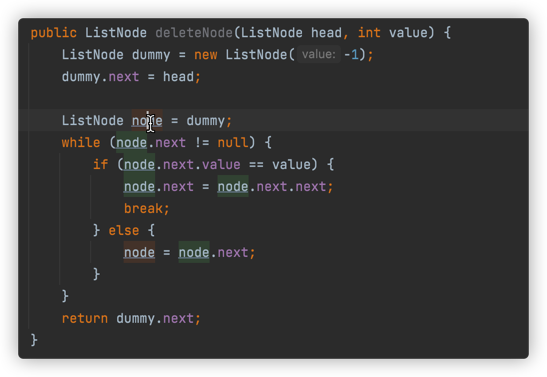
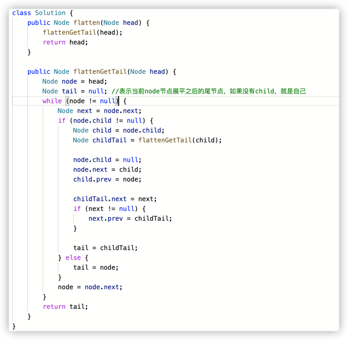

# 链表

---
## 使用哨兵节点添加或删除节点

给一个链表末尾加上一个节点


删除链表中指定值的某一个节点


---

## 面试题21 ：删除倒数第k个节点

### 思路


---

## 面试题22：链表中环的入口节点

### 思路

分两步，先一快一慢得到环中相遇节点；然后另一个从头开始相同步伐走到入口节点。

---

## 面试题23：两个链表的第1个重合节点

### 思路

leetcode后来增加了测试用例，增加了没有公共节点的情况，所有要主要不能用
原来的方法一直循环，不然后一直循环下去，最后超时。用一个count变量记录循环次数。


---

## 面试题24：反转链表

### 思路

```Java
//方法1：前后指针，用空指针开始，严格来说，这不是头插法。但是书上是用这种解法
class Solution {
    public ListNode reverseList(ListNode head) {
        ListNode pre = null;
        ListNode cur = head;
        while(cur != null) {
            ListNode next = cur.next;
            cur.next = pre;
            pre = cur;
            cur = next;
        }
        return pre;
    }
}
```

```Java
//这种才是真正的头插法
class Solution {
    public ListNode reverseList(ListNode head) {
        ListNode dummy = new ListNode(-1);
        ListNode node = head;
        while (node != null) {
            ListNode next = node.next;
            node.next = dummy.next;
            dummy.next = node;
            node = next;
        }
        return dummy.next;
    }
}
```
```Java
//这种是递归解法
class Solution {
    public ListNode reverseList(ListNode head) {
        if (head == null) {
            return null;
        }
        if (head.next == null) {
            return head;
        }
        ListNode next = reverseList(head.next);
        head.next.next = head;
        head.next = null;
        return next;
    }
}
```

---

## 面试题25 链表中的数字相加

### 思路

反转后的两个链表相加的时候，要用哨兵节点保存头节点；还要记住进位的计算方式

---

## 面试题26 重排链表

### 思路

先对半分，获得第二办的头节点；把第二半的链表反转；用prev指针辅助重排。
最重要的就是下面的将两个链表重排操作


---

## 面试题27 回文链表

### 思路

先对半分，将第二个链表反转，再一个个判断节点是否相同。要注意的是：

- 对半分的时候，链表如果有奇数个节点，那么第一个链表的最后一个多出来的节点就不要了。

---

## 面试题28 展开多级双向链表

### 思路



---

## 面试题29 排序的循环链表

### 思路
循环判断当前节点和下一节点，是不是可以插在当前节点和下一节点之间，并且在循环过程中记录链表中最大值；
如果循环一圈之后都不能插在当前节点和下一节点之间，说明新加入节点的是最大值或最小值，需要插在最大值和最小值之间，
这个时候就利用记录下来的最大值节点插入。


---

## 面试题30 插入、删除和随机访问都是O(1)的容器

### 思路 

```Java
class RandomizedSet {
    HashMap<Integer, Integer> numToLocation;
    ArrayList<Integer> nums;//数组用ArrayList实现

    /** Initialize your data structure here. */
    public RandomizedSet() {
        numToLocation = new HashMap<>();
        nums = new ArrayList<>();
    }
    
    /** Inserts a value to the set. Returns true if the set did not already contain the specified element. */
    public boolean insert(int val) {
        if (numToLocation.containsKey(val)) {
            return false;
        } else {
            nums.add(val);
            numToLocation.put(val, nums.size() - 1);
            return true;
        }
    }
    
    /** Removes a value from the set. Returns true if the set contained the specified element. */
    public boolean remove(int val) {
        if (!numToLocation.containsKey(val)) {
            return false;
        } else {
            //删除一个元素的时候要注意，数组将最后一个元素和待删除元素交换位置，然后直接删除最后一个位置上的元素就行。避免后面的元素移动位置。
            int location = numToLocation.get(val);
            numToLocation.put(nums.get(nums.size() - 1), location);
            numToLocation.remove(val);
            nums.set(location, nums.get(nums.size() - 1));
            nums.remove(nums.size() - 1);
            return true;
        }
    }
    
    /** Get a random element from the set. */
    public int getRandom() {
        Random random = new Random();
        int r = random.nextInt(nums.size());
        return nums.get(r);
    }
}

/**
 * Your RandomizedSet object will be instantiated and called as such:
 * RandomizedSet obj = new RandomizedSet();
 * boolean param_1 = obj.insert(val);
 * boolean param_2 = obj.remove(val);
 * int param_3 = obj.getRandom();
 */
```

---
 
## 面试题31： 最近最少使用缓存

### 思路

用哈希表和双向链表实现，哈希表中键是key，值是双向链表的节点；双向链表中一个节点有key，value，next，prev指针。
- 插入元素的时候，如果缓存中有，直接将该节点移到尾节点；如果缓存没有，需要先看缓存时候慢了，如果满了，要先把双向链表中头节点和哈希表中该节点移除，然后插入双向链表尾部。

```Java
class LRUCache {

    class ListNode {
        public int key;
        public int value;

        public ListNode next;
        public ListNode prev;
        public ListNode(int k, int v) {
            key = k;
            value = v;
        }
    }

    private ListNode head;
    private ListNode tail;
    private Map<Integer, ListNode> map;
    int cap;

    public LRUCache(int capacity) {
        map = new HashMap<>();
        head = new ListNode(-1, -1);
        tail = new ListNode(-1, -1);
        head.next = tail;
        tail.prev = head;

        cap = capacity; //构造函数的参数和成员变量参数不能相同
    }
    
    public int get(int key) {
        ListNode node = map.get(key);
        if (node == null) {
            return -1;
        }
        moveToTail(node, node.value);
        return node.value;
    }
    
    public void put(int key, int value) {
        if (map.containsKey(key)) {
            moveToTail(map.get(key), value);
        } else {
            if (map.size() == cap) {
                ListNode toBeDeleted = head.next;
                deleteNode(toBeDeleted);
                map.remove(toBeDeleted.key);
            }
            ListNode node = new ListNode(key, value);
            insertToTail(node);
            map.put(key, node);
        }
    }
    //辅助函数
    private void moveToTail(ListNode node, int newValue) {
        deleteNode(node);
        node.value = newValue;
        insertToTail(node);
    }
    private void deleteNode(ListNode node) {
        node.prev.next = node.next;
        node.next.prev = node.prev;
    }
    private void insertToTail(ListNode node) {
        tail.prev.next = node;
        node.prev = tail.prev;
        node.next = tail;
        tail.prev = node;
    }
}

/**
 * Your LRUCache object will be instantiated and called as such:
 * LRUCache obj = new LRUCache(capacity);
 * int param_1 = obj.get(key);
 * obj.put(key,value);
 */
```

---

