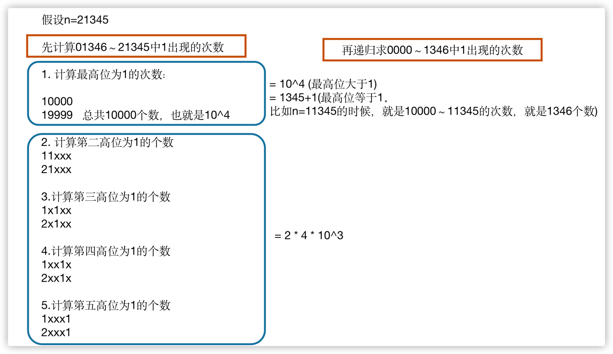
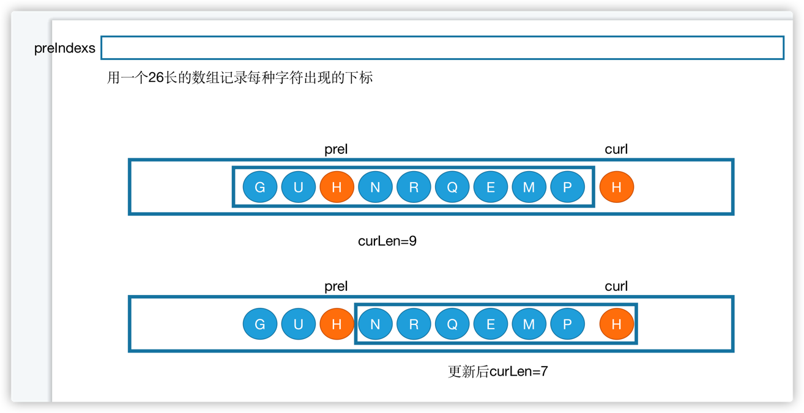
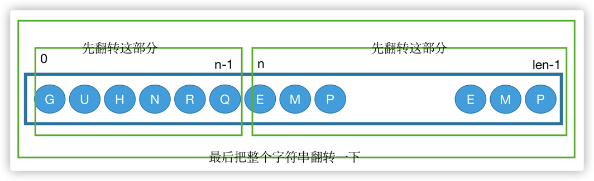

## 面试题26：树的子结构

### 思路
书上的思路是先在A树中到到与B树根节点一样的节点，然后判断该子树是不是和B树一样，这种方法很难写，还是下面的简单点。
```java
/**
public class TreeNode {
    int val = 0;
    TreeNode left = null;
    TreeNode right = null;

    public TreeNode(int val) {
        this.val = val;

    }

}
*/
public class Solution {
    public boolean HasSubtree(TreeNode root1,TreeNode root2) {
        if (root1 == null || root2 == null) {
            return false;
        }
        return isSubTreeWithRoot(root1, root2) || HasSubtree(root1.left, root2) || HasSubtree(root1.right, root2);
    }
    private boolean isSubTreeWithRoot(TreeNode root1, TreeNode root2) {
        if (root2 == null) {
            return true;
        }
        if (root1 == null) {
            return false;
        }
        
        if (root1.val != root2.val) {
            return false;
        }
        return isSubTreeWithRoot(root1.left, root2.left) && isSubTreeWithRoot(root1.right, root2.right);
    }
}

```

# 第四章：解决面试题的思路

## 面试题27：二叉树的镜像

```java
import java.util.*;

/*
 * public class TreeNode {
 *   int val = 0;
 *   TreeNode left = null;
 *   TreeNode right = null;
 *   public TreeNode(int val) {
 *     this.val = val;
 *   }
 * }
 */

public class Solution {
    /**
     * 代码中的类名、方法名、参数名已经指定，请勿修改，直接返回方法规定的值即可
     *
     * 
     * @param pRoot TreeNode类 
     * @return TreeNode类
     */
    public TreeNode Mirror (TreeNode pRoot) {
        // write code here
        if (pRoot == null) {
            return null;
        }

        TreeNode tmp = pRoot.left;
        pRoot.left = pRoot.right;
        pRoot.right = tmp;

        Mirror(pRoot.left);
        Mirror(pRoot.right);

        return pRoot;
    }
}
```

## 面试题28：对称的二叉树

### 思路

```java
/*
public class TreeNode {
    int val = 0;
    TreeNode left = null;
    TreeNode right = null;

    public TreeNode(int val) {
        this.val = val;

    }

}
*/
public class Solution {
    boolean isSymmetrical(TreeNode pRoot) {
        if (pRoot == null) {
            return true;
        }
        return isMirror(pRoot.left, pRoot.right);
    }
    boolean isMirror(TreeNode p1, TreeNode p2) {
        if (p1 == null && p2 == null) {
            return true;
        }
        if (p1 == null || p2 == null) {
            return false;
        }
        return p1.val == p2.val && isMirror(p1.left, p2.right) && isMirror(p1.right, p2.left);
    }
}

```

## 面试题29：顺时针打印矩阵

### 思路

```java
import java.util.ArrayList;
import java.util.List;

public class Solution {
    public ArrayList<Integer> printMatrix(int [][] matrix) {
        ArrayList<Integer> res = new ArrayList<>();
        int r1 = 0, r2 = matrix.length - 1;
        int c1 = 0, c2 = matrix[0].length - 1;
        while (r1 <= r2 && c1 <= c2) {
            for (int i = c1; i <= c2; i++) {
                res.add(matrix[r1][i]);
            }

            for (int i = r1 + 1; i <= r2; i++) {
                res.add(matrix[i][c2]);
            }

            if (r1 != r2) {
                for (int i = c2 - 1; i >= c1; i--) {
                    res.add(matrix[r2][i]);
                }
            }

            if (c1 != c2) {
                for (int i = r2 - 1; i > r1; i--) {
                    res.add(matrix[i][c1]);
                }
            }
            r1++;
            r2--;
            c1++;
            c2--;
        }
        return res;
    }
}
```

## 面试题30：包含min函数的栈

### 思路

一个dataStack，一个minStack
```java
import java.util.Stack;

public class Solution {

    Stack<Integer> s1 = new Stack<>();
    Stack<Integer> s2 = new Stack<>();

    
    public void push(int node) {
        s1.push(node);
        s2.push(s2.isEmpty() ? node : Math.min(s2.peek(), node));
    }
    
    public void pop() {
        s1.pop();
        s2.pop();
        
    }
    
    public int top() {
        return s1.peek();
    }
    
    public int min() {
        return s2.peek();
    }
}

```

## 面试题31：栈的压入、弹出序列

### 思路
使用一个栈来模拟压入弹出操作。每次入栈一个元素后，都要判断一下栈顶元素是不是当前出栈序列的第一个元素，如果是的话则执行出栈操作并将popSequence往后移一位，继续进行判断。
```java
import java.util.ArrayList;
import java.util.Stack;

public class Solution {
    public boolean IsPopOrder(int [] pushA,int [] popA) {
        Stack<Integer> stack = new Stack<>();
        for (int i = 0, j = 0; i < pushA.length; i++) {
            stack.push(pushA[i]);
            while (j < popA.length && !stack.isEmpty() && stack.peek() == popA[j]) {
                stack.pop();
                j++;
            }
        }
        return stack.isEmpty();
    }
}
```

## 面试题32：从上到下打印二叉树

### 思路

```java
import java.util.ArrayList;
import java.util.LinkedList;
import java.util.Queue;
/**
public class TreeNode {
    int val = 0;
    TreeNode left = null;
    TreeNode right = null;

    public TreeNode(int val) {
        this.val = val;

    }

}
*/
public class Solution {
    public ArrayList<Integer> PrintFromTopToBottom(TreeNode root) {
        ArrayList<Integer> res = new ArrayList<>();
        if (root == null) {
            return res;
        }
        Queue<TreeNode> queue = new LinkedList<>();
        queue.add(root);
        while (!queue.isEmpty()) {
            TreeNode cur = queue.poll();
            res.add(cur.val);
            if (cur.left != null) {
                queue.add(cur.left);
            }
            if (cur.right != null) {
                queue.add(cur.right);
            }
        }
        return res;
    }
}

```

## 分行从上到下打印二叉树

```java
public class 分行从上到下打印二叉树 {
    ArrayList<ArrayList<Integer>> Print(TreeNode pRoot) {
        ArrayList<ArrayList<Integer>> res = new ArrayList<>();
        Queue<TreeNode> queue = new LinkedList<>();
        queue.add(pRoot);
        while (!queue.isEmpty()) {
            ArrayList<Integer> list = new ArrayList<>();
            int cnt = queue.size();
            while (cnt-- > 0) {
                TreeNode node = queue.poll();
                if (node == null) {
                    continue;
                }
                list.add(node.val);
                queue.add(node.left);
                queue.add(node.right);
            }
            if (list.size() != 0) {
                res.add(list);
            }
        }
        return res;
    }
}
```
## 按之字形打印二叉树

```java
package Algorithm4th.剑指offer第二版2023;

import Algorithm4th.剑指offer专项突破版.TreeNode;

import java.util.ArrayList;
import java.util.Collections;
import java.util.LinkedList;
import java.util.Queue;

public class 按之字形打印二叉树 {
    ArrayList<ArrayList<Integer>> Print(TreeNode pRoot) {
        ArrayList<ArrayList<Integer>> res = new ArrayList<>();
        Queue<TreeNode> queue = new LinkedList<>();
        
        queue.add(pRoot);
        boolean reverse = false;
        while (!queue.isEmpty()) {
            ArrayList<Integer> list = new ArrayList<>();
            int cnt = queue.size();
            while (cnt-- > 0) {
                TreeNode node = queue.poll();
                if (node == null) {
                    continue;
                }
                list.add(node.val);
                queue.add(node.left);
                queue.add(node.right);
            }
            if (reverse) {
                Collections.reverse(list);
            }
            reverse = !reverse;
            if (list.size() != 0) {
                res.add(list);
            }
        }
        return res;
    }
}

```

## 面试题33：二叉搜索树的后序遍历序列

把序列分成三部分，最后一个节点一定是根节点，也是中间大小的节点，遍历序列每一个树，找到第一个大于根节点的值，判断后面的数是不是都大于根节点的值，
然后递归判断第一部分和第二部分是不是二叉搜索树的后序遍历序列。

小小小小小｜大大大大｜中

```java
public class Solution {
    public boolean VerifySquenceOfBST(int [] sequence) {
        if (sequence == null || sequence.length == 0) {
            return false;
        }
        return verify(sequence, 0, sequence.length - 1);
    }
    private boolean verify(int[] sequence, int start, int end) {
        if (end - start <= 1) {
            return true;
        }
        int rootVal = sequence[end];
        int index = start;
        while (index < end && (sequence[index] <= rootVal)) {
            index++;
        }
        for (int i = index; i < end; i++) {
            if (sequence[i] < rootVal) {
                return false;
            }
        }
        return verify(sequence, start, index - 1) && verify(sequence, index, end - 1);
    }
}
```

## 面试题34：二叉树中和为某一值的路径

遍历到当前node节点要做的操作是：
- 判断节点是否为空
- node加入路径，target值更新
- 如果node是叶子节点，则更新路径列表
- 如果不是，递归遍历左右子节点
- 回溯
```java
import java.util.ArrayList;

public class Solution {
    public ArrayList<ArrayList<Integer>> FindPath(TreeNode root,int expectNumber) {
        ArrayList<ArrayList<Integer>> res = new ArrayList<>();
        backTracking(root, expectNumber, res, new ArrayList<>());
        return res;
    }
    private void backTracking(TreeNode node, int target, ArrayList<ArrayList<Integer>> res, ArrayList<Integer> path) {
        if (node == null) {
            return;
        }
        path.add(node.val);
        target -= node.val;
        if (target == 0 && node.left == null && node.right == null) {
            res.add(new ArrayList<>(path));
        } else {
            backTracking(node.left, target, res, path);
            backTracking(node.right, target, res, path);
           
        }
        path.remove(path.size() - 1);
    }
}
```

## 面试题35：复杂链表的复制

```java
/*
public class RandomListNode {
    int label;
    RandomListNode next = null;
    RandomListNode random = null;

    RandomListNode(int label) {
        this.label = label;
    }
}
*/
public class Solution {
    public RandomListNode Clone(RandomListNode pHead) {

        if (pHead == null) {
            return null;
        }
        RandomListNode cur = pHead;
        while (cur != null) {
            RandomListNode clone = new RandomListNode(cur.label);
            clone.next = cur.next;
            cur.next = clone;
            cur = clone.next;
        }

        cur = pHead;
        while (cur != null) {
            RandomListNode clone = cur.next;
            if (cur.random != null) {
                clone.random = cur.random.next;
            }
            cur = clone.next;
        }

        //注意这里第三步，分开的操作
        cur = pHead;
        RandomListNode cloneHead = cur.next;
        while (cur.next != null) {
            RandomListNode next = cur.next;
            cur.next = next.next;
            cur = next;
        }
        return cloneHead;
        
    }
}

```

## ！！【背】面试题36：二叉搜索树与双向链表

应该中序遍历。当遍历node节点时，先遍历完左子树，之后左子树就会变成一个双向链表，假设这个双向链表的尾节点是pre，那么在遍历当前节点时，
node.left = pre, pre.right = node。这个时候左子树的双向链表加上当前node节点就是一个新的双向链表，新链表的尾节点就是node，此时更新pre=node。
然后遍历node的右子树。

```java
/**
public class TreeNode {
    int val = 0;
    TreeNode left = null;
    TreeNode right = null;

    public TreeNode(int val) {
        this.val = val;

    }

}
*/
public class Solution {

    TreeNode pre = null;
    TreeNode head = null;
    public TreeNode Convert(TreeNode pRootOfTree) {
        inOrder(pRootOfTree);
        return head;
    }
    private void inOrder(TreeNode node) {
        if (node == null) {
            return ;
        }
        inOrder(node.left);
        node.left = pre;//inOrder之后的尾节点
        if (pre != null) {
            pre.right = node;
        }

        pre = node;
        if (head == null) {
            head = node;
        }
        inOrder(node.right);
    }
}

```
## 面试题37：序列化二叉树

有没有另外一种写法，可以不用定义全局变量？str作为参数应该怎么写？
```java

public class Solution {
    String Serialize(TreeNode root) {
        if (root == null) {
            return "#";
        }
        return root.val + " " + Serialize(root.left) + " " + Serialize(root.right);
    }

    private String deserializeStr;
    TreeNode Deserialize(String str) {
        deserializeStr = str;
        return Deserialize();

    }

    TreeNode Deserialize() {
        //先找出str的根节点
        if (deserializeStr.length() == 0) {
            return null;
        }

        int index = deserializeStr.indexOf(" ");
        
        String nodeStr = index == -1 ? deserializeStr : deserializeStr.substring(0, index);
        deserializeStr = index == -1 ? "" : deserializeStr.substring(index + 1);
        if (nodeStr.equals("#")) {
            return null;
        }
    
        TreeNode node = new TreeNode(Integer.valueOf(nodeStr));
        node.left = Deserialize();
        node.right = Deserialize();
        return node;

       
    }
}
```

## 面试题38：字符串的排列

第二版的回溯和专项突破版的回溯的模版有点不一样。要注意区别

```java
import java.util.ArrayList;
import java.util.Arrays;
public class Solution {
    public ArrayList<String> Permutation(String str) {
        ArrayList<String> res = new ArrayList<>();
        if (str.length() == 0) {
            return res;
        }

        char[] chars = str.toCharArray();
        Arrays.sort(chars);

        backtracking(chars, new boolean[chars.length], new StringBuilder(), res);
        return res;
       
    }

    private void backtracking(char[] chars, boolean[] hasUsed, StringBuilder sb, ArrayList<String> res) {
        if (sb.length() == chars.length) {
            res.add(sb.toString());
        } else {
            for (int i = 0; i < chars.length; i++) {
                if (hasUsed[i]) {
                    continue;
                }
                if (i != 0 && chars[i] == chars[i-1] && !hasUsed[i-1]) {
                    continue;
                }

                hasUsed[i] = true;
                sb.append(chars[i]);
                backtracking(chars, hasUsed, sb, res);
                sb.deleteCharAt(sb.length() - 1);
                hasUsed[i] = false;
            }
        }
    }
}
```

## 面试题39：数组中出现次数超过一半的数字
多数投票问题，当cnt等于0的时候，说明已经遍历的数字中有一半都不是该数字了，此时，majority就要换人了。
注意这种方法只是找出出现次数最多的那个数，并不表示这个数一定超过半数了，最后的cnt也不是表示这个数出现的次数。
```java
public class Solution {
    public int MoreThanHalfNum_Solution(int [] array) {
        int majority = array[0];
        int cnt = 1;
        for (int i = 1; i < array.length; i++) {
            cnt = array[i] == majority ? cnt + 1 : cnt - 1;
            if (cnt == 0) {
                majority = array[i];
                cnt = 1;
            }
        }
        return majority;
    }
}
```

## 面试题40：最小的k个数

用一个k大小的大顶堆，保存小的数，每次进来一个数，判断是不是比堆顶小，是的话，就替换掉堆顶元素。这样就能一直保存堆中的数都是最小的k个数。

另一种做法是用快速排序的partition操作，找到index，是index=k，这样index左边都是小的数。

```java
public class Solution {
    public ArrayList<Integer> GetLeastNumbers_Solution(int [] input, int k) {
        if (k <= 0 || k > input.length) {
            return new ArrayList<>();
        }
        Queue<Integer> maxHeap = new PriorityQueue<>((o1, o2) -> (o2 - o1));
        for (int num : input) {
            maxHeap.offer(num);
            if (maxHeap.size() > k) {
                maxHeap.poll();
            }
        }
        return new ArrayList<>(maxHeap);
    }
}
```

## 面试题41：数据流中的中位数

把大顶堆中最大的，和小顶堆中最小的，取平均就是中位数。

```java
public class Solution {
    Queue<Integer> left = new PriorityQueue<>((o1, o2) -> (o2 - o1));
    Queue<Integer> right = new PriorityQueue<>();
    private int count = 0;

    public void Insert(Integer num) {
        //放到right里
        if (count % 2 == 0) {
            left.offer(num);
            right.offer(left.poll());
        } else {
            right.offer(num);
            left.offer(right.poll());
        }
        count++;
    }

    public Double GetMedian() {
        if (count % 2 == 0) {
            return (left.peek() + right.peek()) / 2.0;
        } else {
            return (double)right.peek();
        }
    }
}
```

## 字符流中第一个不重复的字符

```java
class Solution {
    public char firstUniqChar(String s) {
        //用队列保存只出现一次的字符，每次遍历字符的时候，都判断队列中是不是有出现次数多于一次的字符，有就移除
        int[] cnts = new int[26];
        Queue<Character> queue = new LinkedList<>();
        for (char ch : s.toCharArray()) {
            cnts[ch - 'a']++;
            queue.offer(ch);
            while (!queue.isEmpty() && cnts[queue.peek() - 'a'] >= 2) {
                queue.poll();
            }
        }
        return queue.isEmpty() ? ' ' : queue.peek();
    }
}
```

## 面试题42：连续子数组的最大和

用dp(i)表示以前i个数以下标为i-1的数为结尾的连续子数组的最大和

dp(i) = 如果dp(i-1)<=0的话，dp（i）等于nums[i-1]自己，如果dp(i-1)>0,dp(i)=dp(i-1)+nums[i-1];
当i=0的时候，dp(0) = 0

所以
dp(i)= dp(i-1)+nums[i-1] , i!=0 && dp(i-1)>0  
        = nums[i-1], dp(i-1)<=0  
        = 0, i==0;

要注意，max的初始值是最小值，dp[0]的值是0
```java
public class Solution {
    public int FindGreatestSumOfSubArray(int[] array) {
        if (array.length == 0) {
            return 0;
        }
        int[] dp = new int[array.length+1];
        dp[0] = 0;
        int max = Integer.MIN_VALUE;
        for (int i = 1; i <= array.length; i++) {
            if (dp[i-1] <= 0) {
                dp[i] = array[i-1];
            } else {
                dp[i] = dp[i-1] + array[i-1];
            }
            max = Math.max(max, dp[i]);
        }
        return max;
    }
}
```

## 面试题43：1～n整数中1出现的次数

书上的解法，比较容易理解



```java
class Solution {
    public int countDigitOne(int n) {
        String str = String.valueOf(n);
        if (n<=0) {
            return 0;
        }
        if (n > 0 && n <= 9) {
            return 1;
        }

        int first = str.charAt(0) - '0';
        int length = str.length();

        //假设n=21345，先求01346～21345的1出现次数，00000～01345的次数可以递归计算。
      //先计算最高位为1的次数，从10000～19999，出现10000次，再计算第二位为1的次数，2*（4）* 10^3,
        int numFirstDigit = 0;
        if (first > 1) {
            numFirstDigit = PowerBase10(length - 1);
        } else if (first == 1) {
            numFirstDigit = Integer.valueOf(str.substring(1)) + 1;
        }

        int numOtherDigits = first*(length-1)*PowerBase10(length-2);

        int numRecursive = countDigitOne(Integer.valueOf(str.substring(1)));

        return numFirstDigit + numOtherDigits + numRecursive;
    }

    private int PowerBase10(int n) {
        int result = 1;
        for (int i = 0; i < n; i++) {
            result *= 10;
        }
        return result;
    }
}
```

## 面试题44：数字序列中某一位的数字

注意leetcode和牛客上有一个测试用例是输入n=1000000000，这个时候当place=9的时候，有9*10^8个数，占9*9*10^8位，这个时候totalAmount会溢出，所以加一个判断，
当place大于等于9的时候，直接进入判断。
```java
import java.util.*;


public class Solution {
    /**
     * 代码中的类名、方法名、参数名已经指定，请勿修改，直接返回方法规定的值即可
     *
     * 
     * @param n int整型 
     * @return int整型
     */
    public int findNthDigit (int n) {
        // write code here
        if (n < 0) {
            return -1;
        }
        int place = 1;
        while (true) {
            int amount = getAmountOfPlace(place);//place位数有多少个
            long totalAmount = amount * place; // 能占多少位
            if (n < totalAmount || place >= 9) { //重要！！！！
                return getDigitAtIndex(n, place);
            }
            n -= totalAmount;
            place++;
        }
    }

    private int getAmountOfPlace(int place) {
        if (place == 1) {
            return 10;
        }
        return (int) Math.pow(10, place-1) * 9;//2位数从10到99有90(9*10)个数，3位数从100到999有900(9*100)个数，4位数从1000到9999有9000(9*1000)个数
    }

    private int getDigitAtIndex(int index, int place) {
        int beginNumber = getBeginNumberOfPlace(place);
        int shiftNumber = index / place;//第几个数
        String number = (beginNumber + shiftNumber) + "";
        int count = index % place;
        return number.charAt(count) - '0';
    }

    private int getBeginNumberOfPlace(int place) {
        if (place == 1) {
            return 0;
        }
        return (int) Math.pow(10, place-1);
    }
}
```

## 面试题45：把数组排成最小的数

```java
public class Solution {
    public String PrintMinNumber(int [] numbers) {
        if (numbers == null || numbers.length == 0) {
            return "";
        }

        String[] strs = new String[numbers.length];
        for (int i = 0; i < numbers.length; i++) {
            strs[i] = numbers[i] + "";
        }

        Arrays.sort(strs, (num1, num2) -> {
            int str1 = Integer.valueOf(num1 + num2);
            int str2 = Integer.valueOf(num2 + num1);
            return str1 - str2;
        });

        String res = "";
        for (String str : strs) {
            res += str;
        }
        return res;

    }
}
```

## 面试题46：把数字翻译成字符串

用dp(i)表示前i位能组成多少中翻译方法，此时判断i-1位的数字应该怎么组合
> 当i-1位的数字自己一个人组成一位时，此时i-1位必须是1～9中的一个数；
> 当i-1位和i-2位的数字组合成两位数是，此时，i-2位的数字必须不能是0，且组合成的数字必须是10～26之间。

```java
public class Solution {
    public int solve (String nums) {
        // write code here
        if (nums == null || nums.length() == 0) {
            return 0;
        }
        int[] dp = new int[nums.length() + 1];
        dp[0] = 1;
        dp[1] = nums.charAt(0) == '0' ? 0 : 1;
        for (int i = 2; i <= nums.length(); i++) {
            int one = nums.charAt(i-1) - '0';
            if (one != 0) {
                dp[i] += dp[i-1];
            }
            if (nums.charAt(i-2) == '0') {
                continue;
            }
            int two = Integer.valueOf(nums.substring(i-2, i));
            if (two <= 26) {
                dp[i] += dp[i-2];
            }
        }
        return dp[nums.length()];
    }
}
```

## 面试题47：礼物的最大价值

动态规划在填表的时候，一定要注意填表顺序。这种二维矩阵的填表其实应该用一个一维的dp数组更好。

```java
import java.util.*;


public class Solution {
    /**
     * 代码中的类名、方法名、参数名已经指定，请勿修改，直接返回方法规定的值即可
     *
     * 
     * @param grid int整型二维数组 
     * @return int整型
     */
    public int maxValue (int[][] grid) {
        // write code here
        if (grid.length == 0 || grid[0].length == 0) {
            return 0;
        }
        int[][] dp = new int[grid.length][grid[0].length];
        dp[0][0] = grid[0][0];
        for (int i = 0; i < grid.length; i++) {
            for (int j = 0; j < grid[0].length; j++) {
                if (i == 0 && j == 0) {
                    dp[i][j] = grid[0][0];
                } else if (i == 0) {
                    dp[i][j] = dp[i][j-1] + grid[i][j];
                } else if (j == 0) {
                    dp[i][j] = dp[i-1][j] + grid[i][j];
                } else {
                    dp[i][j] = Math.max(dp[i][j-1], dp[i-1][j]) + grid[i][j];
                }
            }
        }
        return dp[grid.length - 1][grid[0].length - 1];
    }
}
```
## 面试题48：最长不含重复字符的子字符串



牛客上这道题有个测试用例是输入" "，所以字符串中的字符有可能不是a到z，所以定义一个128长度的数组。
```java
import java.util.*;


public class Solution {
    /**
     * 代码中的类名、方法名、参数名已经指定，请勿修改，直接返回方法规定的值即可
     *
     * 
     * @param s string字符串 
     * @return int整型
     */
    public int lengthOfLongestSubstring (String s) {
        // write code here

        if (s == null || s.length() == 0) {
            return 0;
        }

        int curLen = 0;
        int maxLen = 0;

        int[] preIndexs = new int[128];
        Arrays.fill(preIndexs, -1);
        for (int curI = 0; curI < s.length(); curI++) {
            int ch = s.charAt(curI) - ' ';
            int preI = preIndexs[ch];
            if (preI == -1 || curI - preI > curLen) {
                curLen++;
            } else {
                maxLen = Math.max(maxLen, curLen);
                curLen = curI - preI;
            }
            preIndexs[ch] = curI;
        }
        maxLen = Math.max(maxLen, curLen);
        return maxLen;
    }
}
```

## [背！！]面试题49：丑数
```java
public class Solution {
    public int GetUglyNumber_Solution(int index) {
        if (index <= 6) {
            return index;
        }
        int i2 = 0, i3 = 0, i5= 0;
        int[] dp = new int[index+1];
        dp[1]= 1;//第一个丑数是1
        int x=1, y=1, z=1;//初始第一个丑数
        for (int i = 2; i <= index; i++) {
            int next2 = dp[x] * 2;
            int next3 = dp[y] * 3;
            int next5 = dp[z] * 5;
            dp[i] = Math.min(next2, Math.min(next3, next5));//第i个丑数肯定是前面某一个丑数乘以2，或乘以3，或乘以5得到的，也一定是这三个乘积的最小的那一个
            if (dp[i] == next2) {
                //说明第x个丑数乘以2会得到第i个丑数，那第x+1个丑数乘以2得到的是排在i后面的丑数
                x++;
            }
            if (dp[i] == next3) {
                y++;
            }
            if (dp[i] == next5) {
                z++;
            }
        }

        return dp[index];//返回第index个丑数

    }
}
```

## 面试题50：第一个只出现一次的字符

这道题和前面有一个还有点区别，前面是要求第一次不重复的字符，这个是要返回字符所在的下标，所以必须保存下标这个值。
所以这道题还是用哈希表保存字符出现的次数比较好。

```java
public class Solution {
    public int FirstNotRepeatingChar(String str) {
        int[] cnts = new int[256];
        for (char ch : str.toCharArray()) {
            cnts[ch - ' ']++;
        }
        for (int i = 0; i < str.length(); i++) {
            if (cnts[str.charAt(i) - ' '] == 1) {
                return i;
            }
        }
        return -1;
        
    }
}
```

## 面试题51：数组中的逆序对

在归并排序的过程中计算逆序对个数

```java
public class Solution {

    private long cnt = 0;
    private int[] tmp;
    public int InversePairs(int [] array) {
        tmp = new int[array.length];
        mergeSort(array, 0, array.length-1);
        return (int)(cnt % 1000000007);
    }
    private void mergeSort(int[] nums, int l, int h) {
        if (h-l<1) {
            return;
        }
        int m = l + (h - l) / 2;
        mergeSort(nums, l, m);
        mergeSort(nums, m+1, h);
        merge(nums, l, m, h);
    }
    private void merge(int[] nums, int l, int m, int h) {
        int i = l, j = m+1, k = l;
        while (i <= m || j <= h) {
            if (i > m) {
                tmp[k] = nums[j];
                j++;
            } else if (j > h) {
                tmp[k] = nums[i];
                i++;
            } else if (nums[i] <= nums[j]) {
                tmp[k] = nums[i];
                i++;
            } else {
                tmp[k] = nums[j];
                j++;
                this.cnt += m - i + 1;
            }
            k++;
        }
        for (k = l; k <= h; k++) {
            nums[k] = tmp[k];
        }
    }
}

```

## 面试题52：两个链表的第一个公共节点
要记得用一个cnt值记录修改次数。
```java
public class Solution {
    public ListNode FindFirstCommonNode(ListNode pHead1, ListNode pHead2) {
        if (pHead1 == null || pHead2 == null) {
            return null;
        }
        ListNode p1 = pHead1;
        ListNode p2 = pHead2;
        int cnt = 0;
        while (p1 != p2) {
            if (p1.next == null) {
                p1 = pHead2;
                cnt++;
            } else {
                p1 = p1.next;
            }

            if (p2.next == null) {
                p2 = pHead1;
                cnt++;
            } else {
                p2 = p2.next;
            }
            if (cnt > 2) {
                return null;
            }
        }
        return p1;
    }
}

```
## 面试题53：在排序数组中查找数字

```java
public class Solution {
    public int GetNumberOfK(int [] array , int k) {
        if (array.length == 0) {
            return 0;
        }
        int firstKIndex = getFirstK(array, 0, array.length -1, k);
        int lastKIndex = getLastK(array, 0, array.length-1,k);
        if (firstKIndex > -1 && lastKIndex > -1) {
            return lastKIndex - firstKIndex + 1;
        } else {
            return 0;
        }
       
    }
    //找到k第一次出现时的下标
    private int getFirstK(int[] array, int l, int h, int k) {
        if (h < l) {
            return -1;
        }
        int mid = l + (h-l)/2;
        if (array[mid] == k) {
            if (mid == 0 || array[mid-1] != k) {
                return mid;
            } else {
                return getFirstK(array, l, mid-1, k);
            }
        } else if (array[mid] > k){
            return getFirstK(array, l, mid-1, k);
        } else {
            return getFirstK(array, mid+1, h, k);
        }
    }

    //找到最后一个k出现的下标
    private int getLastK(int[] array, int l, int h, int k) {
        if (l > h) {
            return -1;
        }
        int mid = l + (h-l)/2;
        if (array[mid] == k) {
            if (mid == array.length - 1 || array[mid + 1] != k) {
                return mid;
            } else {
                return getLastK(array, mid + 1, h, k);
            }
        } else if (array[mid] < k) {
            return getLastK(array, mid + 1, h, k);
        } else {
            return getLastK(array, l, mid - 1, k);
        }
    }
}
```

## 面试题54：二叉搜索树的第k大节点

```java
public class Solution {
    
     private int cnt = 0;
     private TreeNode res = new TreeNode(-1);

    public int KthNode (TreeNode proot, int k) {
        if (proot == null || k == 0) {
            return -1;
        }
        inOrder(proot, k);
        return res.val;
    }
    private void inOrder(TreeNode root, int k) {
        if (root == null || cnt >= k) {
            return;
        }
        inOrder(root.left, k);
        cnt++;
        if (cnt == k) {
            res = root;
        }
        inOrder(root.right, k);
    }
}
```

## 面试题55：二叉树的深度

```java
public class Solution {
    public int TreeDepth(TreeNode root) {
        if (root == null) {
            return 0;
        }
        int left = TreeDepth(root.left);
        int right = TreeDepth(root.right);
        return 1 + Math.max(left, right);
    }
}
```

## 平衡二叉树

```java
public class 平衡二叉树 {

    private boolean isBalanced = true;
    boolean isBalanced(TreeNode root) {
        if (root == null) {
            return false;
        }
        height(root);
        return isBalanced;
    }
    private int height(TreeNode root) {
        if (root == null || !isBalanced) {
            return 0;
        }
        int left = height(root.left);
        int right = height(root.right);
        if (Math.abs(left-right) > 1) {
            isBalanced = false;
        }
        return 1 + Math.max(left, right);
    }
}
```

## 面试题56：数组中数字出现的次数 题目一：数组中只出现一次的两个数字

将全部数字一起异或，异或结果肯定不为0，所以结果一定有一位是1，根据该位，将数组分为两部分，一部分是该位上是0的，1部分是该位上是1的，
这样两个只出现一次的数字就被分开了，分别在两个数组中，这样问题就化简为只有一个数字出现一次，其他数字出现两次的情况。


```java
import java.util.*;


public class Solution {
    /**
     * 代码中的类名、方法名、参数名已经指定，请勿修改，直接返回方法规定的值即可
     *
     * 
     * @param array int整型一维数组 
     * @return int整型一维数组
     */
    public int[] FindNumsAppearOnce (int[] array) {
        // write code here
        int orRes = 0;
        for (int num : array) {
            orRes ^= num;
        }

        int index = findFirstBit(orRes);
        
        int num1 = 0, num2 = 0;

        for (int i = 0; i < array.length; i++) {
            if (isBit1(array[i], index)) {
                num1 ^= array[i];
            } else {
                num2 ^= array[i];
            }
        }
        int[] res = {num1, num2};
        Arrays.sort(res);
        return res;
    }

    private int findFirstBit(int num) {
        //找到num的二进制表示中，从右数，首次是1的位
        int index = 0;
        while ((num & 1) == 0) {
            num = num >> 1;
            index++;
        }
        return index;
    }
    //判断num从右数第index位是不是1
    private boolean isBit1(int num, int index) {
        num = num >> index;
        return (num & 1) == 1;
    }
}
```

## 面试题56：题目二：数组中有一个数字出现一次，其他都出现三次


## 面试题57：和为s的数字 题目一：和为s的两个数字

```java
public class Solution {
    public ArrayList<Integer> FindNumbersWithSum(int [] array,int sum) {
        int left = 0;
        int right = array.length - 1;
        ArrayList<Integer> res = new ArrayList<>();
        while (left < right) {
            int tmp = array[left] + array[right];
            if (tmp == sum) {
                res.add(array[left]);
                res.add(array[right]);
                return res;
            } else if (tmp > sum) {
                right--;
            } else {
                left++;
            }
        }
        return res;
    }
}
```

## 面试题57：和为s的数字 题目二：和为s的连续正数序列

## 面试题58：翻转字符串 题目一：翻转单词顺序


## 面试题58：翻转字符串 题目二：左旋转字符串

把前n个字符翻转到字符串的后面



```java
public class Solution {
    public String LeftRotateString(String str,int n) {
        if (str == null || str.length() == 0) {
            return "";
        }
        n = n % str.length();
        char[] chars = str.toCharArray();
        reverse(chars, 0, n-1);
        reverse(chars, n, str.length()-1);
        reverse(chars, 0, str.length()-1);
        return new String(chars);
        
    }
    private void reverse(char[] chars, int i, int j) {
        while (i < j) {
            swap(chars, i, j);
            i++;
            j--;
        }
    }
    private void swap(char[] chars, int i, int j) {
        char tmp = chars[i];
        chars[i] = chars[j];
        chars[j] = tmp;
    }
}
```

## 面试题59：队列的最大值 题目一：滑动窗口的最大值

```java
public class Solution {
    public ArrayList<Integer> maxInWindows(int [] num, int size) {
        ArrayList<Integer> res = new ArrayList<>();
        if (size == 0 || size > num.length) {
            return res;
        }
        Queue<Integer> maxHeap = new PriorityQueue<>((o1, o2) -> (o2-o1));
        for (int i = 0; i < size; i++) {
            maxHeap.offer(num[i]);
        }
        res.add(maxHeap.peek());
        for (int i = size; i < num.length; i++) {
            maxHeap.remove(num[i-size]);
            maxHeap.offer(num[i]);
            res.add(maxHeap.peek());
        }
        return res;
    }
}
```

## 面试题59：队列的最大值 题目一：队列的最大值

定义一个队列并实现函数max得到队列里的最大值。

这个在java里就有线程的优先队列这种数据结构，可以直接使用。

## 面试题60：n个骰子的点数


